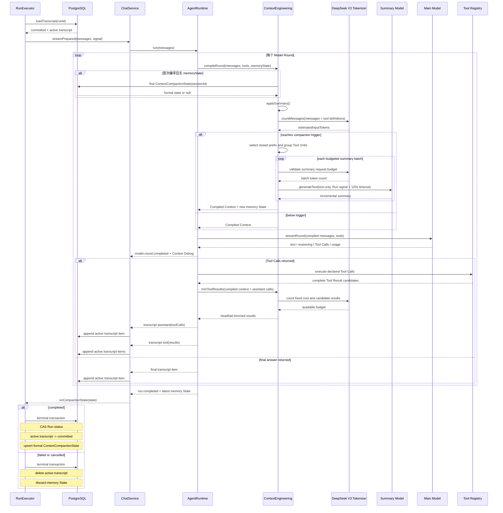

# Context Engineering

> 文档状态：第一阶段已确定的实现方案。
>
> 本阶段只实现 Token-aware Context Compilation、Tool Result Trimming 和 Incremental Compaction。文件外化、Artifact Store、Memory、语义检索、审计平台等能力不在本阶段范围内。

## 1. 目标与边界

Agent Runtime 已经可以在一个 Run 中执行多个 Model Round：模型可以直接回答，也可以请求工具；工具执行完成后，Runtime 将结果带入下一次模型调用。

随着 Round 增加，消息、Tool Call 和 Tool Result 会持续累积。第一阶段在不改变既有 Agent Loop 和 Tool Module 职责的前提下，保证模型输入始终处于可用预算内，并让长任务能够通过多次压缩继续执行。

本阶段只解决：

1. 每个 Model Round 调用模型前，按 Token 预算编译模型输入。
2. Tool Result 过大时，按上下文预算进行安全裁剪。
3. 历史上下文达到阈值时，对已闭合历史做增量 Compaction。

本阶段明确不做：

- Artifact Store、文件外化和原始大型 Tool Result 长期保存。
- 长期 Memory、Embedding、语义检索和 Context Selector。
- Skills、Plugins、多 Agent Context 协调。
- Context Trace、审计平台、Prompt Preview 和复杂配额平台。
- Redis/数据库 Token Cache、跨模型自动修复和缓存优化平台。

如果后续运行证明“被裁剪的原始内容必须按需找回”成为核心问题，再单独设计 Artifact Store 或文件外化；不能为这一假设提前引入复杂度。

## 2. 核心原则

### 2.1 每个 Model Round 都重新编译

一个 Model Round 是 Agent Loop 中的一次模型调用。Context Engineering 必须在每次调用 `model.streamRound()` 前运行，因为新的 Tool Result、用户消息和模型输出都会改变可用预算。

### 2.2 Tool Module 与 Context Engineering 分工

```text
Tool Module
  执行工具，返回完整、结构化的 Tool Result

Context Engineering
  根据本轮总 Token 预算，决定模型实际看到的 Tool Result 及其裁剪方式
```

Tool Module 不关心 Context Window，也不做面向模型的裁剪。Context Engineering 不执行工具，也不改变工具的业务语义。

### 2.3 Canonical Model Transcript 记录模型实际看到的内容

第一阶段的 Canonical Model Transcript 保存 User Message、Assistant Message、Tool Call，以及裁剪后、实际发送给模型的 Tool Result。

被裁剪掉的原始 Tool Result 剩余部分不持久化。这是 V1 有意接受的取舍：先控制复杂度；后续若确实需要恢复原始内容，再引入独立的外化存储。

后续 Compaction 或旧结果清理不得改写已有 Transcript。它们只能改变当前 Round 的 Compiled Context：此前模型见过的 Tool Result 仍保留在 Transcript 中，而当前模型输入可用明确的“已清除”占位符替代该旧结果。

### 2.4 Compaction Summary 是派生继续视图

Compaction 不覆盖 Canonical Model Transcript。它产生一个 `Compaction Summary`，作为下一轮编译上下文时替代已覆盖历史的派生视图。

```text
Canonical Model Transcript
  保留模型实际看到过的历史

Compaction Summary
  覆盖某段已闭合历史、供后续模型继续任务的摘要
```

### 2.5 只压缩已闭合历史

未完成的 Tool Unit 不能被裁剪或压缩。一个 Tool Unit 从 Assistant 发出 Tool Call 开始，到匹配的 Tool Result 被追加为止；它在完成前必须保持完整的协议结构。

## 3. 当前实现流程图

### 3.1 数据流程图

```text
Canonical Transcript + Model Profile + Tool Definitions
                │
                ▼
        ┌────────────────────┐
        │ compileRound()     │
        └─────────┬──────────┘
                  ▼
   Memory CompactionState > Session State
                  │
                  ▼
      applySummary + Token Estimate
                  │
        ┌─────────┴─────────┐
        │                   │
   below trigger      reaches trigger
        │                   │
        │                   ▼
        │     closed prefix + Tool Unit grouping
        │                   │
        │                   ▼
        │       Summary Model (budgeted batches)
        │                   │
        │                   ▼
        │     new Memory CompactionState
        └──────────┬────────┘
                   ▼
          final Prompt Budget check
                   │
          ┌────────┴────────┐
          │                 │
       fits          still exceeds
          │                 ▼
          │       clear old Tool Result
          │                 │
          │          still exceeds
          │                 ▼
          │       CONTEXT_BUDGET_EXCEEDED
          ▼
       Compiled Context
          │
          ▼
       Main Model Round
          │
     ┌────┴────┐
     │         │
  answer    Tool Calls
     │         │
     │         ▼
     │   Tool Module returns complete results
     │         │
     │         ▼
     │   trimToolResults(compiled context + assistant calls)
     │         │
     │         ▼
     │   append assistant(toolCalls) -> tool(results)
     │         │
     └─────────┴────── next Model Round

Run completed:
  Memory CompactionState -> terminal transaction -> Session State

Run failed/cancelled:
  Memory CompactionState discarded; Session State unchanged
```

### 3.2 Context Engineering 架构图

```text
┌──────────────────────────── Run Lifecycle ────────────────────────────┐
│ RunExecutor ──▶ ChatService ──▶ AgentRuntimeService                  │
│      │                 │                 │                             │
│      │                 │                 └── per-round compile         │
│      │                 └── Context Debug / projection                 │
│      │                                                                 │
│      ▼                                                                 │
│ RunRepository ── terminal transaction                                 │
└──────┬────────────────────────────────────────────────────────────────┘
       │                         │
       ▼                         ▼
┌───────────────┐       ┌────────────────────────────┐
│ Context       │       │ ModelAdapter                 │
│ Engineering   │──────▶│ main model + summary model  │
├───────────────┤       │ cancellation + timeout       │
│ compileRound  │       └────────────────────────────┘
│ compaction    │
│ Tool trimming │──────▶ DeepSeek V3 Tokenizer package
│ budget guard  │
└──────┬────────┘       (template rendering + cache)
       │
       ▼
┌──────────────────────── PostgreSQL ────────────────────────┐
│ ModelTranscriptItem: active -> committed                    │
│ ContextCompactionState: Session formal state                 │
│ No ContextCompactionDraft table                              │
└─────────────────────────────────────────────────────────────┘
```

### 3.3 完整时序图



### 3.4 Review 代码索引

| 关注点 | 代码位置 | 说明 |
| --- | --- | --- |
| 编译入口 | `apps/api/src/context-engineering/context-engineering.service.ts:30` | 正式 State、内存 State、预算和最终超限保护。 |
| Context 类型 | `apps/api/src/context-engineering/context-engineering.types.ts:4` | `CompactionState`、`CompiledContext` 和 Tool Result 类型。 |
| Prompt Budget | `apps/api/src/context-engineering/context-engineering.service.ts:394` | Window 减输出预留和安全边界。 |
| 模型配置 | `apps/api/src/model/model-catalog.ts:24` | Context Window、输出预留和压缩阈值。 |
| Token 估算 | `packages/deepseek-v3-tokenizer/src/index.ts:94` | DeepSeek 模板渲染、Token 计算和缓存。 |
| 历史压缩 | `apps/api/src/context-engineering/context-engineering.service.ts:124` | 封闭前缀、增量 Summary 和内存 State。 |
| Summary 分批 | `apps/api/src/context-engineering/context-engineering.service.ts:167` | Tool Unit 分组、预算检查和超大单元首尾裁剪。 |
| Summary 取消 | `apps/api/src/context-engineering/context-engineering.service.ts:271` | Run AbortSignal、120 秒超时和一次 text-only 重试。 |
| Tool Result 裁剪 | `apps/api/src/context-engineering/context-engineering.service.ts:79` | 扣除已编译 Context 后共享分配剩余预算。 |
| Runtime State | `apps/api/src/agent-runtime/agent-runtime.service.ts:55` | 当前 Run 内存 State 生命周期。 |
| 裁剪基线 | `apps/api/src/agent-runtime/agent-runtime.service.ts:529` | 压缩后 Context 加当前 assistant Tool Calls。 |
| 终态提交 | `apps/api/src/runs/run.repository.ts:535` | completed 原子提交正式 State 和 Transcript。 |
| 正式 State 表 | `apps/api/prisma/schema.prisma:50` | Session 级正式状态，没有 Draft 模型。 |
| 压缩测试 | `apps/api/test/unit/context-engineering/context-engineering.service.spec.ts:67` | 压缩、内存复用、取消、分批和失败回滚。 |
| 终态测试 | `apps/api/test/unit/runs/run.repository.spec.ts:151` | completed 写入，failed/cancelled 不写入。 |

一个长 Agent Loop 可以发生两次或更多次 Compaction。这是正常路径，不是异常。

## 4. 模型与 Token 预算

### 4.1 ModelProfile 是唯一配置来源

Context Window、最大输出预留和 Compaction 阈值必须来自经过验证的 `ModelProfile`，不能从 Tokenizer 资产的配置推断，也不能硬编码在编译算法中。

```ts
interface ModelProfile {
  modelId: string;
  contextWindowTokens: number;
  maxOutputTokens: number;
  tokenizer: 'deepseek-v3';
  compactionTriggerTokens: number;
}
```

Tokenizer 的 `model_max_length` 不是服务端模型 Context Window 的权威来源。模型升级或切换后必须显式更新并验证 `ModelProfile`。

未验证的 Profile 只能用于 Token 观测和偏差校准，不能驱动生产请求的强制裁剪、Compaction 或 `CONTEXT_BUDGET_EXCEEDED` 拒绝。启用这些保护前，必须为实际启用模型补齐供应商权威来源并将 Profile 标记为已验证。

### 4.2 预算公式

每轮调用前计算：

```text
Prompt Budget
  = Context Window
  - Reserved Output Tokens
  - Safety Margin

Safety Margin
  = max(Context Window × 5%, 4096 tokens)
```

当前 Round 可分配给新增 Tool Result 的预算在固定内容计数后计算：

```text
Tool Result Budget
  = Prompt Budget
  - System Prompt
  - Tool Definitions
  - 强制保留的 User / Assistant 消息
  - Latest Summary
  - 当前 Round 的其他固定内容
```

只有得到这个剩余预算后，才能对同轮多个 Tool Result 进行均分和回收。

示例：若经验证的 Profile 为 `131072` Context Window 和 `8192` 最大输出：

```text
Safety Margin       ≈ 6554
Prompt Budget       ≈ 116326
Compaction Trigger  = 100000
Compaction Target   ≤ 50000
```

这些是 V1 的保守起点，不是对所有模型通用的常量。即使未来模型支持 1M Context Window，也不能直接把阈值提高到窗口的 80%；应从 `150K-200K` 起步，并依据实际质量、成本和失败率校准。

### 4.3 Token 计数

模型调用前，使用本地 `deepseek_v3_tokenizer` 预估；模型调用后，使用 Provider 返回的 `usage` 记录实际用量并校准偏差。

不为 Token 计数额外调用 Provider API。

本地估算必须覆盖完整模型请求：System Prompt、Message、Tool Definition、Tool Call、Tool Result 和生成提示均属于预算。不能把消息内容单独计数后简单相加。

## 5. 独立 Tokenizer 依赖包

Tokenizer 是模型资产，不属于业务仓库。它必须以独立、版本化的私有 npm 依赖交付，例如：

```text
@harness/deepseek-v3-tokenizer
```

该包包含：

```text
tokenizer.json
tokenizer_config.json
DeepSeek Chat Template 渲染
Token 计算实现
缓存实现
```

主项目只通过固定版本依赖引用：

```json
{
  "dependencies": {
    "@harness/deepseek-v3-tokenizer": "1.0.0"
  }
}
```

禁止以下方式：

- `file:/Users/...` 或任何本地绝对路径依赖。
- `../Downloads/...` 或其他相对路径依赖。
- 运行时读取开发者 Downloads 目录。
- 将 Tokenizer 资产提交到当前 Monorepo。
- 运行时临时下载 Tokenizer。

`/Users/sz-0203017616/Downloads/deepseek_v3_tokenizer` 仅作为创建该独立依赖包的一次性原始输入，不能成为构建、CI 或生产运行时依赖。

建议接口：

```ts
interface TokenEstimator {
  countText(text: string): number;

  countMessages(input: {
    messages: ModelMessage[];
    tools?: ToolDefinition[];
    addGenerationPrompt?: boolean;
  }): number;

  readonly metadata: {
    tokenizer: 'deepseek-v3';
    version: string;
    assetSha256: string;
  };
}
```

### 5.1 强缓存

缓存只在进程内实现两层，不引入 Redis、数据库或磁盘缓存：

1. **Tokenizer 单例**：每个 Node.js Worker 只加载和解析一次 Tokenizer；并发初始化共享同一个 Promise。
2. **内容级 Weighted LRU**：以 Tokenizer 版本、资产 SHA-256、计数模式和规范化序列化内容的 SHA-256 作为缓存键。缓存 Message、Tool Definition、Tool Result 等稳定内容块，而不只缓存整个 Prompt。

初始缓存参数：

```text
maxEntries    = 20000
maxCacheBytes = 128 MB
TTL           = 24 hours
```

Tokenizer 资产或版本变化必须自动失效旧缓存。

## 6. Tool Result Trimming

### 6.1 裁剪时机和归属

Tool Module 返回完整、结构化的执行结果。Context Engineering 根据当前上下文和当前 Round 的可用预算，决定该结果向模型展示的版本，并将这个模型可见版本写入 Canonical Model Transcript。

```text
Tool Module: complete structured result
        │
        ▼
Context Engineering: budget-aware trim
        │
        ▼
Canonical Model Transcript: model-visible result
```

### 6.2 安全裁剪策略

裁剪必须保持结构有效，不能在 JSON 中间直接切断：

| 结果类型   | V1 裁剪方式                                |
| ---------- | ------------------------------------------ |
| 普通文本   | 保留头部和尾部，并标明中间省略。           |
| 列表       | 保留前 N 项、总数量和截断信息。            |
| 搜索结果   | 保留高相关结果及标题、链接、摘要。         |
| 日志       | 保留错误、警告以及首尾片段。               |
| 结构化对象 | 保留对象结构、关键字段和明确的截断元数据。 |

模型可见结果必须带有明确的元数据：

```ts
interface TruncationMetadata {
  truncated: boolean;
  originalCharacters: number;
  retainedCharacters: number;
  originalTokens?: number;
  retainedTokens: number;
  strategy: 'none' | 'head-tail' | 'list-limit' | 'relevance-limit' | 'structured-reducer';
}
```

例如：

```text
[Tool Result truncated: originalTokens=42380, retainedTokens=8000, strategy=head-tail]
```

### 6.3 单个和多个大结果

单个 Tool Result 不得独占整轮预算。多个大型 Tool Result 在同一轮出现时：

```text
1. 计算本轮可用于 Tool Result 的总预算。
2. 为每个结果初始均分预算。
3. 回收小结果未使用的额度。
4. 按结果类型执行安全裁剪。
```

没有通用的单结果百分比阈值；V1 由全局 Round Budget 驱动，而不是维护一套复杂的工具级配额系统。

## 7. Incremental Compaction

### 7.1 触发与目标

每个 Model Round 编译前，如果预估输入 Token 达到 `compactionTriggerTokens`，触发 Compaction。

Compaction 后的尽力目标是：

```text
Estimated Input Tokens <= Compaction Trigger × 50%
```

一次压缩应释放足够空间，避免每几轮发生小规模压缩和反复抖动。`Trigger × 50%` 不是硬约束：如果强制保留内容本身已经超过该值，但最终输入仍不超过 `Prompt Budget`，则继续执行；唯一硬约束是最终输入必须不超过 `Prompt Budget`。

### 7.2 压缩范围

只压缩已闭合历史前缀。强制保留：

- 当前用户请求。
- 当前 Round 内所有尚未闭合的 Tool Unit。
- 最近 3 个已完成的 Tool Use/Result。
- 最近一轮 User/Assistant 原始交互。
- System Prompt、模型约束和当前 Tool Definitions。

不压缩存在待返回结果的 Tool Call。否则模型可能在恢复后重复发起工具调用。

这里的“当前”不等于整个未完成 Run。只要更早的 Round 已闭合，即使它仍属于当前 Run，也可以进入 Compaction 的历史前缀。

### 7.3 Summary 内容与模型调用

Summary 必须保留未来继续任务所需的：

```text
Task Overview
Current State
Important Decisions and Constraints
Important Discoveries
Completed Work
Failed Attempts
Unresolved Problems
Next Steps
User Preferences
```

V1 使用当前 Agent 相同模型生成 Summary。Compaction 请求不暴露 Tools，并明确要求“只输出文本摘要、不得调用工具”。

### 7.4 多次 Compaction

```text
Summary V1 = closed history before boundary 1

Summary V2 = Summary V1 + newly closed history before boundary 2

Summary V3 = Summary V2 + newly closed history before boundary 3
```

后续上下文只使用最新版 Summary，不叠加多份旧 Summary：

```text
Latest Summary + Recent Raw Context + Current Run Context
```

`CompactionState` 至少保存：

```ts
interface CompactionState {
  summary: string;
  coveredThroughMessageId: string;
  version: number;
  tokenCount: number;
}
```

当前 Run 内的最新版 `CompactionState` 只保存在 Runtime 内存中，并立即用于后续 Model Round。只有 Run 成功完成时，它才与 active Transcript 在同一个 terminal transaction 中写入 Session 正式状态。Run 失败、取消或进程中断时，内存状态自然释放，正式状态和覆盖位置均不推进；当前阶段不为不可恢复的 Run 建立数据库 Draft。

正式 Summary 与覆盖位置必须原子保存。同一个覆盖范围重复执行时应复用或确定性替换同一版本结果。未来只有支持 Run 恢复或跨 Worker 接管时，才需要重新引入持久化 Compaction Checkpoint。

## 8. 错误与极端情况

### 8.1 Compaction 失败

```text
Compaction 失败
  │
  ▼
使用更严格的 text-only / no-tools 提示重试一次
  │
  ▼
仍失败
  │
  ▼
在 Compiled Context 中确定性地用占位信息替代最旧的已闭合 Tool Result
  │
  ▼
仍无法满足预算
  │
  ▼
返回 CONTEXT_BUDGET_EXCEEDED
```

不得无限重试或在每轮反复进行极小压缩。

该降级不修改 Canonical Model Transcript；Transcript 保留历史上模型实际看过的裁剪后结果。

### 8.2 单次用户输入过大

用户当前输入本身超过预算时，直接拒绝本轮并要求拆分或缩小输入。

不得静默裁剪用户输入，也不得未经用户确认先对输入摘要再继续执行。

### 8.3 强制保留内容仍超限

常见来源包括当前输入过大、同轮多个大型 Tool Result、System Prompt/Tool Definitions 过大、Summary 膨胀，或切换到更小模型窗口。

处理顺序：

1. 裁剪当前 Tool Result。
2. 清除最旧的已闭合 Tool Result。
3. 限制 Summary 最大长度。
4. 仍无法放下时返回 `CONTEXT_BUDGET_EXCEEDED`。

### 8.4 模型切换

模型切换后使用目标模型的 `ModelProfile` 重新编译。若强制保留内容无法放入更小窗口，拒绝切换；V1 不做跨模型自动修复。

## 9. 最小运行观测

本阶段不建设可视化、审计或 Context Trace 平台，只记录用于排障和校准的结构化日志：

```text
modelId
modelRound
estimatedInputTokens
actualInputTokens
promptBudget
toolResultOriginalTokens
toolResultRetainedTokens
compactionTriggered
compactionBeforeTokens
compactionAfterTokens
compactionCoveredThroughMessageId
failureCode
```

Provider `usage` 与本地预估的偏差应被记录，以便校准预算安全余量和 ModelProfile，不应把本地估算伪装成实际 Provider 用量。

## 10. 实现验收

第一阶段完成的标准：

- 每个 Model Round 前执行 Token 预算检查。
- 正常情况下不会向模型发送超过 Context Window 的请求。
- Tokenizer 通过独立、版本化依赖包提供，不依赖开发者本机路径。
- 每个 Worker 只初始化一次 Tokenizer，并具备内容级 Weighted LRU 缓存。
- 单个及多个大型 Tool Result 可按预算稳定裁剪，并明确标示截断。
- Canonical Model Transcript 只保存模型实际看到的 Tool Result。
- 长 Agent Loop 可稳定发生两次或更多次增量 Compaction。
- Compaction 只覆盖已闭合历史，不破坏当前 Tool Unit。
- Summary 与覆盖边界原子更新。
- 超大用户输入、压缩失败和强制内容超限均有明确错误结果。

## 11. 业界依据

本方案采用的机制在业界已经较为收敛，但具体阈值应以实际运行校准：

- [Anthropic Compaction](https://platform.claude.com/docs/en/build-with-claude/compaction)：Token 阈值触发、支持多次压缩、保留最近原始消息，并明确工具场景应使用 text-only 摘要提示。
- [Anthropic Context Editing](https://platform.claude.com/docs/en/build-with-claude/context-editing)：优先清理最旧 Tool Result，默认保留最近 3 个 Tool Use/Result，默认触发阈值为 100K Input Tokens。
- [LangChain Middleware](https://docs.langchain.com/oss/python/langchain/middleware/built-in)：采用 Token 阈值摘要和最近 Tool Use 保留模式。
- [DeepSeek Token Usage](https://api-docs.deepseek.com/quick_start/token_usage/)：使用本地 Tokenizer 做估算，以 Provider `usage` 作为实际 Token 数据。
