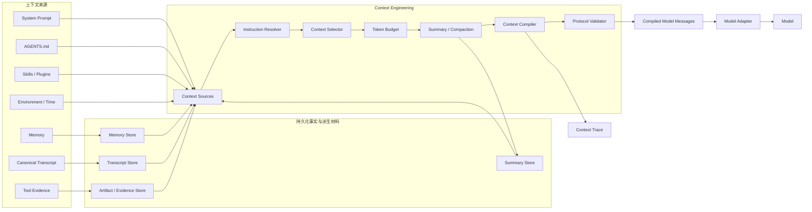
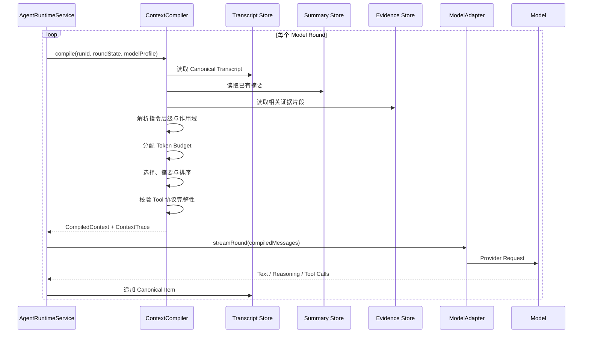
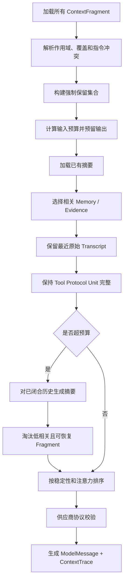
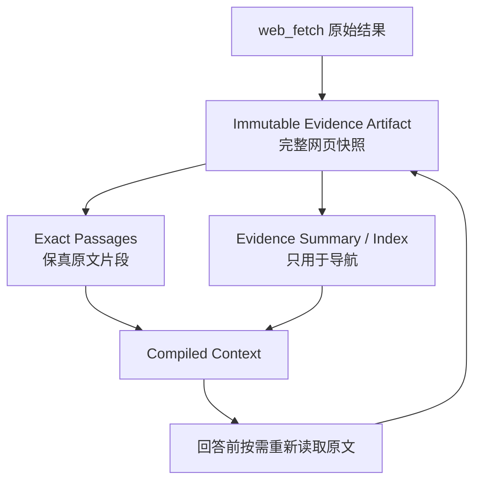

# Context Engineering

> 文档状态：方案已确认，P0 Context Engineering Eval 代码已落地；修订后的真实 S/M/L/X 高压力 Dry Run、Judge 人工校准和正式 Baseline 尚未完成。早期低压力 20/20 只验证了 Harness 链路，已因压力等级不足而废弃，不能作为 Context Engineering 零点。P0 是 Context Engineering 实施的硬前置；完成并冻结 Baseline 后才能进入阶段一。本文冻结职责边界、核心数据模型、主流程和初始默认参数，所有经验参数仍需用相同 Benchmark 持续校准。

## 1. 背景与问题

当前项目已经具备 Connection-Durable Agent Loop、Model-led Tool Boundary，以及 reasoning、Tool Call、Tool Result 的 canonical transcript。Runtime 可以连续执行多个 Model Round，并在每轮末尾把新的模型输出和 Tool Result 追加到 transcript。

目前模型上下文仍然通过“System Prompt + 历史消息 + 本轮新增消息”直接构造，并随着 Agent Loop 持续增长。这会逐渐产生以下问题：

- 历史消息、reasoning 和 Tool Result 不断累积，最终超过模型上下文窗口。
- 即使没有超过硬限制，过长上下文也会稀释模型注意力、增加延迟和成本。
- 当前按最近消息数量截取历史，可能丢失较早但仍有效的用户约束和关键决策。
- 网页、PDF、文件等 Tool Result 可能非常大，单次结果就能显著挤占上下文。
- 只做选择和淘汰会损失长期任务状态，无法支持长时间、多轮次 Agent 执行。
- 每轮模型输出所需空间没有统一预留，可能出现输入填满窗口但模型无法完成回答的情况。
- 后续还会引入 `AGENTS.md`、Memory、Skills、Plugins、Environment、当前时间等新上下文来源，匿名字符串无法表达它们的类型、来源、作用域和权威等级。

因此，Context Engineering 不是一个 Web Research 或 Tool Result 的局部优化，而是所有模型输入的统一编译边界。

## 2. 核心原则

### 2.1 每个 Model Round 都重新编译上下文

Context Engineering 必须在 Agent Loop 的每个 Model Round、调用 `model.streamRound()` 之前执行。

第一轮模型请求和 Tool 执行后的下一轮请求拥有不同材料。只在 Run 开始时编译一次，无法处理新产生的 Tool Result、摘要、约束和运行状态。

### 2.2 Canonical Transcript 与 Compiled Context 分离

```text
Canonical Transcript = 不可变的历史事实
Compiled Context      = 当前 Model Round 的派生视图
```

Canonical Transcript 完整保存：

- User Message。
- Assistant Text。
- 供应商协议允许持久化和回放的 reasoning。
- Tool Call。
- Tool Result。
- 发生顺序和关联关系。

Context Compiler 可以选择、摘要、重排或淘汰模型本轮看到的材料，但不能修改、覆盖或反向重建 Canonical Transcript。

### 2.3 摘要是派生材料，不是事实源

摘要必须具备来源、覆盖范围和版本信息。摘要不能覆盖原始 transcript，也不能冒充 native reasoning 或原始 Tool Result。

### 2.4 原始证据必须可恢复

网页、PDF、文件和大型 API 返回值的完整原始内容保存到 Evidence Artifact Store。模型上下文可以只包含相关原文片段、结构化观察和 Artifact 引用，但任何有损压缩都不能成为原始证据的唯一副本。

### 2.5 指令、事实、记忆和外部数据必须有类型

所有候选上下文先转换为带类型、来源、作用域、优先级和可压缩策略的 `ContextFragment`，再由 Context Compiler 编译为供应商无关的 `ModelMessage[]`。

### 2.6 任何压缩都应尽可能可解释、可追踪、可恢复

每个 Model Round 保存精简的 Context Trace，记录选择了哪些 Fragment、使用了哪些摘要、遗漏了什么以及原因，但不重复保存完整 Prompt 和原始证据。

### 2.7 Eval-first

Context Engineering 复杂度较高，不能在全部实现后再凭主观感受判断效果。实现前必须先在 `@harness/agent-evals` 中完成 P0 Context Engineering Benchmark，并对当前上下文逻辑运行正式 Baseline。

后续阶段使用相同 Benchmark、Fixture、Model Profile 和 Grader Version 重复运行：

```text
P0 Baseline：当前上下文逻辑
V1：每轮 Context Compiler + Token Budget
V2：V1 + Summary + Constraint Ledger
V3：V2 + Evidence Artifact / Passage
V4：V3 + 扩展 Context Source
```

每个阶段必须同时证明目标能力提升、Regression 不退化和成本可接受。P0 的任务、Fixture、Trial、Grader、人工校准、版本纪律与完成标准见 [Agent Evaluation System](./24-general-web-research-evaluation.md)。

## 3. 业界实践依据

本方案主要参考以下已公开实践：

| 系统                    | 公开实践                                                                                                 | 本项目采用的原则                                                               |
| ----------------------- | -------------------------------------------------------------------------------------------------------- | ------------------------------------------------------------------------------ |
| OpenAI / Codex          | `AGENTS.md` 按目录作用域分层；Compaction 将较长上下文压缩为可继续使用的状态；Prompt Cache 依赖稳定前缀   | Fragment 具备 scope 和 precedence；摘要成为一等派生 Artifact；稳定内容优先排列 |
| Anthropic / Claude Code | 每次推理都整理上下文；使用 JIT Retrieval、Compaction、结构化笔记和 Subagent 隔离；长任务保留最近访问文件 | 每轮编译；摘要、外部状态和按需读取组合使用                                     |
| Anthropic API           | Context Editing 可在请求前清理旧 Tool Result，同时客户端继续保存完整历史                                 | 完整历史与模型本轮视图分离；旧 Tool Result 可以被派生表示替换                  |
| Manus                   | 上下文尽量 append-only；文件系统作为外部上下文；压缩必须可恢复；通过 `todo.md` 重述目标；保留失败证据    | Artifact 外置；Operational Summary；关键错误保留；Cache-aware 排序             |
| LangGraph               | 每个 Step 读取 Thread State，并支持 trim、delete、summarize；短期状态与长期 Memory 分离                  | Compiler 位于 Model Step 前；Transcript、Summary 和 Memory 分层                |

公开资料：

- [OpenAI Compaction](https://developers.openai.com/api/docs/guides/compaction)
- [OpenAI Prompt Caching](https://developers.openai.com/api/docs/guides/prompt-caching)
- [Codex AGENTS.md](https://developers.openai.com/codex/guides/agents-md)
- [Anthropic: Effective context engineering for AI agents](https://www.anthropic.com/engineering/effective-context-engineering-for-ai-agents)
- [Anthropic Context Editing](https://platform.claude.com/docs/en/build-with-claude/context-editing)
- [Manus: Context Engineering for AI Agents](https://manus.im/blog/Context-Engineering-for-AI-Agents-Lessons-from-Building-Manus)
- [LangChain Short-term Memory](https://docs.langchain.com/oss/javascript/langchain/short-term-memory)

Codex 的内部 Context Compiler 算法没有完整公开。本文只引用其公开的指令分层、Compaction、Prompt Caching 和可扩展上下文来源原则，具体编译策略由本项目自行设计。

## 4. 总体架构



三类数据必须保持独立：

```text
Canonical Transcript
  用户、模型和 Tool 真实发生过什么

Evidence Artifact
  网页、PDF、文件和 API 返回的原始内容

Compiled Context
  当前 Model Round 实际交给模型的有限视图
```

## 5. ContextFragment

### 5.1 统一中间表示

```ts
type ContextFragmentKind =
  | 'system_instruction'
  | 'project_instruction'
  | 'agent_instruction'
  | 'skill'
  | 'plugin'
  | 'tool_definition'
  | 'environment'
  | 'current_time'
  | 'user_constraint'
  | 'user_decision'
  | 'memory'
  | 'conversation'
  | 'tool_protocol_unit'
  | 'tool_evidence'
  | 'conversation_summary'
  | 'operational_summary'
  | 'evidence_index'
  | 'current_user';

type ContextFragment = {
  id: string;
  kind: ContextFragmentKind;

  source: {
    type: 'builtin' | 'file' | 'transcript' | 'tool' | 'memory' | 'summary';
    ref: string;
    version?: string;
  };

  scope: 'global' | 'project' | 'session' | 'run' | 'round';
  authority: number;
  priority: number;
  required: boolean;

  stability: 'static' | 'slow' | 'session' | 'round';
  compressibility: 'never' | 'lossless' | 'lossy';

  content: string | ModelMessage[];
  tokenEstimate: number;

  provenance?: {
    messageIds?: string[];
    artifactId?: string;
    passageIds?: string[];
    summaryId?: string;
  };

  supersedes?: string[];
  createdAt: string;
};
```

`authority` 与 `scope` 含义不同：

- `authority` 表示一段内容能够约束哪些其他内容。
- `scope` 表示一段内容对哪些项目、会话、Run 或 Round 生效。

### 5.2 模型可见的类型边界

TypeScript 类型只对后端有效。Context Compiler 必须把必要的类型和来源边界编码进最终消息，使模型知道一段文字是项目指令、用户约束、记忆还是不可信外部数据。

概念示例：

```text
<project_instruction source="AGENTS.md" scope="project">
...
</project_instruction>

<user_constraints>
- [source: message_123] 不要向用户展示 reasoning
</user_constraints>

<external_evidence source="artifact:web_456" trust="untrusted">
...
</external_evidence>
```

具体采用 XML 边界、独立 Message 还是其他序列化形式，由 Model Adapter 能力和评测确定。外部网页与 Tool Result 必须始终标记为不可信数据，不能进入指令权威层。

## 6. 每轮编译流程



完整编译管线：



Context Compiler 的结果：

```ts
type CompiledContext = {
  messages: ModelMessage[];
  trace: ContextTrace;
  estimatedInputTokens: number;
};
```

## 7. Token Budget

### 7.1 Tokenizer

项目统一使用 DeepSeek V3 开源 Tokenizer 进行本地 Token 计量。当前原始资产位于：

```text
packages/deepseek-tokenizer/
├── resources/
│   ├── tokenizer.json
│   └── tokenizer_config.json
└── src/index.ts
```

已确认 `tokenizer.json` 是 Hugging Face Tokenizer 格式，核心为 128,000 词表的 BPE，并包含 DeepSeek 的数字、中日韩文字、通用文本和 ByteLevel 预切分规则。资源已作为 `@harness/deepseek-tokenizer` 的受控依赖纳入 workspace，加载时校验固定 SHA-256；官方 ZIP 中的 Python 示例和 macOS 元数据未进入项目。

正式实现要求：

- Runtime 不能依赖开发者 `Downloads` 目录；实现时将经过来源和许可证确认的 Tokenizer 资产复制到仓库内的稳定资源目录。
- 使用独立 TypeScript 包 `@harness/deepseek-tokenizer` 直接加载内置 `tokenizer.json`；不在生产链路调用 Python 子进程，也不通过环境变量读取任意外部路径。
- TypeScript 版本必须精确编码普通文本，并使用项目冻结的 DeepSeek Chat Template 对 `ModelMessage[]`、Tool Definition 和 Tool Protocol 特殊 Token 生成确定性本地估算。Provider 服务端可能使用不同或升级后的隐藏序列化，因此 Provider Usage 仍是实际计费和请求用量的权威值。
- 使用现有 Python Transformers 版本生成 Golden Vectors，覆盖中文、英文、数字、Unicode、JSON、Tool Call、Tool Result 和特殊 Token；TypeScript 输出必须逐项匹配 Token ID 和 Token Count。
- `tokenizer_config.json` 中当前的 `model_max_length=16384` 只属于该下载资产的配置，不能作为 `deepseek-v4-flash/pro` 的 Context Window。模型窗口和最大输出仍由独立 `ModelProfile` 明确配置。
- Provider 实际返回的 Usage 与本地估算分字段保存；本地 Tokenizer 不能伪装成 Provider Usage。

### 7.2 初始预算公式

业界没有适用于所有模型和 Agent 的统一数值。共同做法是预留输出、保留安全边界、在硬溢出前主动 Compaction，并通过真实 Evals 校准。本项目采用以下保守默认值作为 V1 起点：

```text
C = Model Profile Context Window
O = Model Profile maxOutputTokens；未配置时默认 8,192
S = max(2,048, floor(C × 5%))
T = 当前 Round 序列化 Tool Definitions Token

Material Budget B = C - O - S - T
Soft Limit         = floor(B × 70%)
Hard Limit         = floor(B × 90%)
```

行为：

- 低于 Soft Limit：优先保留高价值原始材料，不因存在摘要能力而主动做有损压缩。
- 达到 Soft Limit：允许创建或更新已闭合历史的 Summary，并优先淘汰可恢复的低相关材料。
- 达到 Hard Limit：必须执行 Compaction/Selection，把最终材料压回不高于 Soft Limit 的目标区间。
- Emergency：P0、P1、P2 强制集合本身超过 `B` 时，不发送必然失败或协议不完整的模型请求，返回明确预算错误并记录 Trace。

`O` 最终必须受 Provider 最大输出能力约束；模型具有更高或更低输出要求时，在 Model Profile 中显式覆盖。上述 70%/90%/5% 是可运行默认值，不是跨模型行业标准，后续只能根据固定 Benchmark 的质量、Overflow、Token、成本和延迟共同调整。

### 7.3 优先级

然后按优先级填充：

| 层级 | 内容                                                  | 策略                           |
| ---- | ----------------------------------------------------- | ------------------------------ |
| P0   | System、安全边界、当前用户请求                        | 必须保留，禁止摘要             |
| P1   | 当前有效用户约束、项目指令、当前任务目标              | 必须保留，关键约束尽量使用原文 |
| P2   | 未闭合 Tool Call 单元、最近若干轮原始消息             | 必须保持供应商协议完整         |
| P3   | Conversation Summary、Operational Summary、未解决问题 | 高优先级                       |
| P4   | 当前任务相关 Memory、Skills、Plugin 信息              | 按作用域和相关性选择           |
| P5   | Tool Evidence 原文片段                                | 按当前信息需求选择             |
| P6   | 旧消息、旧 Tool Result、低相关 Memory                 | 摘要、引用或淘汰               |

### 7.4 Fragment 默认配额

P0、P1、P2 先形成 Mandatory Set，不参与下面的普通比例竞争。Mandatory Set 包含 System、安全边界、当前用户请求、当前有效约束、项目强指令和未闭合 Tool Protocol Unit。

从 `B` 扣除 Mandatory Set 后得到 Flexible Budget，初始软配额：

| Flexible 类别                      | 默认份额 | 说明                                             |
| ---------------------------------- | -------: | ------------------------------------------------ |
| Recent Raw Transcript              |      35% | 保留最近的完整用户、Assistant 和已闭合 Tool Unit |
| Relevant Evidence Passages         |      30% | 当前任务需要的保真原文片段                       |
| Conversation / Operational Summary |      15% | 较旧历史状态和当前任务复述                       |
| Memory                             |      10% | 当前 Session/任务相关记忆；Memory 实现前为空     |
| Project / Skill / Plugin Context   |       8% | 非 Mandatory 的按需说明和索引                    |
| Environment / Current Time         |       2% | 动态但通常很小的运行信息                         |

这些配额是软上限，不是保证份额：

- 某类别未使用的预算可以由更高优先级类别借用。
- Mandatory Set 永远不会为了满足类别比例而被截断。
- Evidence 密集任务可以从 Recent Transcript、Memory 等未使用预算借用；纯对话任务反之。
- 单个 Fragment 超过本类软配额时，Compiler 根据 `required`、priority、相关性和可恢复性决定保留或降级，不能机械截断协议单元。
- 配额必须在 P0/V1 的 Constraint、Evidence、Long Loop 和 Short Regression Case 上分别报告和校准。

## 8. 摘要与长期连续性

只做选择和淘汰无法保留长任务状态，因此初版必须实现摘要。摘要分为三类，不使用一个不断覆盖的匿名大文本。

### 8.1 Conversation Summary

保存：

- 用户目标。
- 关键讨论和已确认决定。
- 已完成事项。
- 未解决问题。
- 重要实体、文件和 Artifact。
- 已失败的方案及失败原因。

Conversation Summary 可以使用抽象式摘要，但必须保留来源范围。

### 8.2 Operational Summary

Operational Summary 负责把当前工作状态重新放到上下文的近期注意力区域，作用类似 Manus 的 `todo.md`：

```text
当前目标：
当前进度：
已经确认：
待解决：
下一步：
```

它解决的是长循环中的注意力漂移，而不仅是存储空间问题。

### 8.3 Evidence Index

Evidence Index 只作为证据导航：

```text
- artifact:web_123：Anthropic Context Engineering 文章
  - passage_7：Compaction
  - passage_12：Structured note-taking
- artifact:web_456：Manus 文章
  - passage_4：Restorable compression
```

Evidence Index 不能替代原文，也不能单独作为最终事实依据。

### 8.4 摘要数据模型

```ts
type ContextSummary = {
  id: string;
  kind: 'conversation' | 'operational' | 'evidence_index';

  sourceFragmentIds: string[];
  sourceSequenceFrom: number;
  sourceSequenceTo: number;

  content: string;

  model: string;
  promptVersion: string;
  compilerVersion: string;

  inputTokens: number;
  outputTokens: number;

  parentSummaryId?: string;
  createdAt: string;
};
```

摘要规则：

- 不覆盖 Canonical Transcript。
- 能定位摘要覆盖的原始 Fragment 和 sequence range。
- 不同时注入摘要及其覆盖的全部原文。
- 通过层级摘要合并较旧材料，避免无限反复改写一个摘要造成漂移。
- Conversation Summary 优先保证召回率，再通过评测减少冗余。
- 当前用户请求、有效指令、未闭合 Tool Unit 禁止进入有损摘要。

### 8.5 模型、Prompt 与质量验证

Conversation Summary 的模型和 Prompt 不在设计阶段凭经验永久冻结。阶段二先为 Summary 定义独立 Model Profile 和版本化 Prompt，再通过 P0 已预留的 Context Eval Summary Case 做选择。

至少验证：

- 关键事实召回率。
- 当前有效用户约束召回率。
- 已 supersede/revoke 约束的错误保留率。
- 数字、单位、否定和限定条件保持率。
- Summary 新增事实与矛盾率。
- 多级 Summary 的累计漂移。
- 压缩率、额外 Token 成本和延迟。

确定性字段优先使用程序 Grader；开放式语义使用经过人工校准的独立 Judge。Summary 方案只有在目标压力 Case 上降低输入 Token，同时不造成 Critical Evidence/Constraint Regression，才能进入默认路径。

## 9. Tool Evidence 与大型网页

### 9.1 原始证据和模型观察分离



网页读取流程：

1. `web_fetch` 获取并规范化完整网页。
2. 完整内容保存为不可变 Evidence Artifact。
3. 保存 URL、抓取时间、内容哈希、标题和段落边界。
4. 当前 Tool Result 向模型提供 Artifact 元数据和相关原文片段。
5. 模型通过内部 Artifact 读取能力按 Passage 或 Offset 继续读取；具体是独立 `read_artifact` 还是扩展 `web_fetch`，在阶段三评测后冻结。
6. 最终回答需要引用或核对事实时，重新加载对应原文片段。

概念结果：

```json
{
  "artifactId": "web_123",
  "url": "https://example.com/article",
  "title": "Article title",
  "contentHash": "...",
  "truncated": true,
  "passages": [
    {
      "id": "passage_7",
      "start": 10240,
      "end": 13680,
      "text": "完全保真的原文片段"
    }
  ]
}
```

必须区分：

```text
原文片段选择 = Extractive，保留原文字词
摘要           = Abstractive，存在语义改变风险
```

事实依据优先使用原文片段。摘要只用于定位相关 Artifact 和 Passage。

### 9.2 Passage 混合切分策略

业界没有唯一切分算法，但成熟检索系统通常组合文档结构、语义边界和 Token Window。本项目第三阶段采用以下初始策略：

1. DOM/文档结构清洗：移除导航、广告、脚注重复、隐藏元素和模板噪声，保留标题层级、段落、列表、表格、引用和代码块。
2. 语义块生成：以 Heading、Paragraph、List Item、Table、Quote、Code Block 形成不跨结构边界的基础 Block。
3. Token Packing：使用 DeepSeek Tokenizer 将相邻 Block 打包，目标 800 Tokens、普通最大 1,200 Tokens、相邻 Passage 重叠约 100 Tokens。
4. 超大原子块：表格、代码或单段超过普通上限时优先保持语义完整，允许提升到 1,600 Tokens；仍超限则按行、句子或结构子节点切分，并保留父 Block 引用。
5. Locator：每个 Passage 保存 Document ID、Heading Path、DOM/结构 Locator、字符 Offset、Token Range 和 Content Hash。
6. Retrieval：先按结构和相关性选择 Passage，再把保真原文注入上下文；摘要只建立索引，不替代 Passage。

800/1,200/100/1,600 是第三阶段的初始默认值，必须用长网页中的否定、限定、数字、表格和跨段关系 Case 调整。第一阶段不实现 Evidence Passage Pipeline。

### 9.3 Tool Result 的三层表示

```text
Raw Result
  完整原始返回，持久化到 Transcript 或 Artifact Store

Immediate Observation
  当前 Tool Call 完成后交给下一 Model Round 的结果
  可以是完整结果，也可以是 Artifact 引用 + 原文片段

Historical Representation
  多轮之后再次编译时使用的派生表示
  通常是摘要、状态、关键错误和 Artifact 引用
```

不同 Tool 可以声明不同上下文策略：

```ts
type ToolContextPolicy =
  | { mode: 'inline_full'; maxTokens: number }
  | { mode: 'inline_excerpt'; maxTokens: number }
  | { mode: 'artifact'; previewTokens: number }
  | { mode: 'structured'; fields: string[] };
```

示例：

- 小型计算结果：`inline_full`。
- 搜索结果：`structured`。
- 网页和 PDF：`artifact + inline_excerpt`。
- 大型 Stack Trace：关键错误原文 + Artifact 引用。

Tool 决定如何安全、完整地执行能力以及如何保存原始返回；Context Compiler 决定本轮选择哪些 Observation 进入模型。Tool 不能把有损摘要作为原始证据的唯一副本。

### 9.4 Evidence Artifact 存储与保留

目标架构：

```text
PostgreSQL
  Artifact metadata、source、hash、MIME、大小、Passage locator、引用关系和生命周期状态

Object Storage
  规范化原文、Raw Document、大型解析结果和可选派生文件
```

本地单机阶段可以使用文件系统实现同一 Blob Store 接口，但数据库不保存无界大正文，业务代码也不绑定具体对象存储供应商。

建议的生命周期默认值：

- Active Run 或可恢复 Session 引用的 Artifact：始终保留，不能被 TTL 清理。
- Session 删除或显式归档后：进入 30 天 Grace Period，之后仅在没有其他引用时 GC。
- 未被任何成功 Run、Summary 或用户结果引用的临时/失败抓取：7 天后 GC。
- 被用户显式 Pin、被长期 Memory 引用或受审计要求约束：跟随引用对象生命周期，不使用普通 TTL。
- Eval Fixture：不可变、版本化并长期保留，不能被运行时 GC。
- 用户上传或项目级文档：跟随对应用户/项目的显式生命周期，不能套用临时网页 TTL。

Artifact 使用 Content Hash 去重，但引用、抓取时间和来源记录不能因 Blob 去重而丢失。部署方的隐私、合规和存储政策可以把 TTL 调短；任何清理都必须先确认没有 Active Run、Summary、Memory 或用户交付引用。

保留周期属于第三阶段实现参数。正式默认值在 Evidence Eval、存储成本和恢复需求数据可用后再次确认。

### 9.5 `web_fetch` 与已抓取 Artifact 的再次读取

当前不冻结独立 `read_artifact` Tool。`web_fetch` 和 `read_artifact` 都表现为“读取内容”，如果职责没有清楚区分，会扩大 Tool Surface 并使模型选择变复杂。

第三阶段比较两种方案：

```text
方案 A：独立 read_artifact
  web_fetch 只负责从外部 URL 获取并生成不可变 Artifact
  read_artifact 只读取内部 Artifact ID / Passage / Range，不访问网络

方案 B：扩展 web_fetch
  web_fetch 支持 URL 获取和已抓取 Artifact 的 Passage / Range 模式
  Tool 数量更少，但一个 Tool 同时承担外部网络与内部快照读取
```

评估维度包括 Tool 选择正确率、重复网络请求率、Token、延迟、协议清晰度、安全边界和模型理解成本。在阶段三方案确认前，阶段一和阶段二保持现有 `web_fetch` 行为，不预留虚假的 `read_artifact` 协议。

## 10. Tool Protocol Unit

当前项目已经形成：

```text
Assistant(reasoning + tool_calls)
  -> Tool Result(s)
```

Context Compiler 必须把它视为关联单元：

```ts
type ToolProtocolUnitFragment = {
  kind: 'tool_protocol_unit';
  assistantMessage: ModelMessage;
  toolResults: ModelMessage[];
  state: 'open' | 'closed';
  compressibility: 'never' | 'lossy';
};
```

规则：

- `open` 单元禁止删除、摘要和拆分。
- 最近的 `closed` 单元保留原始供应商协议表示。
- 较旧的 `closed` 单元可以在 Compiled Context 中替换为摘要和 Artifact 引用。
- Canonical Transcript 中始终保存完整单元。
- Context Compiler 不能修改 native reasoning，也不能把摘要伪装成 native reasoning。
- 模型或 reasoning format 不兼容时，只能使用明确标记的派生摘要，不能 native replay。

## 11. 用户约束与决定

较早但仍有效的用户约束不能只依赖消息最近性，也不能只保存在 Conversation Summary 中。系统应维护独立的 Constraint Ledger：

```ts
type UserConstraint = {
  id: string;
  sourceMessageId: string;
  exactQuote: string;
  normalizedMeaning?: string;
  scope: 'session' | 'run' | 'task';
  status: 'active' | 'superseded' | 'revoked';
  supersededBy?: string;
  createdAt: string;
};
```

关键约束保存用户原文和 source message ID，模型提取出的 `normalizedMeaning` 只用于选择和检索。

Context Compiler 每轮把当前有效且与任务相关的约束放入 P1，不参与普通历史淘汰。冲突遵循：

```text
System / 安全边界
  > 项目级明确指令
  > 当前用户明确要求
  > 用户历史偏好
  > Memory / Summary 推断
```

同一权限层级内，后来的明确更正可以 supersede 早期约束。Memory 和 Summary 不能覆盖用户明确说过的要求。

## 12. AGENTS.md、Skills、Plugins 与 Environment

所有新来源通过独立 `ContextSource` 加载：

```ts
interface ContextSource {
  load(input: ContextLoadInput): Promise<ContextFragment[]>;
}
```

使用 `ContextSource` 或 `FragmentLoader` 命名，避免与 Model Provider 混淆。

`AGENTS.md` 类项目指令采用层级作用域：

```text
Global AGENTS
  -> Project Root AGENTS
  -> 当前目录逐层 AGENTS
  -> 更接近操作目标的指令覆盖更广泛的指令
```

Skills 和 Plugins 先以元数据或索引形式进入候选集合，只有当前任务需要时才装载完整说明。Environment 和当前时间属于动态 Fragment，不能放在稳定 Prompt 前缀开头。

未来 Plugin 工具数量较多时，不应在同一个 Run 的每轮随意增删 Tool Definitions。优先选择：

- Run 开始时确定并冻结工具集合与顺序。
- 使用稳定的 Tool Search / Tool Gateway 发现和调用长尾工具。
- 保持工具名称、JSON Schema 和序列化顺序稳定。

## 13. Cache-aware 排序

Prompt Cache 要求前缀尽量稳定。Context Compiler 的默认顺序：

```text
1. 稳定 System / 安全策略
2. 稳定 Tool Definitions
3. Project Instructions / AGENTS
4. Skills / Plugin Instructions
5. Session Memory / Constraint Ledger
6. Conversation Summary
7. 最近 Canonical Transcript
8. 当前 Evidence
9. 当前时间 / 动态环境
10. 当前用户请求与 Operational Summary
```

权威性由 Role、Fragment Kind 和显式边界表达，不单纯依赖文本位置。当前请求和 Operational Summary 靠近上下文尾部，有利于近期注意力；静态内容靠前，有利于 Prompt Cache。

当前时间尤其不能放在 System Prompt 最前方。精确时间会使每轮前缀不同，导致后续 KV Cache 失效。

## 14. Context Trace

每个 Model Step 持久化精简编译清单：

```ts
type ContextTrace = {
  runId: string;
  modelStepId: string;
  roundSequence: number;

  compilerVersion: string;
  modelContextLimit: number;
  reservedOutputTokens: number;
  estimatedInputTokens: number;

  selectedFragmentIds: string[];
  selectedSummaryIds: string[];
  selectedArtifactPassageIds: string[];

  omitted: Array<{
    fragmentId: string;
    reason:
      'irrelevant' | 'budget_exceeded' | 'covered_by_summary' | 'superseded' | 'protocol_replaced';
  }>;

  contextHash: string;

  promptCache?: {
    cachedTokens?: number;
    cacheWriteTokens?: number;
  };
};
```

Context Trace 不重复保存：

- 完整 Prompt 正文。
- Tool Result 的第二份副本。
- 原始 Evidence Artifact。
- 用户不可见 reasoning。
- Secret 或敏感环境变量。

### 14.1 Context Preview 与脱敏

开发调试入口采用 opt-in 设计：

- 默认只展示 Fragment ID、Kind、Source Ref、Token Count、Priority、是否选中和 omitted reason。
- 本地开发可以按 Model Step 临时生成 Compiled Context Preview；不额外持久化第二份完整 Prompt。
- 完整正文预览只在显式 Debug 配置下启用，生产环境默认关闭，不能由普通请求参数开启。
- Preview 永远不展示原始 reasoning、API Key、Authorization/Cookie、数据库连接串、完整环境变量或 Tool Secret。
- External Evidence 默认只展示 Artifact/Passage 引用和有界片段；查看完整 Artifact 走独立权限和审计路径。
- 对邮件、电话、访问令牌、常见凭据格式和配置 Secret 执行确定性 Redactor；Redactor 前后的 Context Hash 分开记录，避免把脱敏文本误认为实际发送 Prompt。
- Debug 访问记录 runId、modelStepId、访问者、时间和内容级别；未来多用户部署时接入 Admin/Owner 权限。

Workbench 可以消费该调试能力，但 Context Engineering 不把 Preview 内容放入用户 SSE，也不改变 reasoning 对用户不可见的既有边界。

## 15. 与当前代码的集成

当前主要链路：

- `apps/api/src/runs/run.executor.ts` 在 Run 开始时调用 `RunRepository.loadTranscript()`。
- `apps/api/src/agent-runtime/agent-runtime.service.ts` 构造一个持续追加的 `messages` 数组。
- `AgentRuntimeService` 每个 Round 直接把该数组传给 `ModelAdapter.streamRound()`。
- `apps/api/src/model/openai-compatible-model.adapter.ts` 把 `ModelMessage[]` 编码成供应商消息。

改造后：

1. Repository 返回 Canonical Transcript Item，不提前决定模型消息形式。
2. Runtime 维护当前 Round 状态和新产生的 canonical items。
3. 每次 `streamRound()` 前调用 `ContextCompiler.compile()`。
4. Compiler 读取 transcript、summary、constraint、memory 和 evidence，输出 `CompiledContext`。
5. Model Adapter 只编码已编译的消息，不负责选择、摘要或 Token Budget。

概念接口：

```ts
loadCanonicalTranscript(runId: string): Promise<CanonicalTranscriptItem[]>;

compile(input: {
  runId: string;
  sessionId: string;
  roundSequence: number;
  transcript: CanonicalTranscriptItem[];
  runtimeItems: CanonicalTranscriptItem[];
  modelProfile: ModelProfile;
  tools?: AgentToolDefinition[];
}): Promise<CompiledContext>;
```

`AgentRuntimeService` 中的调用位置必须位于 Agent Loop 的 `while` 内，并紧邻 `model.streamRound()`：

```ts
const compiled = await this.contextCompiler.compile({
  runId: input.runId,
  sessionId: input.sessionId,
  roundSequence: modelRounds,
  transcript,
  runtimeItems,
  modelProfile,
  tools: definitions,
});

for await (const event of this.model.streamRound({
  model: input.model,
  messages: compiled.messages,
  tools: definitions,
  reasoningEffort: input.reasoningEffort,
  signal: roundSignal,
})) {
  // 保持现有 Agent Loop 语义
}
```

## 16. 推荐模块结构

```text
apps/api/src/context/
├── context.module.ts
├── context-fragment.types.ts
├── context-source.ts
├── context-source.registry.ts
├── context-compiler.service.ts
├── context-budget.service.ts
├── token-meter.service.ts
├── instruction-resolver.service.ts
├── context-protocol-validator.ts
├── context-trace.repository.ts
├── summary/
│   ├── summary.service.ts
│   ├── summary.repository.ts
│   └── summary-prompts.ts
├── tokenizer/
│   ├── deepseek-token-meter.ts
│   ├── model-message-serializer.ts
│   └── resources/tokenizer.json
└── sources/
    ├── system.context-source.ts
    ├── transcript.context-source.ts
    ├── project-instruction.context-source.ts
    ├── user-constraint.context-source.ts
    ├── memory.context-source.ts
    ├── skill.context-source.ts
    ├── plugin.context-source.ts
    ├── environment.context-source.ts
    └── evidence.context-source.ts
```

Evidence Artifact 的存储和读取可以作为独立模块，由 Context Engineering 通过 `evidence.context-source.ts` 消费，避免 Context 模块直接承担网页抓取、PDF 解析等领域逻辑。

## 17. 实施阶段

### 阶段零：P0 Context Engineering Evaluation Baseline

- 在现有 `@harness/agent-evals` 中增加独立 Context Eval。
- 建设约 20 个 Constraint、Pollution、Evidence、Long Loop、Resume 和 Short Regression Case。
- 使用固定 Search/Fetch/Error Fixture 和 Multi-turn Scenario Runner。
- 支持每题多 Trial、Outcome/Trace/Cost Scorecard 和 Baseline/Candidate Diff。
- 补齐 Provider Token Usage、TTFT、Model Round 和 Context Overflow 等通用观测。
- 完成人工 Grader 校准、Dry Run、Benchmark v1 冻结和当前版本正式 Baseline。

阶段零完成标准和数据格式见 [Agent Evaluation System](./24-general-web-research-evaluation.md)。未产出经过人工复核的正式 Baseline，不进入阶段一。

### 阶段一：Compiler 基础框架

- `ContextFragment` 和 `ContextSource`。
- TypeScript `DeepSeekTokenMeter`、Python Golden Vectors 一致性测试和 Model Profile Context Limit。
- Token Budget 与输出空间预留。
- 每个 Model Round 调用 Context Compiler。
- Canonical Transcript 与 Compiled Context 分离。
- Tool Protocol Validator。
- Context Trace。

这一阶段替换当前按最近固定消息数量构造上下文的逻辑，但不引入不可恢复的有损压缩。

### 阶段二：摘要与用户约束

- Conversation Summary。
- Operational Summary。
- Constraint Ledger。
- 摘要版本、coverage range 和 source refs。
- Soft Limit 自动摘要。
- 摘要 + 最近原始 Transcript Tail 的组合。
- 使用 P0 预留的 Summary Case 对模型、Prompt、事实召回、约束保持和漂移打分。

摘要必须在该阶段进入真实 Agent Loop，不能只保留接口占位。

Constraint 自动提取的置信度、纠错和审计机制在进入阶段二时单独讨论并冻结，阶段一不预设临时协议。

### 阶段三：Evidence Artifact

- 网页原文快照持久化。
- Artifact 内容哈希和 Passage 切分。
- `web_fetch` 返回 Artifact + 原文片段。
- 对比独立 `read_artifact` 与扩展 `web_fetch` 的内部 Artifact 读取模式，再冻结 Tool Surface。
- Evidence Index。
- 最终回答前按需重新读取原文。

### 阶段四：扩展上下文来源与优化

- `AGENTS.md`。
- Memory。
- Skills。
- Plugins。
- Environment 和 Current Time。
- Tool Catalog / Tool Search。
- Prompt Cache 指标和 Cache-aware 优化。
- 基于 Evals 调整预算、相关性和摘要策略。

## 18. 已确认决策

以下原则作为后续实现基线：

1. `ContextFragment` 是 Context Compiler 的统一中间表示。
2. 每个 Model Round 都执行 Context Compiler。
3. Canonical Transcript 不因摘要、选择或淘汰而修改。
4. 摘要是带版本、覆盖范围和来源的派生 Artifact。
5. 用户关键约束进入独立 Constraint Ledger，并保留用户原文。
6. 大型 Tool Result 的原始数据完整外置保存。
7. 模型优先消费 Artifact 引用和保真原文片段，而不是只消费摘要。
8. 摘要不能作为原始事实证据。
9. Tool Call 协议单元必须原子处理。
10. 每个 Model Step 持久化精简 Context Trace。
11. Runtime 每轮调用 Compiler；Model Adapter 不承担选择和压缩。
12. 所有有损压缩都必须保留回到原始材料的路径。
13. P0 Context Engineering Eval 和正式 Baseline 是阶段一的硬前置。
14. Token 计量使用 DeepSeek 开源 Tokenizer 的 TypeScript 实现，并通过 Python Golden Vectors 验证一致性。
15. V1 默认使用 Output Reserve、5% Safety Margin、70% Soft Limit 和 90% Hard Limit；所有参数由 Benchmark 校准。
16. Fragment 配额是 Mandatory Set 之后的可借用软配额，不能机械截断高权威指令或 Tool Protocol Unit。
17. Passage 使用 DOM/结构清洗、语义块和 Token Window 的混合切分，第三阶段通过 Evidence Eval 校准。
18. Evidence Raw Blob 后续进入对象存储，PostgreSQL 保存 metadata、locator、引用和生命周期状态。
19. 阶段三前不冻结 `read_artifact`，先比较独立 Tool 与扩展 `web_fetch` 两种职责划分。
20. Memory 的写入和跨 Session 权限留到 Memory 模块设计，不在 Context V1 中占位。

## 19. 仍需通过实现与评测确定的问题

以下问题已明确讨论阶段，不能由阶段一临时实现替代：

- 阶段二：Constraint 自动提取的置信度、用户纠错、supersede/revoke 和审计机制。
- 阶段二：Conversation Summary 的最终模型、Prompt Version 和质量门槛；由 Summary Eval 结果决定。
- 阶段三：`web_fetch` 首次 Passage 选择策略，以及独立 `read_artifact` 与扩展 `web_fetch` 的职责选择。
- 阶段三：Evidence Artifact 的正式 Object Store、30/7 天建议 TTL 是否需要按成本、隐私和恢复数据调整。
- Memory 模块：写入条件、生命周期、用户可编辑性和跨 Session 权限。
- 多用户/生产部署：Context Preview 的最终 Admin/Owner 权限、审计保留和部署级脱敏策略。

以下经验参数已经有 V1 默认值，但仍必须通过固定 Benchmark 收敛：

- 不同 DeepSeek Model Profile 的 Context Window、最大输出和 Soft/Hard Limit 覆盖值。
- Flexible Fragment 的份额、相关性阈值和预算借用规则。
- Passage 的 800/1,200/100/1,600 Token 参数。
- Artifact TTL 和 Object Storage 成本。

所有调整必须保留 Benchmark Version、参数版本和 Context Trace，使用相同任务比较质量、Constraint、Evidence、Overflow、Token、延迟和成本；不能在领域 Tool 内增加不可追踪的临时字符裁剪协议。
