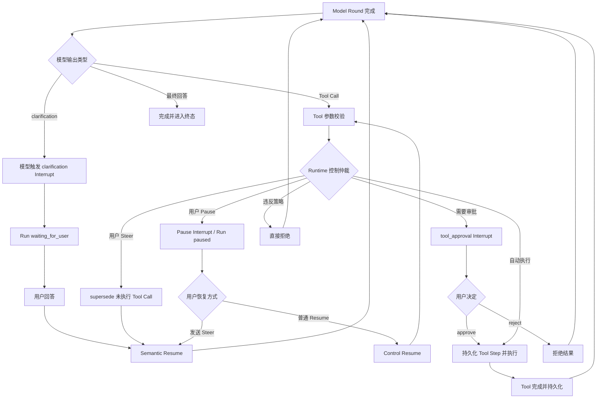

# Interrupt & Resume Control Plane

> 阶段：K3.1 Release Control & Hardening
>
> 状态：方案冻结，尚未实现。
>
> 本文定义第一阶段的 Interrupt/Resume 基础语义。它建立可持久化、可幂等、按安全边界恢复的控制平面，为后续 `clarification`、`steer`、Tool approval 和 Human-in-the-loop 提供共同基础。

## 1. 目标与非目标

### 1.1 目标

本阶段解决：

- Run 如何在安全边界暂停；
- Interrupt 如何保存等待原因和恢复上下文；
- 用户或外部控制方如何提交 Resume；
- Semantic、Decision、Control 三类 Resume 如何选择后续路径；
- 断线、重复提交和并发控制下如何保持幂等；
- 已完成的 Model Round / Tool Step 如何避免重复执行。

### 1.2 非目标

本阶段不实现：

- 完整的副作用风险分级和权限系统；
- Tool 参数在线编辑；
- 所有 Tool 的中途暂停和继续；
- 服务端重启后对执行中 Model / Tool 的自动接管和续跑；
- 多实例 Worker 接管；
- 复杂的 Approval Policy UI。

Tool 是否需要审批由受信任的 Tool Policy 和 Runtime 判断；本阶段只冻结 `approve / reject` 两种 Tool 决策，不引入 `edit`。

已经持久化的 waiting / paused Interrupt 在服务重启后仍必须可查询，并允许由新的用户命令触发恢复；这里排除的是没有外部命令时自动接管执行中的 Runtime，不是排除持久化等待恢复。

## 2. 核心术语

### Interrupt

Run 在安全边界产生的、要求外部输入或控制的持久化等待事实。Interrupt 不是异常，也不等同于取消；它表示 Run 预期可以在未来继续。

### Resume

针对一个 pending Interrupt 提交外部输入，并按照其语义选择下一条合法执行路径。Resume 不是固定的“从原位置继续”。

### Clarification

模型发现任务信息不足或存在歧义时，主动请求用户补充信息的语义型 Interrupt。第一阶段使用 `clarification`，不使用泛化的 `ask_user` 命名。

### Steer

用户在 Run 过程中提供的新任务方向、约束或补充要求。Steer 默认在下一个安全边界生效；它不是新的独立 Run，也不是对已经完成事实的改写。

## 3. 三个安全边界

第一阶段只围绕以下三个边界设计恢复语义：

```text
Model Round 完成
Tool Dispatch 前
Tool 完成并持久化
```

### 3.1 Model Round 完成

模型输出已经完整接收，reasoning、文本和 Tool Call 已通过协议校验，并形成 Round Checkpoint。此时可以：

- 处理模型发出的 `clarification`；
- 消费用户 `steer`；
- 决定是否进入 Tool Dispatch；
- 在 Tool 尚未执行前放弃旧 Tool Call；
- 进入下一轮 Model Round。

这是主要的语义控制边界。

### 3.2 Tool Dispatch 前

Tool Call 已生成且参数已校验，但 Tool 尚未真正执行。此时 Runtime 进行确定性的控制仲裁：

- 无控制且 Policy 允许自动执行：直接执行 Tool；
- Policy 要求用户决定：创建 `tool_approval` Interrupt；
- 已有新的 `steer`：放弃未执行的 Tool Call，进入 Semantic Resume；
- Run 被 pause：等待 Control Resume；
- 违反权限或安全边界：直接拒绝，不创建 approval。

### 3.3 Tool 完成并持久化

Tool Result 已产生，Tool Step 和对应 Transcript 已成功持久化。此时：

- 成功 Tool 不因 Resume 重复执行；
- `steer` 影响下一轮 Model Context；
- pause 可以阻止下一轮模型启动；
- 失败 Tool 只有在错误策略允许且声明可重试时才进入 Retry；
- Resume 通常进入下一轮 Model Round，而不是重新执行已成功 Tool。

Tool 执行中只保证协作式取消，不默认保证中途 pause/resume。Tool 是否可取消、可恢复、幂等或可补偿属于后续 Tool Capability 约束。

## 4. Interrupt 触发来源

### 4.1 模型触发：Clarification

模型在 Model Round 完成时判断信息不足或存在歧义，产生：

```text
clarification Interrupt
→ Run waiting_for_user
→ 用户提交语义回答
→ Semantic Resume
→ 下一轮 Model Round
```

模型只能请求澄清，不能决定 Tool 是否需要审批，也不能绕过 Runtime Policy。

### 4.2 Runtime 触发：Tool Approval

Runtime 根据受信任的 Tool Policy、当前参数、权限和环境判断是否允许自动执行：

```text
Tool Call
→ tool_approval Interrupt
→ 用户 approve / reject
```

第一阶段只支持：

- `approve`：不重新调用模型，为原始 Tool Call 创建持久化 Tool Step 后执行；
- `reject`：不执行 Tool，生成 `rejected_by_user` 控制结果，再进入下一轮 Model Round。

### 4.3 Runtime 触发：Pause

用户或系统在安全边界主动暂停 Run：

```text
安全边界
→ pause Interrupt
→ Run paused
```

Pause 本身不改变任务语义，也不要求模型重新思考。用户只点击 Resume 时，走 Control Resume；用户在 paused 状态发送 Steer 时，走 Semantic Resume。

## 5. 三类 Resume

### 5.1 Semantic Resume

Resume 携带新的任务语义，包括 clarification 回答或 steer：

```text
Interrupt
→ 用户新信息
→ 如存在尚未执行的 Tool Call，则标记为 superseded
→ 新信息进入 Context
→ 下一轮 Model Round
```

Semantic Resume 不执行旧 Tool，也不先调用旧 Tool 再让模型修正。

### 5.2 Decision Resume

Resume 携带对既定 Tool 动作的明确决策：

```text
approve
→ 为原 Tool Call 创建持久化 Tool Step
→ Worker 执行
→ Tool Result
→ 下一轮 Model Round

reject
→ 不执行 Tool
→ 生成拒绝结果
→ 下一轮 Model Round
```

Decision Resume 不先重新调用模型。第一阶段不支持直接修改 Tool 参数；用户想改变搜索目标、范围或任务方向，应使用 Steer/clarification，触发 Semantic Resume。

### 5.3 Control Resume

用户仅恢复一个被暂停的 Run，不提供新的语义，也不作 Tool 决策：

```text
paused
→ Control Resume
→ 从下一个已确认的安全执行点继续
```

## 6. 用户 Steer 的特殊路径

本节只冻结 K3.1 为未来 Steer 提供的安全边界，不属于 K3.1 实现或验收；Steer 的优先级、命令批次和 Queue 交互在 K3.3 重新讨论。Steer 是用户在 Run 中提交的新语义控制，其最早生效位置取决于当前阶段：

```text
Model Round 生成中
  → 记录 pending steer，等待 Round 完成

Model Round 完成、Tool 尚未 Dispatch
  → supersede 当前 Tool Call
  → Semantic Resume

Tool 执行中
  → 请求取消（若 Tool 支持）或等待 Tool 终态
  → 下一轮消费 steer

Tool 完成并持久化
  → 保留 Tool Result
  → 下一轮 Context 消费 steer

Run paused
  → Steer 同时解除等待
  → 视为 Semantic Resume，不需要先点击普通 Resume
```

Steer 不重写已提交 Transcript，不删除模型已经产生过的 Tool Call，也不撤销已经发生的外部副作用。

## 7. 旧 Tool Call 的闭合

模型已经产生但因用户 Steer 而未执行的 Tool Call 仍是模型事实，不能从 Transcript 中删除。事实层必须以明确的控制结果闭合：

```text
tool control outcome:
  executed: false
  outcomeType: superseded
  reason: user_intervened
  retryable: false
```

Provider Adapter 再将该控制结果投影成匹配原 `toolCallId` 的 canonical Tool Message。`superseded` 不是网络失败，也不是普通 Tool Error；它表示原动作因用户新意图失效，下一轮模型应基于新的语义重新规划。

## 8. 状态与幂等原则

Interrupt/Resume 必须与现有 Run Snapshot、Checkpoint、Event Tail、SSE cursor 和状态 CAS 一致。

基本不变量：

1. 一个 pending Interrupt 只能被一个有效 Resume 解决。
2. 相同幂等键和相同 payload 重复提交，返回相同结果，不重复执行 Tool 或推进 Run。
3. 相同幂等键但 payload 不同，返回冲突。
4. Terminal Run 不接受新的 Interrupt 或 Resume。
5. 已提交的 Model Round、成功 Tool Step 和 Transcript 不因 Resume 重复执行。
6. Interrupt 创建、解决、过期、取消和 Resume 结果都必须可恢复、可观察。

## 9. 最低执行正确性

K3.1 不建设完整分布式执行平台，但必须完成以下最低正确性，否则 K3.2 的 clarification 和 approval 只能在 happy path 下工作。

### 9.1 持久化 Envelope 与 Resume Command

Interrupt 和 Resume 使用稳定身份，不依赖 HTTP 连接、SSE 连接或进程内对象：

```ts
type InterruptEnvelope = {
  id: string;
  runId: string;
  kind: "clarification" | "tool_approval" | "pause";
  status: "pending" | "resolved" | "superseded" | "cancelled" | "expired";
  checkpointId: string;
  version: number;
  payload: unknown;
};

type RunCommandBase = {
  commandId: string;
  runId: string;
  expectedRunVersion: number;
  idempotencyKey: string;
};

type RunControlCommand = RunCommandBase &
  (
    | { commandType: "pause" | "cancel"; payload?: unknown }
    | {
        commandType: "resume";
        interruptId: string;
        resumeType: "semantic" | "decision" | "control";
        payload: unknown;
      }
  );
```

Envelope 和 Command payload 必须是可持久化的 JSON 值。Runtime 对命令做 canonical serialization 并保存 hash；相同幂等键只有在 command type、目标和 payload hash 全部相同时才视为重复请求。

### 9.2 Run Status 与调度职责

K3.1 在现有 Run Status 中正式加入 `waiting_for_user` 和 `paused`，两者都属于 active、不可调度、非终态状态：

```text
running / queued → paused
paused → queued → running

running → waiting_for_user
waiting_for_user → queued → running

queued / waiting_for_user / paused → cancelled
running → cancel_requested → cancelled | failed
```

- `waiting_for_user` 表示 clarification / tool approval 等外部语义或决策输入；`paused` 只表示执行控制暂停；
- Resume 事务不直接启动执行，而是把 Run 转回 `queued` 并创建下一 Step / dispatch intent，再由现有 Executor CAS 领取为 `running`；
- paused / waiting Run 没有执行中工作，Cancel 直接在同一事务进入 `cancelled` 并关闭 pending Interrupt，不经过 `cancel_requested`；
- active Run 判断、Session 的单 active Run 唯一索引、Session Snapshot 和 Web active 状态都必须包含 `waiting_for_user` 与 `paused`，防止等待期间创建第二个 Run；
- Run Status 只表达调度生命周期，等待原因和允许响应始终由 active Interrupt 决定。

### 9.3 单 Run 串行化与原子提交

每个 Run 的状态改变必须通过数据库事务中的行锁或 `expectedRunVersion` CAS 串行化，不依赖多实例 lease：

- 命令处理先查询 `idempotencyKey`：已存在且 canonical hash 相同则直接返回首次结果，hash 不同则冲突；只有新 key 才进入状态与版本校验；
- 并发首次提交依赖幂等键唯一约束选出单一赢家，失败方读取赢家结果，不能再次推进 Run；
- 创建 Interrupt 时，安全边界 Checkpoint、Interrupt、Run Status 和 UI Projection Checkpoint 在同一事务提交；
- 解决 Interrupt 时，幂等记录、Interrupt 终态、用户回答或决策事实、下一 Step / dispatch intent、Run Status 和 UI Projection Checkpoint 在同一事务提交；
- 事务提交后才向进程内 Event Tail / SSE 广播；如果提交后、广播前进程崩溃，客户端通过最新持久化 Snapshot 恢复，不为 K3.1 引入数据库 Event Log 或 Outbox；
- 事务提交前不向客户端发布可见的状态变化；Snapshot 和 SSE 只能观察已提交事实；
- CAS 失败返回冲突并重新读取 Snapshot，不能在旧状态上继续推进。

Runtime 为接受的控制命令分配 Run 内单调递增的 sequence。K3.1 只要求串行、幂等和可审计；Steer 的批次水位与优先级仲裁在 K3.3 实现。

### 9.4 Checkpoint 与恢复位置

Checkpoint 只在三个安全边界提交，并明确记录下一合法动作：

```text
round_committed
  → 处理 clarification / control
  → 或进入 Tool Policy 与 Dispatch

tool_dispatch_ready
  → 等待 approval / pause
  → 或创建 Tool Step

tool_result_committed
  → 进入下一轮 Model Round
```

- 未提交的 Model 流式输出、半成品 Transcript 和执行中的 Tool 内部状态不能作为 Resume 起点；
- Resume 只消费已提交 Checkpoint，不重新调用已提交 Model Round，也不重新执行已成功并持久化的 Tool Step；
- 恢复逻辑根据 `checkpointId + resumeType` 选择后续路径，不能通过前端传入“从哪里继续”。

### 9.5 Pause、Cancel 与终态竞态

- Pause 只在安全边界生效；Model 或 Tool 正在执行时只记录 pause request，不承诺中途暂停；
- `waiting_for_user` 已经不可调度，不再创建第二个 pause Interrupt；Pause 请求返回非法状态冲突，前端应禁用该操作；
- K3.1 的 paused Run 只接受匹配的 Control Resume 或 Cancel；普通 Control Resume 不携带新任务语义。K3.3 接入后才允许 Steer 作为 Semantic Resume 解除 paused；
- Cancel 与其他控制命令进入同一串行化路径；Runtime 在推进安全边界前优先检查已持久化 Cancel，再处理 Pause / Resume；
- Run 终态一旦提交，后续 Resume 必须拒绝；Run 进入终态时，pending Interrupt 在同一事务转为 `cancelled`；
- 已提交的完成事实不能被稍后到达的 Cancel 改写，Cancel 也不能撤销已经发生的外部副作用。

### 9.6 进程重启边界

- waiting / paused Run、pending Interrupt、Checkpoint 和幂等结果在进程重启后仍可查询；
- 启动 reconciliation 不能把 waiting / paused Run 收敛为 `RUN_INTERRUPTED`；只有没有可恢复等待事实的 active execution 才沿用现有失败收敛；
- 用户提交新的有效 Resume 后，Runtime 可以从持久化 Checkpoint 创建下一 Step 并继续；
- 已持久化但尚未开始的 queued Step 可以在重启后重新调度；
- 对崩溃时已经处于 Model / Tool 执行中的 Step，K3.1 不做自动接管或盲目重试；由具体 Step 的安全策略决定失败、查询结果或进入明确的不确定状态；
- K3.1 不引入多实例 Worker lease、fencing 或分布式选主。

### 9.7 最低事件与 Snapshot

这不是完整可观测平台，但以下事实必须在数据库事务提交后进入现有 Event Tail / SSE，并始终能由持久化 Snapshot 恢复：

```text
interrupt_created
interrupt_resolved
interrupt_cancelled
run_waiting_for_user
run_paused
run_resumed
resume_rejected
```

Snapshot 至少包含 `run.status`、`run.version`、最后提交的 `checkpointId` 和完整 `activeInterrupt`。客户端刷新或 SSE 重连后不能依赖本地 UI 状态猜测等待原因。

## 10. K3.1 验收标准

- 在三个安全边界发起 Pause，均只从合法的下一动作恢复；
- Model / Tool 执行中发起 Pause，不中断当前不可恢复动作，并在下一安全边界进入 paused；
- 页面刷新、SSE 重连和服务重启后，waiting / paused 状态及 active Interrupt 保持一致；
- 相同幂等键和相同 payload 的 Resume 返回相同结果，不重复推进；相同 key 不同 payload 返回冲突；
- stale `expectedRunVersion`、错误 `interruptId`、错误 Resume Type 和 Terminal Run 的 Resume 均被拒绝；
- Resume、Cancel 和完成竞态通过同一 CAS 路径收敛，不产生双终态或遗留 pending Interrupt；
- Resume 不重复已提交 Model Round，不重复已成功并持久化的 Tool Step；
- 事务失败时 Run、Interrupt、Checkpoint、Projection 和下一 Step 不出现部分提交；提交后 Event 未广播时，Snapshot 仍能表达完整状态；
- queued 但未开始的 Step 可在重启后重新调度，执行中 Step 不被 K3.1 自动接管；
- `git diff --check` 以及相关 protocol、API、integration 测试通过。

## 11. 业界实现模式映射

- [LangGraph Interrupts](https://docs.langchain.com/oss/javascript/langgraph/interrupts)：采用持久化 Checkpointer、稳定 thread identity 和显式 Resume；恢复可能重新进入节点，因此副作用必须放在 Interrupt 之后或保持幂等。
- [Temporal Activity Definition](https://docs.temporal.io/activity-definition)：已完成 Activity 不因 Workflow Replay 重复，但执行完成与结果提交之间仍存在崩溃窗口；写操作使用稳定幂等键，平台只保证可恢复调度，不凭空提供副作用 exactly-once。
- [AWS Step Functions Callback](https://docs.aws.amazon.com/step-functions/latest/dg/connect-to-resource.html#connect-wait-token)：用持久化 Task Token 绑定等待点与外部响应，只有匹配的成功/失败回调才能推进 Workflow。

K3.1 采用这些模式中的共同最小集合：持久化等待身份、显式 Resume、Checkpoint、安全边界、CAS 和幂等；不照搬其分布式 Worker、自动 Retry、Heartbeat 或复杂 Timeout 平台。

## 12. 第一阶段推荐流程

下图展示 Kernel 的完整接入位置：clarification / tool approval 在 K3.2 实现，Steer 在 K3.3 实现；K3.1 本身只交付通用 Interrupt/Resume、Pause、Checkpoint 和最低执行正确性。



## 13. 与后续阶段的关系

```text
K3.1 Interrupt & Resume Kernel
  → K3.2 Clarification & Tool Approval
  → K3.3 Steer & Follow-up Queue
  → K5 Human-in-the-loop & Side-effect Control
```

实施顺序固定为先完成并验证 K3.1，再实现 K3.2；K3.1/K3.2 端到端通过后再讨论和冻结 K3.3。Retry Current Step、执行中自动接管、多实例 Worker、Provider/Search 韧性、系统性安全加固和完整评估平台不属于当前 K3 范围。Tool 风险等级、用户权限、不可逆副作用确认和审批审计在 K5 中继续扩展。
