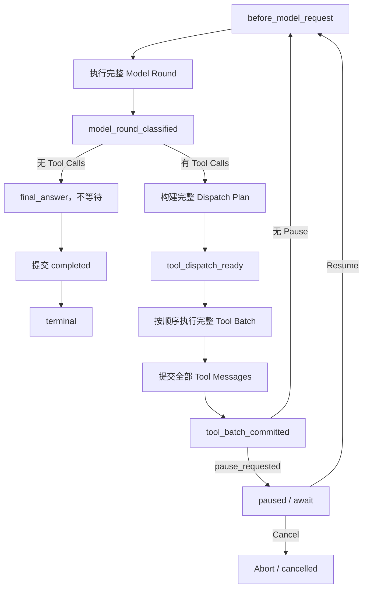

# Runtime Lifecycle & Interrupt/Resume Control

> 阶段：K3.1 Release Control & Hardening
>
> 状态：第一批已实现并验证（2026-08-21）
>
> 当前实现采用同一 API 进程内的 Runtime 生命周期控制。它不持久化 Interrupt、Resume Command 或恢复 Checkpoint；K3.1 只交付安全边界、Pause/Resume/Cancel 和后续 HITL/Steer 所需的生命周期扩展点。

## 1. 当前决策

K3.1 不再把“暂停”实现为持久化 Run 状态，也不从 SSE 或前端事件推测暂停时机。控制权完全位于正在执行 Agent Loop 的 Runtime 内：

```text
用户提交控制意图
→ RunExecutor 路由到当前进程内唯一 RuntimeLifecycleController
→ Runtime 在显式生命周期边界仲裁
→ 必要时 await
→ Resume 唤醒同一个 Runtime Promise
→ 继续原来的 Loop
```

本阶段的核心不变量：

1. Pause 不创建新的 Executor 或 Async Generator。
2. Resume 不重新加载 Transcript、不重新调用已完成模型轮次、不重复执行工具。
3. Tool Batch 中间不暂停；`assistant(tool_calls)` 必须和全部 Tool Messages 闭合。
4. 最终回答不暂停。
5. SSE、Snapshot 和 Web 只观察 Runtime 状态，不参与控制决策。
6. 数据库 Run 状态在暂停期间仍保持 `running`。

## 2. 范围与限制

### 2.1 K3.1 已实现

- 每个本地执行 Run 一个进程内 `RuntimeLifecycleController`；
- 强类型、固定顺序、串行执行的 Runtime 生命周期 Hook；
- `pause_requested → paused → resuming → running` 控制流；
- 完整 Tool Batch 后暂停；
- 下一轮模型请求前捕获已经到达的 Pause；
- Resume 继续同一个 Runtime；
- Cancel 通过现有 AbortController 协作式中止，并能唤醒 paused Runtime；
- 统一 Run Command API、SSE 控制事件和 Web Pause/Resume 状态；
- 生命周期、工具顺序和暂停落点日志。

### 2.2 本阶段不实现

- 持久化 Interrupt、Resume Command、幂等键或 Checkpoint；
- 数据库 `paused`、`waiting_for_user` 状态；
- 服务重启后的 Pause/Resume 恢复；
- 多实例命令路由、Worker lease 或 Runtime 接管；
- Clarification、Tool Approval、HITL 和 Steer；
- Tool Batch 中间暂停；
- 最终回答暂停；
- Tool 参数编辑、Retry Current Step 或副作用补偿。

在进程重启、多实例切换或 Runtime Registry 丢失后，Pause/Resume 返回 `RUNTIME_NOT_FOUND`，不会根据数据库 `running` 状态重建 Runtime。

## 3. Runtime 生命周期

### 3.1 生命周期边界

Runtime 使用封闭联合类型声明边界：

```ts
type RuntimeLifecycleBoundary =
  | 'before_model_request'
  | 'model_round_classified'
  | 'tool_dispatch_ready'
  | 'tool_batch_committed'
  | 'final_answer'
  | 'terminal';
```

标准 Tool Loop 顺序：

```text
before_model_request
→ Model Round
→ model_round_classified
→ tool_dispatch_ready
→ Tool Batch
→ tool_batch_committed
→ before_model_request
```

无 Tool Calls 的最终轮：

```text
before_model_request
→ Model Round
→ model_round_classified(final_answer)
→ final_answer
→ RunExecutor 提交数据库终态
→ terminal
```

### 3.2 边界 Context

| Boundary                 | Context 与成立条件                                                                                  |
| ------------------------ | --------------------------------------------------------------------------------------------------- |
| `before_model_request`   | 下一轮 sequence、是否为强制无工具最终回答；模型请求尚未发出                                         |
| `model_round_classified` | 稳定 Round ID/sequence、finish reason、`tool_calls \| final_answer` 分类、规范化 Tool Calls         |
| `tool_dispatch_ready`    | 全部 Tool Calls 已补齐稳定 ID 和顺序，参数已解析或形成稳定拒绝结果；尚未发出任何 `tool.started`     |
| `tool_batch_committed`   | 全部 Tool Event、canonical Tool Messages 和 Projection 已按原顺序交付；下一动作是模型请求或最终回答 |
| `final_answer`           | 当前轮已确认没有 Tool Calls；该边界不可等待                                                         |
| `terminal`               | RunExecutor 已成功提交 `completed \| cancelled \| failed` 数据库终态；该边界只观察、不阻塞          |

这些边界是未来控制策略的生命周期挂载点，不代表当前 Pause 会在每个边界停下。

### 3.3 Hook 约束

`RuntimeLifecycleController.reach(boundary, context)` 按固定顺序串行调用 Hook：

- Boundary 与 Context 都是强类型、只读输入；
- Hook 不能直接调用模型或工具；
- Hook 不能修改 Transcript、Projection 或广播 SSE；
- Runtime 是唯一消费 Hook 结果并推进 Loop 的主体；
- 普通 Hook 的同步异常或 Promise rejection 进入现有 Run 失败路径；
- `terminal` 已在数据库终态提交之后，只允许观察，不能延迟或推翻终态；
- 没有控制动作时返回 `undefined`，不创建已完成 Promise，也不让出事件循环。

同步快速路径用于消除以下竞态：

```text
边界检查发现无需暂停
→ await resolved promise 让出事件循环
→ Pause 在下一轮模型请求前插入
→ Runtime 却已经通过旧检查
```

当前实现只有 Pause Hook；K3.2 增加 typed Interrupt 和 HITL 策略，Steer 与 Follow-up Queue 留到 K3.3。

## 4. 控制状态

### 4.1 进程内状态

```ts
type RuntimeControlState =
  | 'running'
  | 'pause_requested'
  | 'paused'
  | 'resuming'
  | 'completed'
  | 'cancel_requested'
  | 'cancelled'
  | 'failed';

type RuntimePhase = 'tool_loop' | 'final_answer' | 'terminal';
```

公开 Snapshot 只暴露稳定的粗粒度状态：

```ts
type RuntimeControlSnapshot = {
  runId: string;
  state: RuntimeControlState;
  phase: RuntimePhase;
};
```

具体 Lifecycle Boundary 是 API 内部控制位置，不加入公共协议，也不作为前端业务状态。

### 4.2 状态所有权

- `RuntimeLifecycleController` 是进程内控制状态的唯一所有者；
- `RuntimeLifecycleRegistry` 保证同一进程内一个 Run 只有一个 Controller；
- `AgentRuntimeService` 只报告边界并等待 Controller；
- `RunExecutor` 路由 Pause/Resume/Cancel，投影控制状态并提交 Run 终态；
- `RunEventHub` 只分配 SSE sequence、保存 Live Snapshot 和广播；
- Web 只应用 API/SSE 返回的状态，不根据按钮点击推导最终状态。

## 5. Pause/Resume 语义

### 5.1 当前 Pause 落点

Pause Hook 只在两个边界允许等待：

```text
before_model_request
tool_batch_committed
```

`model_round_classified`、`tool_dispatch_ready` 已存在，但 K3.1 不在这些位置暂停。它们由 K3.2 用于 Clarification 和 Tool Approval。

### 5.2 Model 正在执行时请求 Pause

```text
Model Round 已开始
→ Pause 进入 pause_requested
→ 不 Abort 当前 Model
→ Model 返回 Tool Calls
→ 经过 classified / dispatch_ready，但不等待
→ 按声明顺序执行完整 Tool Batch
→ 提交全部 Tool Messages
→ tool_batch_committed 进入 paused
```

用户点击 Pause 后看到当前 Round 新产生的文本和 Tool Calls，表示模型请求在 Pause 到达前已经发出，不代表 Runtime 又启动了一轮。

### 5.3 Tool 正在执行时请求 Pause

```text
Tool Batch 执行中
→ Pause 进入 pause_requested
→ 不中断当前 Tool，也不在单个 Tool 之间暂停
→ 执行并提交整个 Batch
→ tool_batch_committed 进入 paused
```

### 5.4 边界间请求 Pause

如果 Pause 在上一批 `tool_batch_committed` 后、下一轮模型发出前到达，`before_model_request` 会捕获并等待。无 Pause 时该路径完全同步，不存在 resolved Promise 引入的竞态。

### 5.5 最终回答

- Runtime 已知进入 `final_answer` 后，新的 Pause 返回 `RUN_FINAL_ANSWER_NOT_PAUSABLE`；
- 如果 Pause 在一个尚未分类的 Model Round 执行中到达，而该 Round 最终返回无 Tool Calls，则最终完成优先，未消费 Pause 被 terminal 状态覆盖；
- 最终回答完整输出并由 RunExecutor 正常提交 `completed`，不会遗留 `pause_requested` 或 `running` UI。

### 5.6 Resume 与 Cancel

- Resume 只接受 `paused`，将状态切换为 `resuming` 并 resolve 当前等待 Promise；
- Promise 完成后状态回到 `running`，Runtime 从当前生命周期调用之后继续；
- Resume 不创建新 Runtime，不重建 Context；
- Cancel 把状态置为 `cancel_requested`、唤醒等待 Promise，并触发现有 AbortController；
- Cancel 唤醒 paused Runtime 后不会产生 `run.resumed`，而是进入取消终态路径；
- 重复 Pause、非 paused Resume、final/terminal Pause 和本地 Runtime 不存在都返回明确冲突。

## 6. Tool Dispatch 与 Transcript 正确性

### 6.1 Dispatch Plan

模型 Round 返回 Tool Calls 后，Runtime 在任何工具开始前生成完整 Dispatch Plan：

```text
原始 Tool Calls
→ 补齐稳定 ID、blockSequence、providerIndex
→ 按原声明顺序解析参数
→ ready(input) 或 rejected(error)
→ tool_dispatch_ready
→ 按 Plan 顺序执行
```

参数无效、未知 Tool 或超过调用上限也形成稳定 rejected 项，并最终生成与原 `toolCallId` 匹配的 canonical Tool Message。

### 6.2 Batch 闭合不变量

在允许下一次模型请求之前必须满足：

```text
assistant(tool_calls: [A, B, C])
→ tool(A)
→ tool(B)
→ tool(C)
→ tool_batch_committed
```

不允许：

```text
assistant(tool_calls)
→ 部分 tool results
→ Pause/Resume 后直接请求模型
```

因此 K3.1 不会再产生供应商错误：

```text
An assistant message with 'tool_calls' must be followed by tool messages
responding to each 'tool_call_id'.
```

Activity、Context、Transcript 和工具执行 Projection 都使用稳定 Round/Block/Tool Call 顺序；Resume 不重新生成这些事实。

## 7. API、SSE 与 Web

### 7.1 Command API

```http
POST /api/agent/runs/:runId/commands
```

请求：

```json
{ "type": "pause" }
```

```json
{ "type": "resume" }
```

```json
{ "type": "cancel" }
```

响应包含：

```text
runId
control: RuntimeControlSnapshot
snapshot: RunSnapshot
```

K3.1 命令不持久化 `commandId`、幂等键或 Run version。旧 Cancel 入口继续兼容。

### 7.2 SSE 控制事件

```text
run.pause_requested
run.paused
run.resuming
run.resumed
run.phase_changed
```

事件由 Controller 状态变化产生。SSE 未连接、重连或消费延迟不会影响 Runtime 是否暂停。

### 7.3 Web 状态

| Control state/phase   | Web 行为                          |
| --------------------- | --------------------------------- |
| `running / tool_loop` | 显示 Pause、Cancel                |
| `pause_requested`     | 显示“将在当前工具批次完成后暂停”  |
| `paused`              | 显示 Resume、Cancel，禁用普通输入 |
| `resuming`            | 显示恢复中                        |
| `final_answer`        | 不允许 Pause，仅保留 Cancel       |
| terminal              | 清除运行控制，显示正常终态        |

数据库 Snapshot 在 Pause 期间仍显示 Run `running`；同一 API 进程存在时，Command/Snapshot 服务会合并 Registry 中的 Live Control Snapshot。该行为不承诺跨服务重启恢复。

## 8. 后续扩展契约

K3.1 提供生命周期机制，但没有实现 Interrupt 本身。K3.2 应在现有 Controller 上演进仅服务于 HITL 的 typed Interrupt Channel，而不是重新修改 Loop 骨架；K3.3 再独立接入 Steer 与 Follow-up Queue。

推荐挂载位置：

| 阶段 | 能力          | 入口与等待边界                                                 |
| ---- | ------------- | -------------------------------------------------------------- |
| K3.2 | Clarification | `model_round_classified` 确认模型澄清输出后等待用户语义回答    |
| K3.2 | Tool Approval | `tool_dispatch_ready`，任何 Tool 尚未执行时等待 approve/reject |
| K3.3 | Steer         | 具体注入边界、优先级与 Queue 语义在 K3.3 讨论和冻结            |
| K3.1 | 普通 Pause    | 保持当前两个等待边界                                           |

K3.2 需要新增但 K3.1 不预实现：

- 稳定 `interruptId`、kind、payload 和 active Interrupt Snapshot；
- 带 payload 的 semantic/decision/control Resolution；
- Clarification answer 和 approval decision 写入正式 Transcript；
- Approve 后执行原 Dispatch Plan；Reject 后生成匹配 Tool Call 的 synthetic Tool Result；
- Resolution、Cancel 和迟到请求的进程内并发校验；
- 长时间等待的超时、Cancel 和 Registry 清理。

即使 Interrupt 控制状态仍只保存在内存，用户回答、审批结果和 synthetic Tool Result 仍必须作为会话语义事实持久化。Steer 消息的事实模型留到 K3.3 定义。

## 9. 持久化 Control Plane 的后续条件

仅当产品需要以下任一能力时，才重新设计持久化 Interrupt/Resume：

- 服务重启后继续 waiting/paused Run；
- 多实例命令路由或 Worker 接管；
- 长时间 HITL 的可靠恢复；
- 命令审计、幂等重放和跨进程并发控制；
- 运维侧需要数据库准确区分 running 与 paused。

届时不能只给 Run 增加 `paused` 状态，必须一起设计：

```text
持久化 Interrupt Envelope
+ 稳定 Checkpoint 和唯一下一动作
+ Resume Command 幂等/CAS
+ 已完成 Round/Tool 去重
+ queued dispatch intent
+ 重启 reconciliation
```

单独持久化 `paused` 会产生“数据库看起来可恢复，但原 Async Generator 和恢复位置已经丢失”的伪状态，当前阶段明确不采用。

## 10. 实现位置

- `apps/api/src/agent-runtime/runtime-lifecycle.ts`：生命周期类型、Controller、Pause Hook 和 Registry；
- `apps/api/src/agent-runtime/agent-runtime.service.ts`：显式报告边界、生成 Dispatch Plan、执行 Agent Loop；
- `apps/api/src/runs/run.executor.ts`：Runtime 生命周期实例、命令路由、SSE 投影和终态提交；
- `apps/api/src/chat/chat.service.ts`：在 Runtime Event、Projection 和 Transcript 消费链路中传递 Controller；
- `packages/agent-protocol/src/index.ts`：公开 Control Snapshot、Command、Response 和 SSE Schema；
- Web Conversation/App：应用 Control Snapshot 并展示 Pause/Resume 状态。

## 11. 验收结果

自动化覆盖：

- Tool Round 与最终 Round 生命周期顺序；
- `tool_dispatch_ready` 的规范化调用顺序和解析参数；
- 无控制时同步快速路径；
- Hook 串行执行和错误传播；
- 首轮模型请求前暂停；
- Model 执行中 Pause，完整 Tool Batch 后暂停；
- Resume 后只启动下一轮，工具不重复；
- final answer Pause 冲突和未消费 Pause 的完成优先；
- Cancel 唤醒 paused Runtime且不产生 Resume；
- success、failure、invalid arguments、unknown tool、调用上限和 Transcript 配对回归。

已执行：

```text
pnpm check
pnpm test:integration
pnpm test:e2e
git diff --check
```

有头 `agent-browser` 真实验证了多轮 Web Search/Fetch：Pause 在完整 Tool Batch 后进入 paused，Resume 继续同一个 Run，Activity 与 API Snapshot 工具数量/顺序一致，最终进入 `completed / terminal`，未出现不完整 Tool Transcript 或重复 Runtime。

## 12. 当前流程



## 13. 阶段关系

```text
K3.1 Runtime Lifecycle + In-process Pause/Resume（已完成）
  → K3.2 HITL：Typed Interrupt + Clarification + Tool Approval
  → K3.3 Steer + Follow-up Queue
  → 需要时再设计持久化 Control Plane
  → K5 Side-effect Policy、权限、审批审计与完整 HITL
```

K3.2 必须复用这些生命周期边界和同一 Runtime 等待机制；不得回到 SSE 事件猜测暂停时机、Resume 重建 Runtime 或在未闭合 Tool Transcript 上继续请求模型的实现方式。
