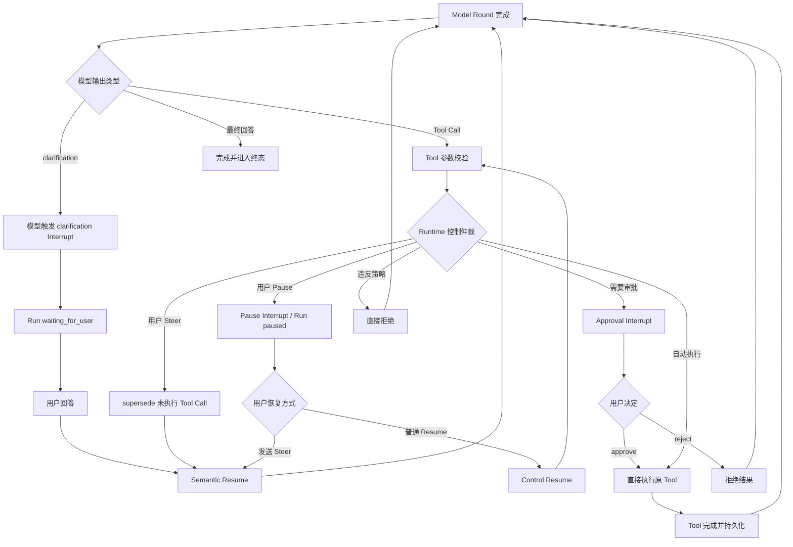

# Interrupt & Resume Control Plane

> 阶段：K3.1 Release Control & Hardening
>
> 状态：方案冻结，尚未实现。
>
> 本文定义第一阶段的 Interrupt/Resume 基础语义。它建立可持久化、可幂等、按安全边界恢复的控制平面，为后续 `clarification`、`steer`、Tool approval 和 Human-in-the-loop 提供共同基础。

## 1. 目标与非目标

### 1.1 目标

本阶段解决：

- Run 如何在安全边界暂停；
- Interrupt 如何保存等待原因和恢复上下文；
- 用户或外部控制方如何提交 Resume；
- Semantic、Decision、Control 三类 Resume 如何选择后续路径；
- 断线、重复提交和并发控制下如何保持幂等；
- 已完成的 Model Round / Tool Step 如何避免重复执行。

### 1.2 非目标

本阶段不实现：

- 完整的副作用风险分级和权限系统；
- Tool 参数在线编辑；
- 所有 Tool 的中途暂停和继续；
- 服务端重启后的 Runtime 自动续跑；
- 多实例 Worker 接管；
- 复杂的 Approval Policy UI。

Tool 是否需要审批由受信任的 Tool Policy 和 Runtime 判断；本阶段只冻结 `approve / reject` 两种 Tool 决策，不引入 `edit`。

## 2. 核心术语

### Interrupt

Run 在安全边界产生的、要求外部输入或控制的持久化等待事实。Interrupt 不是异常，也不等同于取消；它表示 Run 预期可以在未来继续。

### Resume

针对一个 pending Interrupt 提交外部输入，并按照其语义选择下一条合法执行路径。Resume 不是固定的“从原位置继续”。

### Clarification

模型发现任务信息不足或存在歧义时，主动请求用户补充信息的语义型 Interrupt。第一阶段使用 `clarification`，不使用泛化的 `ask_user` 命名。

### Steer

用户在 Run 过程中提供的新任务方向、约束或补充要求。Steer 默认在下一个安全边界生效；它不是新的独立 Run，也不是对已经完成事实的改写。

## 3. 三个安全边界

第一阶段只围绕以下三个边界设计恢复语义：

```text
Model Round 完成
Tool Dispatch 前
Tool 完成并持久化
```

### 3.1 Model Round 完成

模型输出已经完整接收，reasoning、文本和 Tool Call 已通过协议校验，并形成 Round Checkpoint。此时可以：

- 处理模型发出的 `clarification`；
- 消费用户 `steer`；
- 决定是否进入 Tool Dispatch；
- 在 Tool 尚未执行前放弃旧 Tool Call；
- 进入下一轮 Model Round。

这是主要的语义控制边界。

### 3.2 Tool Dispatch 前

Tool Call 已生成且参数已校验，但 Tool 尚未真正执行。此时 Runtime 进行确定性的控制仲裁：

- 无控制且 Policy 允许自动执行：直接执行 Tool；
- Policy 要求用户决定：创建 approval Interrupt；
- 已有新的 `steer`：放弃未执行的 Tool Call，进入 Semantic Resume；
- Run 被 pause：等待 Control Resume；
- 违反权限或安全边界：直接拒绝，不创建 approval。

### 3.3 Tool 完成并持久化

Tool Result 已产生，Tool Step 和对应 Transcript 已成功持久化。此时：

- 成功 Tool 不因 Resume 重复执行；
- `steer` 影响下一轮 Model Context；
- pause 可以阻止下一轮模型启动；
- 失败 Tool 只有在错误策略允许且声明可重试时才进入 Retry；
- Resume 通常进入下一轮 Model Round，而不是重新执行已成功 Tool。

Tool 执行中只保证协作式取消，不默认保证中途 pause/resume。Tool 是否可取消、可恢复、幂等或可补偿属于后续 Tool Capability 约束。

## 4. Interrupt 触发来源

### 4.1 模型触发：Clarification

模型在 Model Round 完成时判断信息不足或存在歧义，产生：

```text
clarification Interrupt
→ Run waiting_for_user
→ 用户提交语义回答
→ Semantic Resume
→ 下一轮 Model Round
```

模型只能请求澄清，不能决定 Tool 是否需要审批，也不能绕过 Runtime Policy。

### 4.2 Runtime 触发：Tool Approval

Runtime 根据受信任的 Tool Policy、当前参数、权限和环境判断是否允许自动执行：

```text
Tool Call
→ approval Interrupt
→ 用户 approve / reject
```

第一阶段只支持：

- `approve`：直接执行原始 Tool Call；
- `reject`：不执行 Tool，生成结构化拒绝结果，再进入下一轮 Model Round。

### 4.3 Runtime 触发：Pause

用户或系统在安全边界主动暂停 Run：

```text
安全边界
→ pause Interrupt
→ Run paused
```

Pause 本身不改变任务语义，也不要求模型重新思考。用户只点击 Resume 时，走 Control Resume；用户在 paused 状态发送 Steer 时，走 Semantic Resume。

## 5. 三类 Resume

### 5.1 Semantic Resume

Resume 携带新的任务语义，包括 clarification 回答或 steer：

```text
Interrupt
→ 用户新信息
→ 当前尚未执行的 Tool Call 标记为 superseded
→ 新信息进入 Context
→ 下一轮 Model Round
```

Semantic Resume 不执行旧 Tool，也不先调用旧 Tool 再让模型修正。

### 5.2 Decision Resume

Resume 携带对既定 Tool 动作的明确决策：

```text
approve
→ 直接执行原 Tool Call
→ Tool Result
→ 下一轮 Model Round

reject
→ 不执行 Tool
→ 生成拒绝结果
→ 下一轮 Model Round
```

Decision Resume 不先重新调用模型。第一阶段不支持直接修改 Tool 参数；用户想改变搜索目标、范围或任务方向，应使用 Steer/clarification，触发 Semantic Resume。

### 5.3 Control Resume

用户仅恢复一个被暂停的 Run，不提供新的语义，也不作 Tool 决策：

```text
paused
→ Control Resume
→ 从下一个已确认的安全执行点继续
```

## 6. 用户 Steer 的特殊路径

Steer 是用户在 Run 中提交的新语义控制。其生效取决于当前阶段：

```text
Model Round 生成中
  → 记录 pending steer，等待 Round 完成

Model Round 完成、Tool 尚未 Dispatch
  → supersede 当前 Tool Call
  → Semantic Resume

Tool 执行中
  → 请求取消（若 Tool 支持）或等待 Tool 终态
  → 下一轮消费 steer

Tool 完成并持久化
  → 保留 Tool Result
  → 下一轮 Context 消费 steer

Run paused
  → Steer 同时解除等待
  → 视为 Semantic Resume，不需要先点击普通 Resume
```

Steer 不重写已提交 Transcript，不删除模型已经产生过的 Tool Call，也不撤销已经发生的外部副作用。

## 7. 旧 Tool Call 的闭合

模型已经产生但因用户 Steer 而未执行的 Tool Call 仍是模型事实，不能从 Transcript 中删除。它必须以明确的控制结果闭合：

```text
tool result:
  executed: false
  status: superseded
  reason: user_intervened
```

`superseded` 不是网络失败，也不是普通 Tool Error；它表示原动作因用户新意图失效，下一轮模型应基于新的语义重新规划。

## 8. 状态与幂等原则

Interrupt/Resume 必须与现有 Run Snapshot、Checkpoint、Event Tail、SSE cursor 和状态 CAS 一致。

基本不变量：

1. 一个 pending Interrupt 只能被一个有效 Resume 解决。
2. 相同幂等键和相同 payload 重复提交，返回相同结果，不重复执行 Tool 或推进 Run。
3. 相同幂等键但 payload 不同，返回冲突。
4. Terminal Run 不接受新的 Interrupt 或 Resume。
5. 已提交的 Model Round、成功 Tool Step 和 Transcript 不因 Resume 重复执行。
6. Interrupt 创建、解决、过期、取消和 Resume 结果都必须可恢复、可观察。

## 9. 第一阶段推荐流程



## 10. 与后续阶段的关系

```text
K3.1 Interrupt & Resume Kernel
  → K3.2 clarification / waiting_for_user
  → K3.3 steer
  → K3.4 Tool approval
  → K3.5 pause / cancel / retry hardening
  → K5 Human-in-the-loop & Side-effect Control
```

K3.1 先冻结通用暂停、等待、恢复和幂等语义；Tool 风险等级、用户权限、不可逆副作用确认和审批审计在 K5 中继续扩展。
