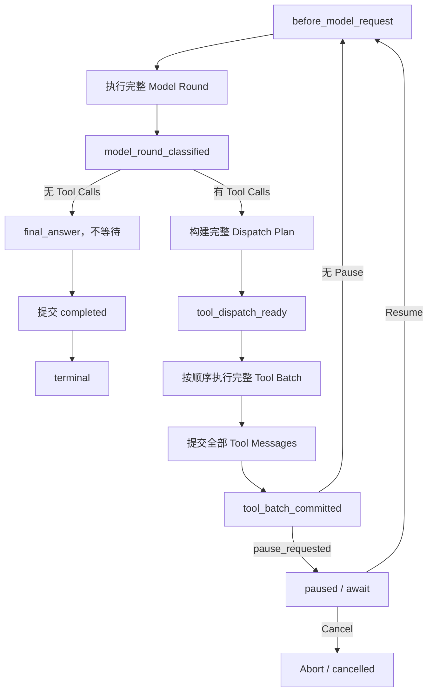
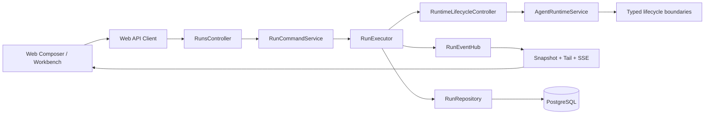
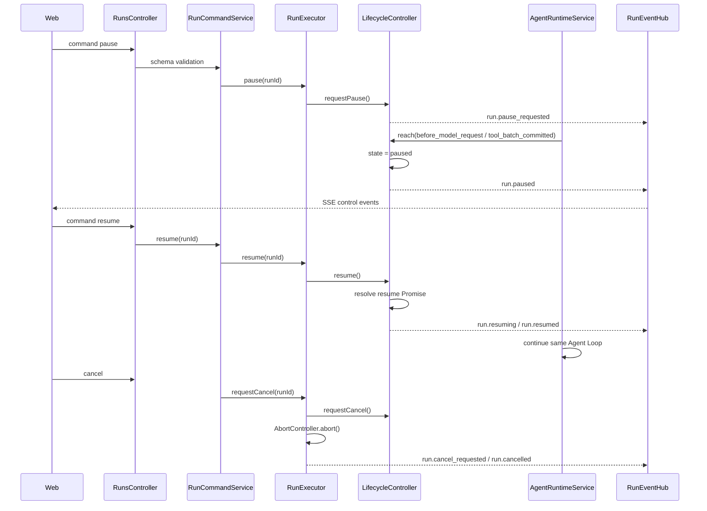
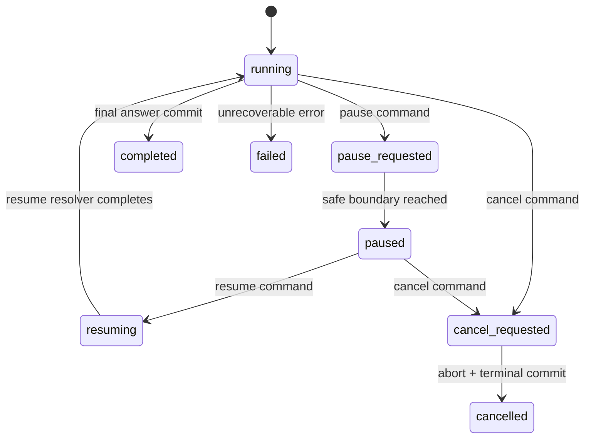
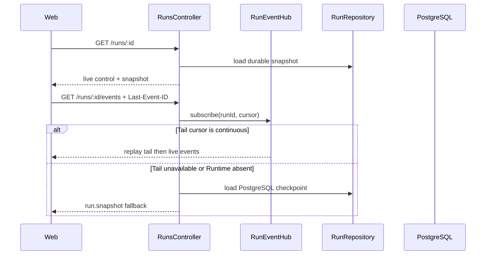
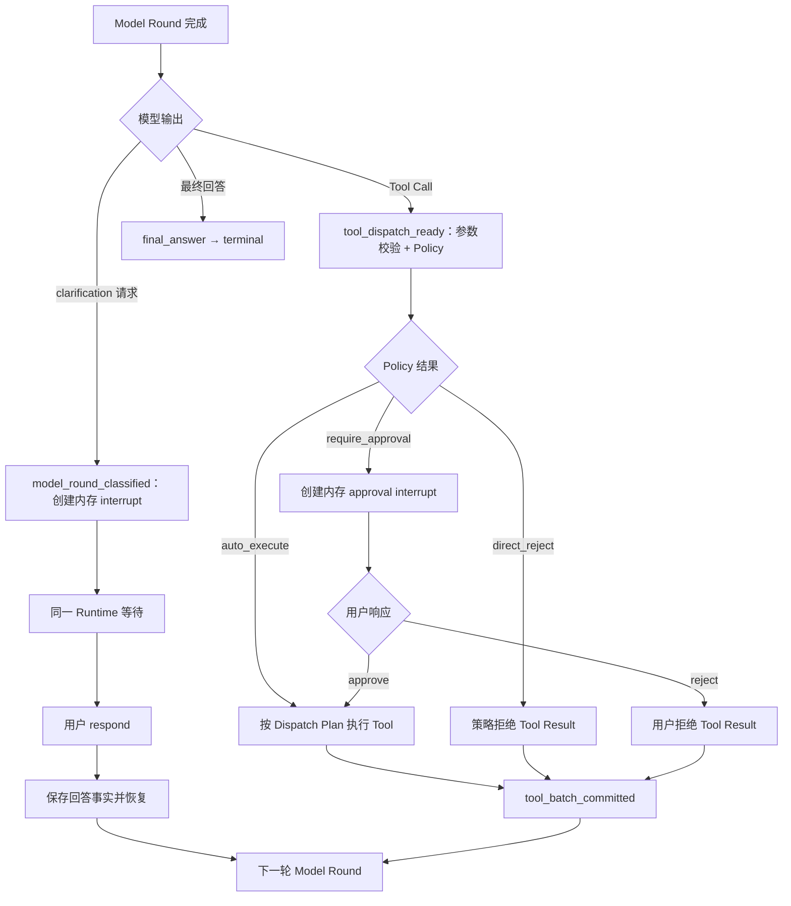
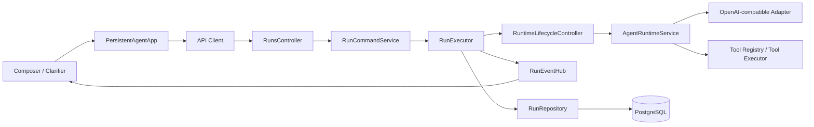
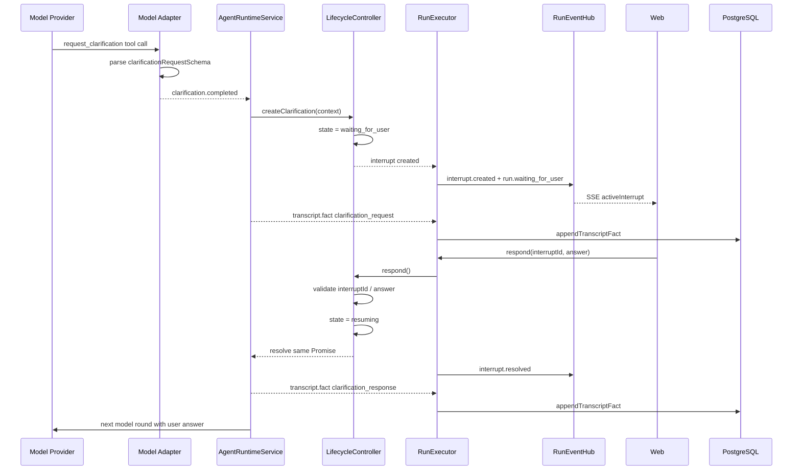
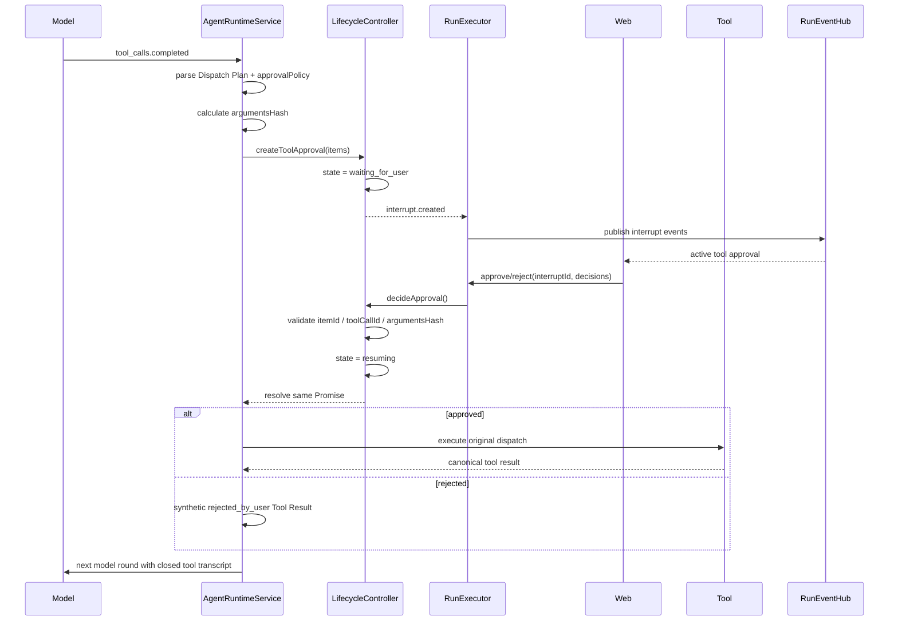

# K3 Release Control & Hardening

> K3 统一文档：Runtime Lifecycle、Clarification、Tool Approval、Steer、Follow-up Queue 及当前 Release Hardening 问题台账。
>
> 文档按 K3.1 → K3.2 → K3.3 → 问题记录排列；问题章节记录当前已复现、阻塞和待回归事项。

# K3.1 Runtime Lifecycle & Interrupt/Resume Control

> 阶段：K3.1 Release Control & Hardening
>
> 状态：第一批已实现并验证（2026-08-21）
>
> 当前实现采用同一 API 进程内的 Runtime 生命周期控制。它不持久化 Interrupt、Resume Command 或恢复 Checkpoint；K3.1 只交付安全边界、Pause/Resume/Cancel 和后续 HITL/Steer 所需的生命周期扩展点。

## 1. 当前决策

K3.1 不再把“暂停”实现为持久化 Run 状态，也不从 SSE 或前端事件推测暂停时机。控制权完全位于正在执行 Agent Loop 的 Runtime 内：

```text
用户提交控制意图
→ RunExecutor 路由到当前进程内唯一 RuntimeLifecycleController
→ Runtime 在显式生命周期边界仲裁
→ 必要时 await
→ Resume 唤醒同一个 Runtime Promise
→ 继续原来的 Loop
```

本阶段的核心不变量：

1. Pause 不创建新的 Executor 或 Async Generator。
2. Resume 不重新加载 Transcript、不重新调用已完成模型轮次、不重复执行工具。
3. Tool Batch 中间不暂停；`assistant(tool_calls)` 必须和全部 Tool Messages 闭合。
4. 最终回答不暂停。
5. SSE、Snapshot 和 Web 只观察 Runtime 状态，不参与控制决策。
6. 数据库 Run 状态在暂停期间仍保持 `running`。

## 2. 范围与限制

### 2.1 K3.1 已实现

- 每个本地执行 Run 一个进程内 `RuntimeLifecycleController`；
- 强类型、固定顺序、串行执行的 Runtime 生命周期 Hook；
- `pause_requested → paused → resuming → running` 控制流；
- 完整 Tool Batch 后暂停；
- 下一轮模型请求前捕获已经到达的 Pause；
- Resume 继续同一个 Runtime；
- Cancel 通过现有 AbortController 协作式中止，并能唤醒 paused Runtime；
- 统一 Run Command API、SSE 控制事件和 Web Pause/Resume 状态；
- 生命周期、工具顺序和暂停落点日志。

### 2.2 本阶段不实现

- 持久化 Interrupt、Resume Command、幂等键或 Checkpoint；
- 数据库 `paused`、`waiting_for_user` 状态；
- 服务重启后的 Pause/Resume 恢复；
- 多实例命令路由、Worker lease 或 Runtime 接管；
- Clarification、Tool Approval、HITL 和 Steer；
- Tool Batch 中间暂停；
- 最终回答暂停；
- Tool 参数编辑、Retry Current Step 或副作用补偿。

在进程重启、多实例切换或 Runtime Registry 丢失后，Pause/Resume 返回 `RUNTIME_NOT_FOUND`，不会根据数据库 `running` 状态重建 Runtime。

## 3. Runtime 生命周期

### 3.1 生命周期边界

Runtime 使用封闭联合类型声明边界：

```ts
type RuntimeLifecycleBoundary =
  | 'before_model_request'
  | 'model_round_classified'
  | 'tool_dispatch_ready'
  | 'tool_batch_committed'
  | 'final_answer'
  | 'terminal';
```

标准 Tool Loop 顺序：

```text
before_model_request
→ Model Round
→ model_round_classified
→ tool_dispatch_ready
→ Tool Batch
→ tool_batch_committed
→ before_model_request
```

无 Tool Calls 的最终轮：

```text
before_model_request
→ Model Round
→ model_round_classified(final_answer)
→ final_answer
→ RunExecutor 提交数据库终态
→ terminal
```

### 3.2 边界 Context

| Boundary                 | Context 与成立条件                                                                                  |
| ------------------------ | --------------------------------------------------------------------------------------------------- |
| `before_model_request`   | 下一轮 sequence、是否为强制无工具最终回答；模型请求尚未发出                                         |
| `model_round_classified` | 稳定 Round ID/sequence、finish reason、`tool_calls \| final_answer` 分类、规范化 Tool Calls         |
| `tool_dispatch_ready`    | 全部 Tool Calls 已补齐稳定 ID 和顺序，参数已解析或形成稳定拒绝结果；尚未发出任何 `tool.started`     |
| `tool_batch_committed`   | 全部 Tool Event、canonical Tool Messages 和 Projection 已按原顺序交付；下一动作是模型请求或最终回答 |
| `final_answer`           | 当前轮已确认没有 Tool Calls；该边界不可等待                                                         |
| `terminal`               | RunExecutor 已成功提交 `completed \| cancelled \| failed` 数据库终态；该边界只观察、不阻塞          |

这些边界是未来控制策略的生命周期挂载点，不代表当前 Pause 会在每个边界停下。

### 3.3 Hook 约束

`RuntimeLifecycleController.reach(boundary, context)` 按固定顺序串行调用 Hook：

- Boundary 与 Context 都是强类型、只读输入；
- Hook 不能直接调用模型或工具；
- Hook 不能修改 Transcript、Projection 或广播 SSE；
- Runtime 是唯一消费 Hook 结果并推进 Loop 的主体；
- 普通 Hook 的同步异常或 Promise rejection 进入现有 Run 失败路径；
- `terminal` 已在数据库终态提交之后，只允许观察，不能延迟或推翻终态；
- 没有控制动作时返回 `undefined`，不创建已完成 Promise，也不让出事件循环。

同步快速路径用于消除以下竞态：

```text
边界检查发现无需暂停
→ await resolved promise 让出事件循环
→ Pause 在下一轮模型请求前插入
→ Runtime 却已经通过旧检查
```

当前实现只有 Pause Hook；K3.2 增加 typed Interrupt 和 HITL 策略，Steer 与 Follow-up Queue 留到 K3.3。

## 4. 控制状态

### 4.1 进程内状态

```ts
type RuntimeControlState =
  | 'running'
  | 'pause_requested'
  | 'paused'
  | 'resuming'
  | 'completed'
  | 'cancel_requested'
  | 'cancelled'
  | 'failed';

type RuntimePhase = 'tool_loop' | 'final_answer' | 'terminal';
```

公开 Snapshot 只暴露稳定的粗粒度状态：

```ts
type RuntimeControlSnapshot = {
  runId: string;
  state: RuntimeControlState;
  phase: RuntimePhase;
};
```

具体 Lifecycle Boundary 是 API 内部控制位置，不加入公共协议，也不作为前端业务状态。

### 4.2 状态所有权

- `RuntimeLifecycleController` 是进程内控制状态的唯一所有者；
- `RuntimeLifecycleRegistry` 保证同一进程内一个 Run 只有一个 Controller；
- `AgentRuntimeService` 只报告边界并等待 Controller；
- `RunExecutor` 路由 Pause/Resume/Cancel，投影控制状态并提交 Run 终态；
- `RunEventHub` 只分配 SSE sequence、保存 Live Snapshot 和广播；
- Web 只应用 API/SSE 返回的状态，不根据按钮点击推导最终状态。

## 5. Pause/Resume 语义

### 5.1 当前 Pause 落点

Pause Hook 只在两个边界允许等待：

```text
before_model_request
tool_batch_committed
```

`model_round_classified`、`tool_dispatch_ready` 已存在，但 K3.1 不在这些位置暂停。它们由 K3.2 用于 Clarification 和 Tool Approval。

### 5.2 Model 正在执行时请求 Pause

```text
Model Round 已开始
→ Pause 进入 pause_requested
→ 不 Abort 当前 Model
→ Model 返回 Tool Calls
→ 经过 classified / dispatch_ready，但不等待
→ 按声明顺序执行完整 Tool Batch
→ 提交全部 Tool Messages
→ tool_batch_committed 进入 paused
```

用户点击 Pause 后看到当前 Round 新产生的文本和 Tool Calls，表示模型请求在 Pause 到达前已经发出，不代表 Runtime 又启动了一轮。

### 5.3 Tool 正在执行时请求 Pause

```text
Tool Batch 执行中
→ Pause 进入 pause_requested
→ 不中断当前 Tool，也不在单个 Tool 之间暂停
→ 执行并提交整个 Batch
→ tool_batch_committed 进入 paused
```

### 5.4 边界间请求 Pause

如果 Pause 在上一批 `tool_batch_committed` 后、下一轮模型发出前到达，`before_model_request` 会捕获并等待。无 Pause 时该路径完全同步，不存在 resolved Promise 引入的竞态。

### 5.5 最终回答

- Runtime 已知进入 `final_answer` 后，新的 Pause 返回 `RUN_FINAL_ANSWER_NOT_PAUSABLE`；
- 如果 Pause 在一个尚未分类的 Model Round 执行中到达，而该 Round 最终返回无 Tool Calls，则最终完成优先，未消费 Pause 被 terminal 状态覆盖；
- 最终回答完整输出并由 RunExecutor 正常提交 `completed`，不会遗留 `pause_requested` 或 `running` UI。

### 5.6 Resume 与 Cancel

- Resume 只接受 `paused`，将状态切换为 `resuming` 并 resolve 当前等待 Promise；
- Promise 完成后状态回到 `running`，Runtime 从当前生命周期调用之后继续；
- Resume 不创建新 Runtime，不重建 Context；
- Cancel 把状态置为 `cancel_requested`、唤醒等待 Promise，并触发现有 AbortController；
- Cancel 唤醒 paused Runtime 后不会产生 `run.resumed`，而是进入取消终态路径；
- 重复 Pause、非 paused Resume、final/terminal Pause 和本地 Runtime 不存在都返回明确冲突。

## 6. Tool Dispatch 与 Transcript 正确性

### 6.1 Dispatch Plan

模型 Round 返回 Tool Calls 后，Runtime 在任何工具开始前生成完整 Dispatch Plan：

```text
原始 Tool Calls
→ 补齐稳定 ID、blockSequence、providerIndex
→ 按原声明顺序解析参数
→ ready(input) 或 rejected(error)
→ tool_dispatch_ready
→ 按 Plan 顺序执行
```

参数无效、未知 Tool 或超过调用上限也形成稳定 rejected 项，并最终生成与原 `toolCallId` 匹配的 canonical Tool Message。

### 6.2 Batch 闭合不变量

在允许下一次模型请求之前必须满足：

```text
assistant(tool_calls: [A, B, C])
→ tool(A)
→ tool(B)
→ tool(C)
→ tool_batch_committed
```

不允许：

```text
assistant(tool_calls)
→ 部分 tool results
→ Pause/Resume 后直接请求模型
```

因此 K3.1 不会再产生供应商错误：

```text
An assistant message with 'tool_calls' must be followed by tool messages
responding to each 'tool_call_id'.
```

Activity、Context、Transcript 和工具执行 Projection 都使用稳定 Round/Block/Tool Call 顺序；Resume 不重新生成这些事实。

## 7. API、SSE 与 Web

### 7.1 Command API

```http
POST /api/agent/runs/:runId/commands
```

请求：

```json
{ "type": "pause" }
```

```json
{ "type": "resume" }
```

```json
{ "type": "cancel" }
```

响应包含：

```text
runId
control: RuntimeControlSnapshot
snapshot: RunSnapshot
```

K3.1 命令不持久化 `commandId`、幂等键或 Run version。旧 Cancel 入口继续兼容。

### 7.2 SSE 控制事件

```text
run.pause_requested
run.paused
run.resuming
run.resumed
run.phase_changed
```

事件由 Controller 状态变化产生。SSE 未连接、重连或消费延迟不会影响 Runtime 是否暂停。

### 7.3 Web 状态

| Control state/phase   | Web 行为                          |
| --------------------- | --------------------------------- |
| `running / tool_loop` | 显示 Pause、Cancel                |
| `pause_requested`     | 显示“将在当前工具批次完成后暂停”  |
| `paused`              | 显示 Resume、Cancel，禁用普通输入 |
| `resuming`            | 显示恢复中                        |
| `final_answer`        | 不允许 Pause，仅保留 Cancel       |
| terminal              | 清除运行控制，显示正常终态        |

数据库 Snapshot 在 Pause 期间仍显示 Run `running`；同一 API 进程存在时，Command/Snapshot 服务会合并 Registry 中的 Live Control Snapshot。该行为不承诺跨服务重启恢复。

## 8. 后续扩展契约

K3.1 提供生命周期机制，但没有实现 Interrupt 本身。K3.2 应在现有 Controller 上演进仅服务于 HITL 的 typed Interrupt Channel，而不是重新修改 Loop 骨架；K3.3 再独立接入 Steer 与 Follow-up Queue。

推荐挂载位置：

| 阶段 | 能力          | 入口与等待边界                                                 |
| ---- | ------------- | -------------------------------------------------------------- |
| K3.2 | Clarification | `model_round_classified` 确认模型澄清输出后等待用户语义回答    |
| K3.2 | Tool Approval | `tool_dispatch_ready`，任何 Tool 尚未执行时等待 approve/reject |
| K3.3 | Steer         | 具体注入边界、优先级与 Queue 语义在 K3.3 讨论和冻结            |
| K3.1 | 普通 Pause    | 保持当前两个等待边界                                           |

K3.2 需要新增但 K3.1 不预实现：

- 稳定 `interruptId`、kind、payload 和 active Interrupt Snapshot；
- 带 payload 的 semantic/decision/control Resolution；
- Clarification answer 和 approval decision 写入正式 Transcript；
- Approve 后执行原 Dispatch Plan；Reject 后生成匹配 Tool Call 的 synthetic Tool Result；
- Resolution、Cancel 和迟到请求的进程内并发校验；
- 长时间等待的超时、Cancel 和 Registry 清理。

即使 Interrupt 控制状态仍只保存在内存，用户回答、审批结果和 synthetic Tool Result 仍必须作为会话语义事实持久化。Steer 消息的事实模型留到 K3.3 定义。

## 9. 持久化 Control Plane 的后续条件

仅当产品需要以下任一能力时，才重新设计持久化 Interrupt/Resume：

- 服务重启后继续 waiting/paused Run；
- 多实例命令路由或 Worker 接管；
- 长时间 HITL 的可靠恢复；
- 命令审计、幂等重放和跨进程并发控制；
- 运维侧需要数据库准确区分 running 与 paused。

届时不能只给 Run 增加 `paused` 状态，必须一起设计：

```text
持久化 Interrupt Envelope
+ 稳定 Checkpoint 和唯一下一动作
+ Resume Command 幂等/CAS
+ 已完成 Round/Tool 去重
+ queued dispatch intent
+ 重启 reconciliation
```

单独持久化 `paused` 会产生“数据库看起来可恢复，但原 Async Generator 和恢复位置已经丢失”的伪状态，当前阶段明确不采用。

## 10. 实现位置

- `apps/api/src/agent-runtime/runtime-lifecycle.ts`：生命周期类型、Controller、Pause Hook 和 Registry；
- `apps/api/src/agent-runtime/agent-runtime.service.ts`：显式报告边界、生成 Dispatch Plan、执行 Agent Loop；
- `apps/api/src/runs/run.executor.ts`：Runtime 生命周期实例、命令路由、SSE 投影和终态提交；
- `apps/api/src/chat/chat.service.ts`：在 Runtime Event、Projection 和 Transcript 消费链路中传递 Controller；
- `packages/agent-protocol/src/index.ts`：公开 Control Snapshot、Command、Response 和 SSE Schema；
- Web Conversation/App：应用 Control Snapshot 并展示 Pause/Resume 状态。

## 11. 验收结果

自动化覆盖：

- Tool Round 与最终 Round 生命周期顺序；
- `tool_dispatch_ready` 的规范化调用顺序和解析参数；
- 无控制时同步快速路径；
- Hook 串行执行和错误传播；
- 首轮模型请求前暂停；
- Model 执行中 Pause，完整 Tool Batch 后暂停；
- Resume 后只启动下一轮，工具不重复；
- final answer Pause 冲突和未消费 Pause 的完成优先；
- Cancel 唤醒 paused Runtime且不产生 Resume；
- success、failure、invalid arguments、unknown tool、调用上限和 Transcript 配对回归。

已执行：

```text
pnpm check
pnpm test:integration
pnpm test:e2e
git diff --check
```

有头 `agent-browser` 真实验证了多轮 Web Search/Fetch：Pause 在完整 Tool Batch 后进入 paused，Resume 继续同一个 Run，Activity 与 API Snapshot 工具数量/顺序一致，最终进入 `completed / terminal`，未出现不完整 Tool Transcript 或重复 Runtime。

## 12. 当前流程



## 13. 阶段关系

```text
K3.1 Runtime Lifecycle + In-process Pause/Resume（已完成）
  → K3.2 HITL：Typed Interrupt + Clarification + Tool Approval
  → K3.3 Steer + Follow-up Queue
  → 需要时再设计持久化 Control Plane
  → K5 Side-effect Policy & Governance
```

K3.2 必须复用这些生命周期边界和同一 Runtime 等待机制；不得回到 SSE 事件猜测暂停时机、Resume 重建 Runtime 或在未闭合 Tool Transcript 上继续请求模型的实现方式。

## 14. 实现映射与 Review Guide

本节把 K3.1 的设计决策映射到当前代码，供实现 Review 和回归测试使用。

### 14.1 控制面架构



代码入口：

| 责任                                 | 实现位置                                                                |
| ------------------------------------ | ----------------------------------------------------------------------- |
| Web pause/resume/cancel handler      | `apps/web/src/app.tsx` 的 `handlePause`、`handleResume`、`handleCancel` |
| HTTP command 校验和路由              | `apps/api/src/runs/runs.controller.ts`、`run-command.service.ts`        |
| 当前进程 Runtime 命令入口            | `apps/api/src/runs/run.executor.ts`                                     |
| 状态机、Pause Hook、等待 Promise     | `apps/api/src/agent-runtime/runtime-lifecycle.ts`                       |
| 生命周期边界报告                     | `apps/api/src/agent-runtime/agent-runtime.service.ts`                   |
| 控制事件、Live Snapshot、Tail replay | `apps/api/src/runs/run-event-hub.ts`                                    |
| Durable Run/Projection/Transcript    | `apps/api/src/runs/run.repository.ts`                                   |

### 14.2 Pause/Resume/Cancel 数据流



Pause 的 review 重点：

1. `requestPause()` 只设置 `pause_requested`，不会直接假装已经暂停。
2. Pause 只在 `before_model_request` 和 `tool_batch_committed` 等安全边界等待。
3. 当前模型请求或当前完整 Tool Batch 不被硬中断。
4. Resume 唤醒原 Runtime Promise，不重新创建 Executor、不重放 Tool。
5. Cancel 可以唤醒 paused Runtime，也可以 reject waiting Interrupt，最终统一进入取消收尾。

### 14.3 状态机与事件契约



控制事件：

```text
run.pause_requested
run.paused
run.resuming
run.resumed
run.phase_changed
run.cancel_requested
run.cancelled
```

事件由 `RunExecutor` 的 Lifecycle listener 产生，`RunEventHub` 负责分配 run-scoped sequence、更新 Live Snapshot、写入 Tail 并广播；Web 不应根据按钮点击自行推导最终状态。

### 14.4 SSE / Snapshot 恢复链路



这条链路只保证连接恢复，不保证 Runtime 恢复。服务进程重启后，数据库可以提供最后一个 durable Snapshot，但无法重建内存中的 `resumeResolver`、Async Generator 或 Pause 位置。

### 14.5 K3.1 Review Findings

以下是实现 Review 时必须明确的边界，而不是额外的功能需求：

| 优先级 | Review 点                                | 当前结论                                                  |
| ------ | ---------------------------------------- | --------------------------------------------------------- |
| P1     | Pause 是否在安全边界生效                 | 是；只挂在 `before_model_request`、`tool_batch_committed` |
| P1     | Resume 是否重建 Runtime                  | 否；唤醒同一个 Lifecycle Promise                          |
| P1     | Tool Batch 是否可能半闭合后暂停          | 不允许；完整 Tool Batch 提交后才可暂停                    |
| P1     | Final answer 是否可暂停                  | 不允许；返回 `RUN_FINAL_ANSWER_NOT_PAUSABLE`              |
| P1     | Cancel 是否能结束 paused/waiting Runtime | 能；requestCancel 会唤醒等待并触发 abort                  |
| P2     | Snapshot 是否等价于 Runtime 恢复         | 不等价；Snapshot/Tail 只恢复观察面                        |
| P2     | 多实例/重启后能否 Resume                 | 当前不能，明确返回 `RUNTIME_NOT_FOUND`                    |
| P3     | Controller 错误文案                      | 需要覆盖完整命令集合，不能只写 pause/resume/cancel        |

### 14.6 K3.1 测试矩阵

```text
running → pause_requested → paused
paused → resuming → running
running → cancel_requested → cancelled
waiting_for_user → cancel_requested → cancelled
final_answer + pause → RUN_FINAL_ANSWER_NOT_PAUSABLE
重复 pause → RUN_ALREADY_PAUSED
非 paused resume → RUN_NOT_PAUSED
Pause during model → complete current model/tool boundary first
Pause during tool batch → complete whole batch first
SSE disconnect/reconnect → no duplicate or missing sequence
```

对应测试应覆盖 `runtime-lifecycle.spec.ts`、`run-event-hub.spec.ts`、`run-command.service` 和 Web 状态 reducer；新增状态行为时，必须同时验证 Command Response、SSE Event 和最终 Snapshot 三者收敛。

# K3.2 Clarification & Tool Approval

> Implementation status: implemented in protocol `0.13.0` (2026-08-21). HITL waits are in-process only; clarification facts use the transcript enum migration and tool-control outcomes use existing transcript metadata. Steer, durable Interrupt state, and restart recovery remain out of scope.

> 阶段：K3.2 Release Control & Hardening
>
> 状态：已实现并完成验证（2026-08-21）。
>
> 本阶段在 K3.1 Runtime Lifecycle 的进程内安全边界上增加两条业务路径：模型请求用户澄清，以及 Runtime 在 Tool Dispatch 前请求用户批准。Interrupt 是当前 API 进程内的等待对象，不新增控制面数据库表、字段或迁移；是否需要跨进程恢复的持久化 Control Plane，另行作为后续方案冻结。
>
> 范围：K3.2 只实现 HITL，不实现 Steer 或 Follow-up Queue；后两者属于 K3.3。

## 1. 本阶段目标

```text
clarification request
→ 进程内 clarification interrupt
→ respond
→ 同一个 Runtime Promise 恢复
→ 下一轮 Model Round
```

```text
tool_dispatch_ready
→ 进程内 tool_approval interrupt
→ approve / reject
→ 同一个 Runtime Promise 恢复
```

具体目标：

- 模型可以在信息不足或任务存在歧义时提出结构化 clarification 请求；
- Runtime 校验请求，并在 `model_round_classified` 边界创建进程内等待；
- 用户回答作为正式语义事实保存，再进入下一轮 Model Round；
- Runtime 根据受信任的 Tool Policy 判断 Tool 是否需要审批；
- 审批前不执行 Tool；
- `approve` 不重新调用模型，恢复原 Dispatch Plan 后执行；
- `reject` 不执行 Tool，生成结构化拒绝结果，再进入下一轮 Model Round；
- 两条路径都保持 K3.1 的 Transcript 闭合、Tool 顺序和生命周期事件顺序。

本阶段不承诺服务重启、页面刷新、多实例切换后的等待恢复。等待期间数据库中的 Run 仍保持已有 `running` 状态；不新增 `waiting_for_user`、`paused` 或其他数据库状态。

## 2. 本阶段不做什么

本阶段不实现：

- `edit` Tool 参数；
- 复杂的 Tool 风险分级、用户权限和审批策略管理；
- Tool 执行中的 pause/resume；
- 多人审批、审批转交和审批超时策略的完整产品化；
- Steer 和 Follow-up Queue（属于 K3.3）；
- Provider fallback、熔断和其他后续 Reliability Backlog 项目；
- 持久化 Interrupt Envelope、Checkpoint、Resume Command、幂等键或跨进程恢复。

Tool 的静态审批元数据可以作为受信任 Policy 的输入，但本阶段只要求 Runtime 能确定地得到：

```text
auto_execute
require_approval
direct_reject
```

## 3. K3.1 当前底座约束

- 每个执行中的 Run 只有一个 `RuntimeLifecycleController`，由同进程 Registry 管理。
- Interrupt、等待 Promise、控制状态和当前阶段只存在内存；Resume 必须命中该 Runtime。
- `model_round_classified` 是 clarification 的挂载点，`tool_dispatch_ready` 是 approval 的挂载点。
- `tool_batch_committed` 只在全部 Tool Result、Transcript 和 Projection 完成后到达。
- Hook 只能读取强类型 Context、等待或返回控制结果；不能直接调用模型、执行 Tool、修改 Transcript/Projection 或广播 SSE。
- Runtime 是唯一推进 Loop 的主体；用户响应只唤醒原 Runtime，不创建新的 Executor，不重新调用模型，也不重复执行已经完成的 Tool。
- 用户回答、审批决定、Tool Control Outcome 和 Tool Result 仍按现有事实层规则持久化；这与不持久化等待控制对象不同。
- 服务重启或 Runtime 被释放后，未完成的进程内等待不会恢复。若产品未来需要跨进程恢复，再单独设计 durable Interrupt/Checkpoint/Command。

## 4. 统一 Interrupt 模型

两类 Interrupt 共用内存生命周期：

```text
pending → resolved | cancelled | expired
```

当前 K3.2 使用 `pending → resolved` 和终态取消；`expired` 只有明确超时策略后才能产生。K3.3 如果需要 `superseded`，应在 Steer 方案中另行定义，不属于本协议。

每个 Interrupt 只允许自己的响应类型：

```text
clarification
  allowed response: respond

tool_approval
  allowed response: approve | reject
```

Runtime 创建并持有 Interrupt；模型只能提出 clarification 意图，用户不能直接改变 Run 状态；Runtime Policy 决定是否创建 approval interrupt。

一个 Run 同时最多只有一个 pending Interrupt。创建 pending interrupt 时，Runtime 在相应生命周期边界暂停同一个执行 Promise，但不改变数据库 Run 状态或创建新的可调度 Step。

## 5. Clarification 路径

### 5.1 触发

Model Round 完成后，模型可以返回结构化 clarification 请求。请求至少包含：

- 面向用户的问题；
- 可选的选项列表；
- 是否允许自由文本回答。

模型表达的是“我需要更多信息才能继续”，真正的等待由 Runtime 在边界中创建：

```text
model_round_classified (clarification)
→ 校验请求
→ 创建进程内 clarification interrupt
→ await RuntimeLifecycleController
```

此时 Model Round 已完整提交，数据库 Run 仍为 `running`，不写入 `waiting_for_user`。校验要求：`question` 去除空白后非空且不超过配置上限；`options` 中每项非空、互不重复且数量不超过配置上限；`allowFreeText = false` 时必须至少提供一个 option。校验失败时不创建 Interrupt，按模型协议错误处理。

### 5.2 用户响应

用户使用 `respond` 唤醒当前 clarification interrupt：

```text
clarification interrupt
→ 校验 interruptId、状态和响应格式
→ 保存用户 clarification response 事实
→ resolve 当前等待 Promise
→ before_model_request
```

`respond` 内容去除空白后必须非空；`allowFreeText = false` 时，回答必须引用当前 Interrupt 提供的合法 option。响应校验失败不能解决 Interrupt。

用户回答是新的任务语义，不能直接当作 Tool 参数执行。它必须进入下一轮 Context，让模型重新判断下一步；上一轮 Model Round 不重复调用。

### 5.3 Clarification 的上下文事实

至少保留三项事实：

```text
模型提出的问题
用户最终回答
该回答解决了哪个 clarification interrupt
```

Provider Context 应能区分：

```text
assistant clarification request
user clarification response
```

如果底层模型协议要求闭合结构，Runtime 可以生成内部 clarification result；产品和事实层必须保留用户回答的原始来源，不能伪装成普通 Tool 执行结果。

本阶段允许用户回答后再次澄清，但每次只能有一个当前 pending clarification：

```text
Round N → clarification A → respond A → Round N+1 → clarification B
```

## 6. Tool Approval 路径

### 6.1 触发与等待

在 `tool_dispatch_ready` 前逐项进行控制仲裁：

```text
Model Round 完成
→ Tool Call 参数校验
→ 读取受信任 Tool Policy
→ auto_execute / require_approval / direct_reject
```

只要存在 `require_approval`，当前 Dispatch Plan 进入进程内 `tool_approval` interrupt：

```text
tool_dispatch_ready
→ 创建 tool_approval interrupt
→ await RuntimeLifecycleController
```

Tool 在 Interrupt 解决前不得执行，也不得发起下一轮模型。等待不创建 queued Tool Step，不写入 `waiting_for_user`。

同一 Model Round 混合出现三种 Policy 结果时采用批次屏障：所有 Tool Call 暂不 Dispatch；approval interrupt 解决后，`auto_execute` 与 approved 项按原顺序执行，rejected 与 `direct_reject` 项生成各自控制结果。

Approval 项绑定不可变的 `itemId`、`toolCallId`、Tool 名称、canonical 参数和 `argumentsHash`。这些值由当前 Runtime 保存并在响应时校验，防止执行被替换或修改的调用；它们不是当前控制面数据库约束。

### 6.2 approve

```text
tool_approval interrupt
→ 用户提交 approve
→ 校验完整决策
→ resolve 当前等待 Promise
→ 恢复原 Dispatch Plan
→ 按原顺序执行 approved/auto_execute Tool
→ tool_batch_committed
→ 下一轮 Model Round
```

`approve` 不重新调用模型。已经完成的 Tool 不重复执行；当前 Model Round 的 `assistant(tool_calls)` 必须与每个 Tool Call 对应的 Tool Message 一一配对。

### 6.3 reject

```text
tool_approval interrupt
→ 用户提交 reject
→ resolve 当前等待 Promise
→ Tool 不执行
→ 生成 synthetic canonical Tool Result
→ tool_batch_committed
→ 下一轮 Model Round
```

拒绝结果至少表达：

```text
type: tool_control_outcome
toolCallId: string
executed: false
outcomeType: rejected_by_user
retryable: false
```

事实层可同时保存独立 `ToolControlOutcome`，Provider Context 必须投影为匹配原 `toolCallId` 的 Tool Message，保持 Transcript 闭合。拒绝不是 Runtime 直接结束 Run；下一轮模型应看到拒绝事实并自行决定下一步。

### 6.4 direct_reject

违反权限、安全或网络边界的 Tool Call 不创建 approval interrupt：

```text
Tool Call → Policy direct_reject → synthetic canonical Tool Result → 下一轮 Model Round
```

`rejected_by_user` 与 `rejected_by_policy` 必须保持不同语义；策略拒绝不能交给用户绕过。

## 7. 响应与竞态原则

### 7.1 单一等待点

一个 Run 同时最多一个 pending Interrupt。已有 clarification 或 approval 等待时，只接受该 Interrupt 允许的响应类型或 Cancel；普通聊天输入、Queue 或其他控制命令不能解决 Interrupt，也不能触发待审批 Tool。

### 7.2 响应幂等（进程内）

当前不提供持久化幂等键。Runtime 对同一个 pending interrupt 的重复响应、错误响应或响应竞态，按内存状态返回明确冲突；已 resolved 的重复响应不得再次执行 Tool 或再次进入 Model。若网络重试需要跨请求稳定幂等，需在后续持久化 Control Plane 中增加 command identity 和幂等记录。

### 7.3 Cancel 与等待竞态

Cancel 复用 K3.1 AbortController，与生命周期等待共享唤醒路径。Cancel 获胜时，当前 Interrupt 变为 cancelled，Runtime 进入现有取消终态；Cancel 不执行 Resume，也不启动下一轮 Model。

## 8. 业务流程图



## 9. 验收重点

### Clarification

- 合法 clarification 在 `model_round_classified` 创建内存等待，数据库 Run 仍为 `running`；
- 等待期间不启动下一轮 Model；
- `respond` 后只启动下一轮 Model，不重复上一轮 Round；
- 用户回答进入下一轮 Context 并保留来源；
- 错误、重复或并发响应不会重复推进 Run；
- 模型可以在回答后继续提出下一次 clarification；
- 服务重启或 Runtime 不存在时明确返回不可恢复冲突，不尝试从数据库重建。

### Tool Approval

- 需要审批的 Tool 在用户决定前不会执行；
- `approve` 不重新调用模型，按原 Dispatch Plan 执行；
- `reject` 不执行 Tool，下一轮模型能看到 synthetic canonical Tool Result；
- `direct_reject` 不创建审批，不给用户绕过安全策略的入口；
- 混合 Policy 结果遵守批次屏障，等待期间没有 Tool 提前 Dispatch；
- 批量审批允许部分批准、部分拒绝，但缺失、重复、未知或摘要不匹配的决策整体拒绝；
- 重复 approve 不重复执行 Tool；
- Tool Result 持久化后，恢复同一 Runtime 不重复执行成功 Tool；
- `assistant(tool_calls)` 始终与全部 Tool Messages 闭合。

## 10. 与后续阶段的关系

```text
K3.1 Runtime Lifecycle
  → K3.2 Clarification & Tool Approval（本文）
  → K3.3 Steer & Follow-up Queue
  → K5 Side-effect Policy & Governance
```

K3.2 交付 clarification 与 tool approval 两条 HITL 路径，K3.3 在同一 Control Kernel 上交付 Steer、Follow-up Queue 和跨边界竞态处理。K5 负责可信风险分级、不可变授权绑定、真实写能力接入、审批失效、审计和副作用治理。持久化 Control Plane、跨进程恢复和 exactly-once 根据未来部署与能力需求另行冻结。

## 11. 已冻结的业务结论

### 11.1 Clarification 协议

```ts
type ClarificationRequest = {
  type: 'clarification';
  question: string;
  options?: string[];
  allowFreeText: boolean;
};
```

Clarification 是独立结构化协议，不实现为 Tool Call。System Prompt 说明触发方式，Runtime 校验后创建 interrupt。Clarification 与 Tool Call、最终回答互斥；Transcript 使用专用 `clarification_request` / `clarification_response` 类型。Provider Adapter 在不支持自定义类型时投影为带稳定语义标记的 assistant/user 消息，但不转换为 Tool Message。

### 11.2 触发条件

仅当缺失信息会显著改变结果、成本或副作用，且无法从 Context 或可用 Tool 获得，也不存在安全、低成本、可逆的合理默认值时触发。提问前检查 Context，一次集中询问最少关键问题，不重复询问已回答内容。

### 11.3 Tool Control Outcome

```ts
type ToolControlOutcome = {
  type: 'tool_control_outcome';
  toolCallId: string;
  executed: false;
  outcomeType: 'rejected_by_user' | 'rejected_by_policy';
  reason?: string;
  retryable: false;
};
```

Runtime、审计和前端以独立控制事实为准；Provider Context 投影成匹配原 `toolCallId` 的 canonical Tool Message。未来 Steer 所需的 `superseded` 结果由 K3.3 自己定义，不能作为 K3.2 的当前协议值。

### 11.4 与 K3.3 的边界

K3.2 不定义或接受 Steer 命令。K3.3 设计 Steer 时不得让 pending approval 中的 Tool 绕过决策而执行；除此之外，Steer 的命令协议、优先级、仲裁批次、supersede 和前端交互均由 K3.3 独立冻结。

### 11.5 单一 pending Interrupt 的限制

Clarification 一次集中询问当前最少关键问题；同一安全边界的多个 Tool Approval 合并为一个内存 interrupt，每项具有稳定 `itemId`、`toolCallId`、canonical 参数和 `argumentsHash`。用户可以逐项 approve/reject，但响应必须完整覆盖全部项目；未知、遗漏或重复项目整体拒绝。多个独立 pending Envelope、分支恢复和多人审批不在本阶段范围内。

## 12. 未来持久化 Control Plane 的触发条件

只有当产品明确需要以下任一能力时，才重新设计并落库 Interrupt/Checkpoint/Command：

- 服务重启后继续等待并恢复；
- 多实例之间迁移 Runtime；
- 页面刷新后从数据库恢复完整 active interrupt；
- 跨请求稳定幂等、审计和事件回放；
- durable Tool Step、lease、execution_unknown 对账和至少一次副作用治理。

在此之前，K3.1 的生命周期控制器是唯一暂停/恢复权威，数据库只保存已经提交的业务事实，不保存进程内等待状态。

## 13. 实现映射与 Review Guide

本节将 K3.2 的业务语义映射到当前 Web、API、Runtime、SSE 和 Transcript 实现。设计稿中的状态展示不等于运行时会同时存在的状态；一个 Run 同时只有一个 active pending Interrupt。

### 13.1 端到端架构



实现位置：

| 责任                            | 实现位置                                                         |
| ------------------------------- | ---------------------------------------------------------------- |
| Clarifier 渲染和本地选择状态    | `apps/web/src/features/agent/components/conversation.tsx`        |
| respond handler                 | `apps/web/src/app.tsx` 的 `handleClarificationResponse`          |
| approve/reject handler          | `apps/web/src/app.tsx` 的 `handleApprovalResponse`               |
| Command schema/API 路由         | `apps/api/src/runs/runs.controller.ts`、`run-command.service.ts` |
| Interrupt Promise 和状态校验    | `apps/api/src/agent-runtime/runtime-lifecycle.ts`                |
| Clarification / Approval 触发   | `apps/api/src/agent-runtime/agent-runtime.service.ts`            |
| 中断事件和控制 Snapshot         | `apps/api/src/runs/run.executor.ts`、`run-event-hub.ts`          |
| Transcript facts / Tool outcome | `apps/api/src/runs/run.repository.ts`                            |
| 公共协议和 Zod schema           | `packages/agent-protocol/src/index.ts`                           |

### 13.2 Clarification 数据流



Review 不变量：

1. Clarification 请求和普通 Tool Call、最终回答互斥。
2. 用户回答不能直接变成 Tool 参数，必须进入下一轮模型 Context。
3. `respond` 校验失败不能解决 Interrupt。
4. `respond` 不重新调用上一轮模型，不重复已有 Tool。
5. 请求事实和回答事实都要保留 `interruptId`、`roundId`、`roundSequence`。

### 13.3 Tool Approval 数据流



审批响应必须绑定当前 Runtime 生成的不可变摘要：

```text
itemId
toolCallId
toolName
canonical input
argumentsHash
```

用户响应中的任意项目缺失、重复、未知或 hash 不匹配，整个审批响应拒绝，不执行部分 Tool。

### 13.4 当前实现与“串行审批”产品意图的差异

当前实现的真实协议是：

```text
一个 tool_approval interrupt
→ payload.items 可以包含同一 Model Round 的多个需审批 Tool
→ 用户逐项给出 approve/reject
→ 一次提交完整 decisions
```

代码位置：

- `AgentRuntimeService` 收集 `approvalItems`：`apps/api/src/agent-runtime/agent-runtime.service.ts`
- `RuntimeLifecycleController.createToolApproval` 保存 `payload.items`：`apps/api/src/agent-runtime/runtime-lifecycle.ts`
- Web Composer 遍历 approval items：`apps/web/src/features/agent/components/conversation.tsx`

这和“模型工具调用按原顺序执行”不同：当前是执行顺序串行/按 Plan 处理，但审批协议仍允许一个 Interrupt 内多个项目。如果产品冻结为“一次只审批一个 Tool”，需要改变 Runtime，而不只是改变 UI：

```text
Dispatch Plan
→ 取第一个 require_approval Tool
→ 创建单 item Interrupt
→ 用户决定
→ 执行或生成拒绝结果
→ 再处理下一个 Tool
```

在协议真正收紧前，文档和 UI 不应宣称后端已经是严格 single-item approval。当前 Web 可将单 item 作为主要呈现，但必须保留多 item 响应校验的事实兼容性。

### 13.5 Web 状态与失败恢复 Review

当前 Web 的必要状态是：

```text
pending Interrupt
→ 本地选择/输入
→ submitting
→ interrupt.resolved 后清除
```

不需要把以下 showcase 状态作为持久 UI 状态加入产品：

```text
已批准，正在执行工具
已拒绝，Agent 将调整后续计划
已收到回答，正在继续执行
```

这些可以由普通 Tool Activity、Agent 文本或 SSE 控制状态自然表达，不需要额外结果卡片。

Review 时重点检查：

| 优先级 | Review 点                                        | 当前风险/结论                                                       |
| ------ | ------------------------------------------------ | ------------------------------------------------------------------- |
| P1     | active Interrupt 时普通 Composer 是否仍显示      | 当前代码存在条件渲染，需确保输入框和操作栏只 disabled、不消失       |
| P1     | respond/approval 请求失败是否清除本地 submitting | 当前本地 loading 由 Composer 持有，失败重试需要显式 reset           |
| P1     | Interrupt resolve 是否只发生一次                 | `interruptId`、状态和 Promise resolver 必须 CAS-like 校验           |
| P2     | approval 是否严格 single-item                    | 当前协议允许 `payload.items` 多项，需要产品决策与文档保持一致       |
| P2     | Cancel 是否清除 activeInterrupt                  | `requestCancel` 应发送 `interrupt.cancelled` 并进入 cancelled 终态  |
| P2     | SSE 断线后是否恢复 pending interrupt             | 同进程可从 Live Snapshot/Tail 恢复观察状态，重启后不能恢复 Runtime  |
| P3     | Controller 错误文案是否覆盖 K3.2                 | 应包含 `respond`、`approve`、`reject`，不能只写 pause/resume/cancel |

### 13.6 K3.2 测试矩阵

```text
Clarification
  合法请求 → waiting_for_user + interrupt.created
  空回答 → CLARIFICATION_RESPONSE_INVALID
  非法 option → CLARIFICATION_RESPONSE_INVALID
  正确 respond → interrupt.resolved + next model round
  重复 respond → INTERRUPT_NOT_FOUND
  Clarification 后再次 Clarification → 允许顺序发生

Tool Approval
  require_approval → Tool 未执行且产生 pending interrupt
  approve → 原 Dispatch Plan 执行，不重新调用模型
  reject → Tool 不执行，生成 rejected_by_user Tool Result
  direct_reject → 不创建用户审批，生成 rejected_by_policy result
  hash mismatch → TOOL_APPROVAL_RESPONSE_INVALID
  缺失/重复/未知 decision → 整体拒绝
  重复 approve → 不重复执行 Tool

Cross-cutting
  waiting_for_user + cancel → interrupt.cancelled + cancelled
  SSE reconnect → activeInterrupt 不重复、不丢失
  API command failure → UI 可重试且不丢失输入
  process restart → 明确 RUNTIME_NOT_FOUND，不伪装成可恢复
```

### 13.7 K3.2 与 K3.1 的边界

K3.2 不另造一套控制状态机。Clarification 和 Tool Approval 都复用 K3.1 的：

- `RuntimeLifecycleController` 状态所有权；
- `waiting_for_user`、`resuming`、`cancel_requested` 语义；
- RunCommand API 和 ConflictException 错误边界；
- RunEventHub 的事件序号、Snapshot 和 SSE Tail；
- Tool Batch 闭合和 Transcript 顺序约束。

差异只在等待原因和响应类型：

| Interrupt kind  | 创建边界                 | 响应                 | 恢复动作                                   |
| --------------- | ------------------------ | -------------------- | ------------------------------------------ |
| `clarification` | `model_round_classified` | `respond`            | 写入 user clarification fact，下一轮 Model |
| `tool_approval` | `tool_dispatch_ready`    | `approve` / `reject` | 执行原 Tool 或生成 synthetic Tool Result   |

这样可以保证 K3.1 的 Pause/Resume、Cancel 和 K3.2 的 HITL 等待不会互相覆盖或绕过同一个 Runtime 的生命周期仲裁。

# K3.3 Steer & Follow-up Queue

> 状态：K3.3 MVP 已实现，正在进行缺陷回归与最终一致性收口
>
> 前置阶段：K3.1 Runtime Lifecycle、K3.2 Clarification & Tool Approval

## 1. 目标

K3.3 为运行中的 Agent Run 增加统一的用户输入收件箱，并支持两种消费方式：

- **Follow-up**：不影响当前 Run，等待当前 Run 进入 terminal 后启动下一轮独立对话；
- **Steer**：用户将一条待处理消息提升为当前 Run 的运行中指导，在下一个安全边界注入当前 Loop。

```text
运行中用户输入
        ↓
PendingUserInput
        ├─ Follow-up → 当前 Run terminal → 新 Run
        └─ Steer     → safe boundary   → 当前 Run 继续
```

## 2. 非目标

K3.3 不实现：

- 中断正在执行的 Model Call 或 Tool Batch；
- Steer 对 Goal 的替换、任务重置或完整 Re-plan；
- Steer 的智能合并、优先级和自动重排；
- 多个并行 Follow-up Run；
- 多实例 Worker、Redis、服务端自动续跑；
- Tool 参数编辑、当前步骤重试和副作用补偿；
- Clarification / Tool Approval 的新协议。

Steer 第一版只是“追加用户指导”，不是改变任务目标。

## 3. 统一用户输入事实

运行中的新消息先保存为 `PendingUserInput`，在被某条执行路径消费前，不进入正式 Model Transcript。

最小事实可以复用现有消息/Transcript 存储；若现有模型无法表达 pending，再新增最小 Pending Input 记录。MVP 只需要以下语义字段：

```ts
type PendingUserInputKind = 'follow_up' | 'steer';

type PendingUserInputStatus = 'pending' | 'consumed' | 'rejected' | 'cancelled';

type PendingUserInput = {
  id: string;
  sessionId: string;
  kind: PendingUserInputKind;
  status: PendingUserInputStatus;
  content: string;
  sequence: number;
  idempotencyKey: string;
  createdAt: string;
};
```

核心原则：一条 Pending User Input 只能被消费一次，不能既作为 Steer 应用，又作为 Follow-up 再次启动。

不保存提交时关联的 Run ID。Steer 只是当前 Context 中的一项普通用户事实，Follow-up 只是延迟提交的普通用户消息；类型、状态和服务端 sequence 足以支持 MVP。

## 4. 默认交互和 Steer 提升

Agent Run 执行期间，用户发送新消息时：

```text
创建 PendingUserInput(kind=follow_up, status=pending)
```

用户点击“引导模型”后：

```text
pending follow_up
→ 原子转换为 kind=steer
→ 等待当前 Runtime safe boundary
```

转换必须具备基本 CAS / 幂等语义。已经 `consumed`、`rejected` 或 `cancelled` 的消息不能再次升级。

## 5. Steer 语义

Steer 不打断当前动作，不创建新的 Run，只影响当前 Run 的后续 Model Round：

```text
当前 Model / Tool action
→ action 完成
→ tool_batch_committed 或 before_model_request
→ 读取并冻结 pending steer
→ 作为 user message 注入下一轮 Context
→ 写入当前 Run 的 canonical Transcript
→ 标记 input=consumed
→ 继续 Model Round
```

第一版只在完整 Tool Batch 提交后、下一轮模型请求前应用 Steer。不要在 Tool Batch 中间、单个 Tool 之间或最终回答阶段应用。

同一个 safe boundary 冻结当时全部可见的 pending Steer，按服务端 sequence 依次加入 Context，并只触发一次 Model Round。safe boundary 之后新到达的 Steer 留到下一批。Runtime 不自动合并或覆盖消息，冲突由模型在 Context 中处理。

Steer 作为正式用户事实保留在 Session 历史中，并带有 `source=steer` 标记；不能伪装成系统消息或模型控制消息。

## 6. Follow-up 语义

Follow-up 不进入当前 Run Context，也不改变当前 Runtime：

```text
当前 Run terminal
→ 按 Session FIFO 选择最早 pending follow_up
→ 原子领取并创建新的 queued Run
→ 新 Run 的 user message = Follow-up content
→ 标记 input=consumed
```

第一版约束：

- 每个 Session 严格 FIFO；
- 一个 Session 同时最多一个 `queued/running/cancel_requested` Run；
- 当前 Run 完成、失败或取消后，才允许启动下一轮；
- 不支持优先级、重排、合并和并行执行；
- Follow-up 最终作为普通 user message 进入新 Run Transcript。

Follow-up 被领取后完全复用普通对话的 Run 创建和执行流程，不引入特殊上下文继承逻辑。新 Run 从 Session 当前已提交的 canonical transcript 编译 Context。

Run terminal 后的 Follow-up 领取和新 Run 创建必须具备基本幂等保护，避免重复启动。

## 7. 与 HITL 的关系

Clarification、Tool Approval、Steer 和 Follow-up 语义分离：

- Clarification 由模型发起，用户回答它；
- Tool Approval 由 Runtime Policy 发起，用户批准或拒绝；
- Steer 由用户发起，指导当前 Run；
- Follow-up 由用户发起，安排下一轮 Run。

存在 pending clarification 或 tool approval 时：

- 只有匹配当前 Interrupt 的响应可以解决等待；
- 普通 Steer 不能绕过 Interrupt；
- Follow-up 可以按产品选择继续排队，但不能提前启动；
- 不允许把普通消息当作 clarification response。

## 8. 失败、取消和终态规则

- 未应用的 Steer 在当前 Run 失败或取消后不自动执行；用户可手动转为 Follow-up；
- 已应用的 Steer 永久保留，即使之后 Model Round 失败；
- Follow-up 持久化保存；当前 Run `completed` 后自动按 FIFO 调度，`failed/cancelled` 后保留队列但暂停自动调度，用户明确继续后再启动；
- 如果 Steer 提交时 Runtime 已进入 `final_answer` 或已经 terminal，则自动降级为 Follow-up，不打断最终回答；
- Session 删除级联删除其未消费输入；
- 一条输入在任何终态下都不可再次消费。

服务器进程重启或 Runtime 丢失时，当前 active Run 按现有规则收敛为失败；不重建旧 Runtime，不自动注入 pending Steer。pending Follow-up 保留，用户可以手动将 Steer 转为 Follow-up 或继续 Follow-up 队列。

没有 active Run 时，消息继续走现有普通对话创建流程，不进入 PendingUserInput，也不显示 Follow-up / Steer 操作。

## 9. 协议与观察面

MVP 使用一个统一事件表示待处理输入状态变化：

```text
user_input.updated
```

第一版只扩展 Run Snapshot 和对应 SSE；暂缓 Session Detail 扩展。客户端不能根据按钮点击自行推导最终状态。

## 10. 实施前技术契约

### 10.1 存储选择

实现前先检查现有 Message / Transcript 模型是否能够表达“已收到但尚未进入正式对话”的 Pending Input。

- 如果现有模型可以表达 pending、kind、status、sequence 和幂等键，则复用现有事实层；
- 如果不能表达，再新增最小 Pending Input 记录；
- 不新增 attached Run、consumed Run 或完整 Control Plane 字段；
- Pending 阶段不进入正式 Model Transcript；Steer consumed 或 Follow-up 创建新 Run 时，才按对应路径进入正式事实。

### 10.2 消息提交判定

由后端根据数据库事实判断 Session 是否存在 active Run，前端不负责决定使用哪条路径：

```text
没有 active Run
→ 继续现有普通对话 / Create Run 流程

存在 active Run
→ 创建 Pending Input(kind=follow_up)
```

这样可以避免前端 Snapshot 过期导致普通消息和 Pending Input 之间的竞态。重复请求仍使用现有幂等语义。

### 10.3 Steer 注入点

Steer 只在 Runtime 已完成当前 action、准备发起下一轮模型请求时消费：

```text
tool_batch_committed
→ before_model_request
→ 冻结当前 pending Steer 批次
→ 按 sequence 写入 Context / Transcript
→ 一批只触发一次 Model Round
```

不得在 Model Call、Tool Batch、单个 Tool 之间或最终回答生成中间注入。Runtime 已进入 `final_answer` 或 Run 已 terminal 时，新 Steer 自动降级为 Follow-up。

### 10.4 Follow-up 调度责任

MVP 由现有 `RunExecutor` 在 Run terminal 收尾路径中直接触发 Follow-up 调度，不新增独立 dispatcher：

```text
Run terminal transaction
→ completed 且存在 pending Follow-up
→ FIFO 领取最早一条
→ 原子创建 queued Run
→ 复用现有 Executor 启动流程
```

`failed/cancelled` 只保留队列并暂停自动调度。Terminal 收尾和 Follow-up 创建必须具备 CAS / 幂等保护，重复 terminal 事件不能创建重复 Run。

### 10.5 最小协议和 Snapshot

`Run Snapshot` 与统一 `user_input.updated` SSE 至少暴露：

```ts
type PendingUserInputView = {
  id: string;
  kind: 'follow_up' | 'steer';
  status: 'pending' | 'consumed' | 'rejected' | 'cancelled';
  content: string;
  sequence: number;
};
```

客户端只根据 Snapshot / SSE 的 canonical 状态更新界面，不根据按钮点击推导 `consumed` 或 `rejected`。第一版不扩展 Session Detail。

## 11. 实施切片

### K3.3-A：Pending User Input 基础设施

- 复用或新增最小 Pending Input 事实、状态和幂等键；
- 运行中消息提交；
- FIFO 查询与取消；
- Follow-up → Steer 的原子提升；
- Run Snapshot / SSE 的统一状态投影；
- 与 Clarification、Tool Approval、Cancel 的冲突规则。

### K3.3-B：Steer 消费路径

- Lifecycle safe boundary 读取 pending Steer；
- 冻结一批 Steer，按 sequence 注入 Context，并只触发一次 Model Round；
- 注入 canonical Transcript；
- 应用状态 CAS；
- 多条 Steer 顺序测试；
- 当前 Model / Tool / terminal 竞态测试。

### K3.3-C：Follow-up 消费路径

- Run terminal 后 FIFO 领取；
- 原子创建下一 queued Run；
- Session active-run 唯一性和 dispatcher 幂等；
- 失败、取消、刷新、断线和重启恢复测试。

### K3.3-D：Workbench 交互

- 运行中输入默认显示为 Follow-up；
- “引导模型”按钮及升级状态；
- Pending / consumed / rejected / cancelled 状态；
- 队列顺序、取消和恢复展示；
- clarification / approval / steer 模式互斥。

### 输入限制

- 复用现有用户消息长度限制；
- 对 pending 输入设置一个简单总量上限；
- 超过上限直接拒绝，不静默丢弃、不覆盖旧消息、不自动合并。

## 12. 完成标准

K3.3 完成至少应满足：

1. 运行中发送消息不会重复创建当前 Run，也不会污染当前 Context；
2. 使用服务端 sequence 排序，Follow-up 按 FIFO 在当前 Run `completed` 后各启动一次，`failed/cancelled` 后保持暂停；
3. Follow-up 启动完全复用普通对话 Run 流程；
4. Steer 不打断当前 Model 或 Tool action；同一批 Steer 只触发一次 Model Round；
5. 同一输入在重试、断线重连和重复事件下不会重复消费；
6. Clarification / Tool Approval 不会被普通 Steer 或 Follow-up 绕过；
7. Run Snapshot、SSE 和数据库事实对输入状态保持一致；
8. 没有 active Run 时继续走现有普通对话流程。

### 12.1 端到端验收

代码实现完成后，必须使用 `agent-browser` 对真实运行中的 Web/API 进行端到端验证，不以 unit test 或 fixture 状态代替真实验收。至少覆盖：

- Runtime 执行期间提交 Follow-up，当前 Run 完成后自动启动下一轮；
- Runtime 执行期间提交多条 Steer，点击“引导模型”后在同一 safe boundary 批量进入一次 Model Round；
- Model / Tool 执行中发送输入不会打断当前 action；
- `final_answer` 阶段提交 Steer 自动转为 Follow-up；
- `failed/cancelled` 后 Follow-up 队列保留且暂停；
- 刷新、断线重连和重复点击不会造成重复消费或重复 Run；
- clarification / tool approval pending 时，Steer 和 Follow-up 不会绕过当前 Interrupt；
- 没有 active Run 时继续走现有普通对话流程。

端到端测试发现任何问题时，必须修改实现并重新执行相关场景；持续迭代，直到上述流程真实跑通、状态和 UI 一致且无已知阻塞问题，才算 K3.3 验收完成。

# K3.4 Current Issues & Release Hardening Ledger

> 更新时间：2026-08-26
>
> 范围：RC-18 及之后的真实运行、刷新、断线、HITL、Steer 和 Follow-up 验收问题。
> 本文只记录问题和验证状态，不代表问题已经修复。

## 1. 已复现缺陷

### RC-18：final_answer 阶段 Steer 未降级为 Follow-up

- **现象**：Runtime 已进入 `final_answer` 或最终回答阶段时提交 Steer，界面仍表现为 Steer 已提交，但当前最终回答不会继续响应；消息没有按规划自动转为 Follow-up。
- **预期**：不修改正在生成的最终回答；Steer 自动降级为 Follow-up，等待当前 Run terminal 后按 Follow-up 规则启动下一轮，并明确显示等待状态。
- **复现**：启动长篇最终回答，在最终输出阶段提交一条消息并点击“引导模型”。
- **初步原因**：`promote()` 将 `follow_up` 改为 `steer` 后，`demotePendingSteers()` 依赖下一次 `onBeforeModelRequest(finalResponseOnly=true)`；如果该边界已经经过，降级逻辑不会再执行。
- **涉及区域**：`apps/api/src/runs/pending-user-input.service.ts`、`apps/api/src/runs/run.executor.ts`。
- **状态**：已修复，手动验收通过。提交时和 Run 终态、Follow-up dispatcher 启动前都会做条件降级，覆盖 final_answer 边界前后提交的竞态。

### Follow-up 队列控制按钮在停止和刷新后消失

- **现象**：停止 Run 后，“继续 Follow-up 队列”按钮短暂出现，随后消失；此时 Follow-up 队列数据仍在，前端仍能看到队列消息卡片，但没有继续队列的按钮。刷新页面后按钮仍不展示，直到再次发送一条消息才重新出现。
- **预期**：Follow-up 队列事实和“继续 Follow-up 队列”按钮在停止、刷新、重新进入会话后保持一致；队列暂停时按钮持续可见。
- **重要澄清**：这不是 Follow-up 数据丢失，而是前端没有正确恢复或派生队列控制状态。
- **初步原因**：Session detail 只恢复消息和 active Run，没有同步 pending inputs；前端 `loadSessionDetail()` 也没有在刷新/切换会话时重新加载 `/pending-inputs`。
- **涉及区域**：`apps/api/src/sessions/sessions.service.ts`、`apps/web/src/app.tsx`、`apps/web/src/api/client.ts`。
- **状态**：已修复。Session detail 返回 `pendingUserInputs`，前端刷新/切换会话时恢复队列，并按 `pendingInputId` 去重。

### 停止后继续 Follow-up 的上下文不完整

- **现象**：停止 Run 后输入 `continue` 继续执行，新 Run 不能完整记住被停止 Run 的上下文，尤其是运行过程中的工具调用、工具结果和中间研究材料。
- **预期**：Follow-up 仍应按当前产品约定恢复可用的 canonical transcript；模型至少应能基于此前已经持久化的用户消息、assistant 内容、Tool Call 和 Tool Result 正确继续。
- **初步原因**：新 Run 使用普通持久化 transcript 编译 Context，但停止点的完整 runtime/tool transcript 可能没有作为可恢复事实闭合，且取消中的工具状态可能仍未落盘为终态。
- **涉及区域**：`apps/api/src/chat/chat.service.ts`、`apps/api/src/runs/run.repository.ts`、`apps/api/src/runs/run-command.service.ts`。
- **状态**：暂不处理。当前产品语义仍是 Stop 结束 Run、Follow-up 创建新 Run，不承诺恢复原 Runtime 执行现场；真正的 Runtime Resume/Checkpoint 另立需求。

### 取消后工具 Activity 状态未收敛

- **现象**：停止 Run 后 API 中 active Run 已为空，但刷新或重新进入会话时，部分工具调用仍显示“执行中”。
- **预期**：取消后的工具调用应显示明确的“已取消”或其他终态，不能出现 Run 已结束但工具仍执行中的假状态。
- **复现**：启动包含多次 Fetch 的长任务，在 Fetch 执行中点击“停止任务”，等待 Run 结束后刷新页面。
- **涉及区域**：`apps/api/src/agent-runtime/agent-runtime.service.ts`、`apps/api/src/chat/chat.service.ts`、`apps/web/src/app.tsx`。
- **状态**：已修复并纳入回归。取消路径会闭合未完成 Tool 的 cancelled Tool Result、Activity 和 Assistant Projection；仍需继续覆盖不同工具批次的真实取消时序。

### 取消后的会话恢复视图可能进入空白新任务

- **现象**：停止并刷新后，URL 仍带原 session 参数，但页面一度展示“新任务 / 今天想完成什么任务？”；重新点击侧边栏中的原会话后，消息和工具活动才重新出现。
- **预期**：刷新后应直接恢复 URL 指定会话，不需要用户再次点击侧边栏。
- **补充**：重新点击原会话后，消息可以恢复，但取消中的工具 Activity 仍可能保持“执行中”，因此这不只是选中态问题。
- **涉及区域**：`apps/web/src/app.tsx` 的初始化、`loadSessionDetail()` 和 active Run 恢复逻辑。
- **状态**：部分修复。URL 会话恢复和持久化投影已修复；Continue 的完整上下文语义仍按“新 Run + canonical transcript”处理，真正的 Runtime 现场恢复暂不承诺。

### RC-35：Follow-up 队列控制和上限行为异常

- **现象**：连续提交 4 条 pending input 请求，接口均返回 `201`；前端没有显示“继续 Follow-up 队列”，停止 Run 后也没有出现该按钮。队列消息以“调整方向 / 删除后续消息”卡片存在，但继续队列入口缺失。
- **预期**：达到队列限制时应明确拒绝超限请求，不静默接受；未超限时应显示完整队列和继续入口；队列状态在停止、刷新后保持一致。
- **当前结论**：原控制入口问题已修复。现在每条 Follow-up 队列项都有独立“发送”按钮，按 `pendingInputId` 发送，成功后立即插入普通用户消息；队列上限调整为最多 3 条，第 4 条会明确拒绝。原按队首继续接口保留兼容，但新 UI 不再依赖统一顶部按钮。
- **涉及区域**：Pending User Input 的数量限制、Follow-up resume API、Session detail/pending-inputs 恢复和前端队列投影。
- **状态**：核心问题已修复，手动验收通过；完整组合场景仍需单独收口。

## 2. 综合验收阻塞项

### RC-37/38：综合最终一致性无法在干净会话中完成

- **场景**：多次搜索 + Tool Approval + Steer/Follow-up + 最终回答 + 刷新/重连后的综合一致性。
- **实际情况**：测试过程中已有长时间运行的研究 Run 占用会话；新测试 URL 被恢复到已有会话，无法建立完全隔离、可重复的综合场景。
- **影响**：当前不能判定 RC-37/38 通过，也不能把现有中间结果当作完整失败证据。
- **前置条件**：需要清理或等待所有测试 Run terminal，创建新的干净会话后重新执行。
- **状态**：阻塞，未完成验收。

## 3. 已测试通过但需持续回归

以下场景本轮通过，但修改上述相关逻辑后必须重新回归：

- RC-24：Tool Approval 批准前不执行，批准后只执行一次。
- RC-25：Tool Approval 拒绝后不执行工具，模型收到结构化拒绝结果。
- RC-26：Interrupt pending 时普通输入不能绕过；点击 HITL `×` 后 Run 取消。
- RC-28：断网恢复后工具活动和最终回答恢复，没有观察到重复工具调用。
- RC-30：同一会话多标签页状态一致。
- RC-31：关闭并重新打开浏览器后，已完成会话内容恢复。
- RC-32/33：取消和审批快速重复点击没有产生重复终态或重复工具执行。
- RC-36：特殊字符、emoji、Markdown 能显示，刷新后仍保留，未观察到脚本执行。
- Follow-up 单项发送：agent-browser 已验证队列项内出现独立“发送”按钮，点击后对应输入被消费并启动新 Run，其他 pending 项保持不变。
- Follow-up 队列上限：服务端上限已调整为 3 条，第 4 条拒绝及删除/发送释放容量已手动验证。

本轮手动回归确认以下核心场景均无异常：

1. `final_answer` 阶段 Steer 自动降级并启动下一轮；
2. Stop 后 Follow-up 队列保留；
3. 每条 Follow-up 可独立发送；
4. 队列最多 3 条，第 4 条明确拒绝；
5. 删除或发送后队列容量释放；
6. 刷新、断线和重复点击后的状态保持一致。

## 4. 问题优先级建议

### P0：先修复

- 继续回归取消后工具 Activity 是否永久停留在“执行中”。
- 继续回归 final_answer 后提交 Steer 的下一轮自动启动。

### P1：随后修复

- Stop/刷新后的队列操作和单项发送仍需真实环境持续回归。
- RC-35 第 4 条拒绝、删除/发送释放容量的浏览器回归。

### P2：完成收口

- 清理测试环境后完成 RC-37/38 综合最终一致性验收。
- 所有修复完成后重新执行 RC-24 至 RC-38 相关回归，重点覆盖停止、刷新、断线和重复命令竞态。
