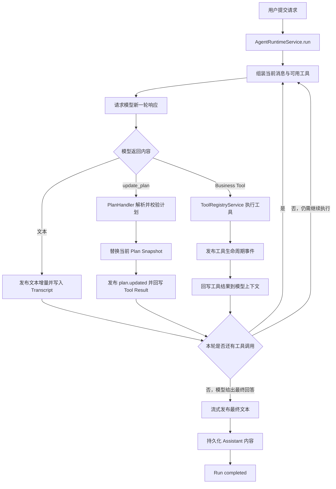

# K4 Agent Task Semantics：Codex 风格 Plan and Execute 实施方案

## 1. 目标与原则

目标是让复杂任务自动拆分为可执行步骤，并让用户实时看到计划和进度。计划是 Agent Loop 的控制工具和 UI 投影，不构建独立的强一致任务执行系统。

- 模型自主判断任务是否需要计划；
- 计划只使用一个 `update_plan` 工具创建或整体更新；
- 计划工具、Business Tool 和文本属于同一 Agent Loop；
- 计划更新不改变工具顺序，不阻塞后续工具；
- 服务端维护唯一 Plan Snapshot，前端只消费服务端投影；
- 最终回答由普通 Agent Loop 自然产生并继续流式输出；
- 计划不参与最终完成条件判断。

## 2. Codex 实现参考

### 2.1 Planning Prompt

Prompt 只提供使用建议：简单任务直接回答；多步骤、耗时较长或需要多个工具的任务使用计划；计划保持简洁；同一时间最多一个步骤处于 `in_progress`；执行过程中根据实际进展更新计划；所有工作完成后将步骤标记为 `completed`，然后回答用户。

Prompt 不保存计划、不验证工具结果、不决定 Run 是否完成。

### 2.2 Plan Tool Spec

Codex 的 `update_plan` 参数是完整计划快照：

```json
{
  "explanation": "可选的计划变更说明",
  "plan": [
    { "step": "收集数据", "status": "in_progress" },
    { "step": "整理结论", "status": "pending" }
  ]
}
```

每个步骤只有 `step` 和 `status`，状态为 `pending`、`in_progress`、`completed`。不使用任务 ID、版本 CAS、观察证据或完成闸门；每次调用直接替换旧快照。

### 2.3 Plan Handler

Handler 解析 JSON、校验计划结构、发送 `PlanUpdate` 事件并返回普通成功 Tool Result。它不执行 Business Tool，也不根据计划状态强制模型行为。

### 2.4 Agent Loop 与 UI

计划调用完成后，Agent Loop 继续执行其他工具。App Server 转发计划更新事件，TUI/Web 根据最新快照渲染步骤。

### 2.5 Codex 已覆盖的核心边界

首版直接沿用 Codex 已验证的以下边界语义：

- 简单任务不强制创建计划，由模型自主判断是否需要 `update_plan`；
- 每次调用提交完整计划快照，后一次合法更新替换前一次；
- `update_plan` 是普通内置控制工具，可以和文本、Business Tool 出现在同一 Agent Loop；
- 计划更新只产生结构化 Plan Update 事件，不从自然语言推断步骤状态；
- 步骤状态仅使用 `pending`、`in_progress`、`completed`，同时最多一个步骤处于 `in_progress`；
- 计划工具失败作为 Tool Result 返回模型，Agent Loop 可以继续执行；
- 计划不会阻塞最终回答，模型完成工作后自然输出最终文本。

以上边界分别对应 Codex 的 [Planning Prompt](https://github.com/openai/codex/blob/main/codex-rs/core/gpt_5_2_prompt.md#planning)、[Plan Tool Spec](https://github.com/openai/codex/blob/main/codex-rs/core/src/tools/handlers/plan_spec.rs)、[Plan Handler](https://github.com/openai/codex/blob/main/codex-rs/core/src/tools/handlers/plan.rs) 和 [TUI Plan Update](https://github.com/openai/codex/blob/main/codex-rs/tui/src/chatwidget/turn_runtime.rs) 实现。

## 3. 项目接入架构

复用现有 `AgentRuntimeService`、`ModelAdapter`、`ToolRegistryService`、`ChatService`、`RunExecutor`、`RunEventHub`、`RunRepository`、SSE 和前端 Workbench。

```text
ModelAdapter
    ↓
AgentRuntimeService
    ├─ Business Tool → ToolRegistryService
    └─ update_plan   → PlanHandler
                          ↓
                     plan.updated
                          ↓
             RunEventHub + RunSnapshot
                          ↓
                 ChatService / Web UI
```

## 4. 已确认的首版决策

1. `update_plan` 不注册为 Business Tool，由 `AgentRuntimeService` 注入内置工具定义并交给 `PlanHandler` 处理；不进入普通工具审批和业务工具配额。
2. 计划不作为对话中的独立用户可见事件，不生成普通工具卡片；服务端仍发布内部计划投影事件，用于更新 Run Snapshot 和步骤浮标。
3. `RunSnapshot.plan` 写入现有 assistant metadata，复用当前 Run Snapshot 持久化和刷新恢复链路，不新增数据库表。
4. assistant Tool Call 和 Tool Result 只保留在模型上下文与 Transcript 中，前端只展示步骤浮标和悬浮信息，不把 `update_plan` 当作普通 Business Tool 展示。
5. `update_plan` 参数定义遵循 Codex 的宽松 Function Schema（`strict: false`）：`plan` 必填，`explanation` 可选，步骤字段和状态做基本校验，未知字段不参与计划投影。

计划浮标是首版唯一的用户可见计划入口：默认显示“第 N / M 步”，鼠标悬停后展示完整步骤及状态。

## 5. 协议设计

### 5.1 Plan 类型

在 `packages/agent-protocol` 中定义：

```ts
type PlanStepStatus = 'pending' | 'in_progress' | 'completed';

type PlanStep = {
  step: string;
  status: PlanStepStatus;
};

type PlanSnapshot = {
  explanation?: string;
  plan: PlanStep[];
};
```

`RunSnapshot` 增加可选字段 `plan?: PlanSnapshot`，普通 Run 不设置该字段。

### 5.2 update_plan Schema

```ts
const updatePlanInputSchema = z.object({
  explanation: z.string().trim().min(1).optional(),
  plan: z.array(
    z
      .object({
        step: z.string().trim().min(1),
        status: z.enum(['pending', 'in_progress', 'completed']),
      })
      .strict(),
  ),
});
```

业务校验要求：最多一个 `in_progress`；步骤数量、单步文本和计划 JSON 大小受配置限制；不要求步骤 ID 或文本唯一；`plan: []` 表示清除当前计划。

### 5.3 计划事件

```ts
type PlanUpdatedEvent = {
  type: 'plan.updated';
  explanation?: string;
  plan: PlanStep[];
  roundId: string;
  roundSequence: number;
  blockSequence: number;
};
```

模型上下文仍保留 assistant Tool Call 和 Tool Result；`plan.updated` 只作为服务端到前端的内部投影事件，不生成对话消息或普通工具卡片。

## 6. Runtime 设计

### 5.1 工具注入

将 `update_plan` 作为内置控制工具加入模型请求工具列表，是否启用由配置控制，默认开启。不根据用户措辞、首轮内容或正则表达式强制调用。

### 5.2 统一调度

按 Provider 返回的 `blockSequence/providerIndex` 顺序处理：`update_plan` 进入 PlanHandler，其他工具进入 `ToolRegistryService`，文本按现有增量事件输出。

同一轮允许出现文本、`update_plan` 和 Business Tool。不重新排序、不延迟文本、不关闭其他工具，不改变当前工具轮流式策略。

### 5.3 PlanHandler 成功路径

解析原始参数 → Schema 和业务校验 → 用新快照替换当前 Run Plan → 更新 Live Snapshot → 发布 `plan.updated` → 返回 `{ status: 'updated' }` → 进入下一轮。

### 5.4 PlanHandler 失败路径

参数错误作为工具业务错误反馈模型：

```text
update_plan → 校验失败 → tool.failed → Tool Message → 下一轮 Agent Loop
```

步骤超限、多个 `in_progress`、字段类型错误、未知字段和文本超长不直接终止 Run。取消、EventHub/持久化失败或 Runtime 内部异常才进入 Run 级错误处理。

## 7. Plan Context

模型下一轮只接收一份最新 Plan Context：

```text
当前计划（只读）：
1. 收集数据 - completed
2. 比较指标 - in_progress
3. 输出结论 - pending
```

首次计划更新时追加 Context，后续更新替换同一条 Context；不追加历史版本；清除计划时移除或更新为空计划；计划和 Context 始终受大小与 Token 预算限制；上下文压缩时保留最新计划。

## 8. Run Snapshot 与持久化

不新增 Prisma 表或 migration。将计划写入现有 assistant metadata/Snapshot：

```ts
AssistantAgentMetadata.plan?: PlanSnapshot;
```

`RunRepository.snapshot()` 从 metadata 返回 `RunSnapshot.plan`。`plan.updated`、工具终态、`message.completed` 和 Run 终态触发 Checkpoint。更新时先替换 `active.liveSnapshot.plan`，再发布和持久化，避免旧对象引用。

不引入 Plan 级 CAS；依赖现有 Run Executor 单所有者和 Run 级持久化机制。计划更新是完整快照替换，最后一次合法更新覆盖旧计划。

## 9. EventHub、API 与 Transcript

`RunEventHub` 为 `plan.updated` 增加 Snapshot reducer：

```text
plan.updated → snapshot.plan = payload → 分配序号 → 写 Tail → 广播 SSE
```

重连和 Tail Replay 必须保持计划事件顺序。`ChatService` 转发内部 `plan.updated` 投影，计划不进入对话文本、搜索结果、来源或报告投影。

assistant Transcript 保留 assistant 文本、`update_plan` Tool Call 和 Tool Result；计划事件不被当作搜索工具处理。

## 10. 前端 Plan Workbench

`WorkbenchState` 增加 `plan?: PlanSnapshot`。前端只消费服务端 Snapshot，不从文本、Business Tool 结果或本地计数推断状态。

Workbench 展示计划说明、步骤列表、步骤状态、当前步骤和更新时间。收到 `plan.updated` 后只替换计划投影，不回滚对话文本和 Tool Activity。

步骤浮标规则：有计划且未全部完成时显示“第 N / M 步”；点击展开详情；点击外部区域关闭；计划清除、全部完成或 Run 终态后隐藏；刷新从 `RunSnapshot.plan` 恢复。

建议隐藏条件：

```ts
plan === undefined ||
  plan.plan.length === 0 ||
  run.status in ['completed', 'failed', 'cancelled'] ||
  plan.plan.every((step) => step.status === 'completed');
```

## 11. Prompt 设计

```text
当任务包含多个相互依赖的步骤、需要多次工具调用或预计需要较长调查时，可以使用 update_plan 创建简洁计划。

简单问题不要创建计划。计划由少量清晰步骤组成，每个步骤只能处于 pending、in_progress 或 completed 状态，同时最多一个步骤处于 in_progress。

执行过程中根据实际进展更新计划。计划更新、普通工具和文本可以出现在同一轮。

计划用于展示工作进度，不替代工具结果，也不替代最终回答。所有工作完成后将步骤标记为 completed，然后直接输出最终回答。
```

## 12. 边界处理

- 模型不调用 `update_plan` 时保持普通 Agent Loop，不创建计划、不查询计划、不显示 Workbench；
- 允许多次提交完整计划，每次替换旧快照，不保存历史版本；
- 计划和 Business Tool 同轮时严格按模型原始顺序处理；
- 计划参数失败写入 `tool.failed` 和 Tool Message，下一轮可修正；
- 取消后不执行尚未开始的调用，Run 进入 `cancelled`；
- 模型、数据库或 EventHub 异常进入 `failed`；
- 最终回答不依赖计划状态，模型无更多工具调用时按现有逻辑流式输出。

## 13. 分阶段实施

### 阶段一：协议和定义

修改 `packages/agent-protocol`：新增 Plan 类型、Schema、`plan.updated` 事件和可选 `RunSnapshot.plan`。

### 阶段二：Runtime 和 Handler

修改 `apps/api/src/agent-runtime`：新增 PlanHandler，注入工具定义，统一参数解析和错误回写，维护单份 Plan Context。

### 阶段三：Snapshot 和 API

修改 `RunEventHub`、`RunExecutor`、`RunRepository`、`ChatService`：实现计划事件发布、Snapshot 持久化、SSE 转发、刷新恢复和 Transcript 保留。

### 阶段四：Web 投影

修改 `apps/web` 的状态模型、事件 reducer、Workbench 和样式，实现计划详情、步骤浮标、展开/关闭和终态隐藏。

## 14. 测试与验收

### Protocol

覆盖合法/非法参数、未知字段、非法状态、多个 `in_progress`、大小限制、`plan.updated` Schema、可选 Snapshot 字段和普通 Run 旁路。

### Runtime

覆盖模型主动创建计划、计划后继续 Business Tool、文本与计划同轮、多调用原始顺序、计划失败后继续、多次更新替换快照，以及工具轮和最终回答流式行为不变。

### Repository/API

覆盖计划事件更新 Live Snapshot、Checkpoint 后刷新恢复、Tail Replay 顺序、取消/失败 Run 和普通 Run 不产生计划字段。

### Web

覆盖计划步骤展示、当前状态、浮标展开/关闭、全部完成和 Run 终态隐藏、刷新恢复及事件顺序稳定。

### 低成本 E2E

1. 多步骤股票研究：自然触发 `update_plan`、调用搜索工具并展示步骤；
2. 计划参数一次失败后修正，确认 Agent Loop 能继续；
3. 计划生成后刷新页面，确认 Snapshot 恢复并正常完成最终回答。

## 15. Agent Runtime 核心流程图



核心时序可以概括为：

```text
用户请求
  → AgentRuntimeService 请求模型
  → 模型自主选择文本、update_plan 或 Business Tool
  → update_plan 更新 Plan Snapshot
  → Business Tool 执行并回写结果
  → 继续下一轮 Agent Loop
  → 无更多工具调用时流式输出最终回答
  → 持久化并结束 Run
```

## 16. 验收结果

```text
复杂用户请求
  → 模型自主调用 update_plan
  → 服务端发布 plan.updated
  → Web 展示计划和当前步骤
  → Agent Loop 继续调用 Business Tool
  → 模型按进展更新计划
  → 步骤逐渐变为 completed
  → Agent Loop 自然输出最终回答
  → 最终回答保持流式
  → Run 结束后计划浮标隐藏
```
