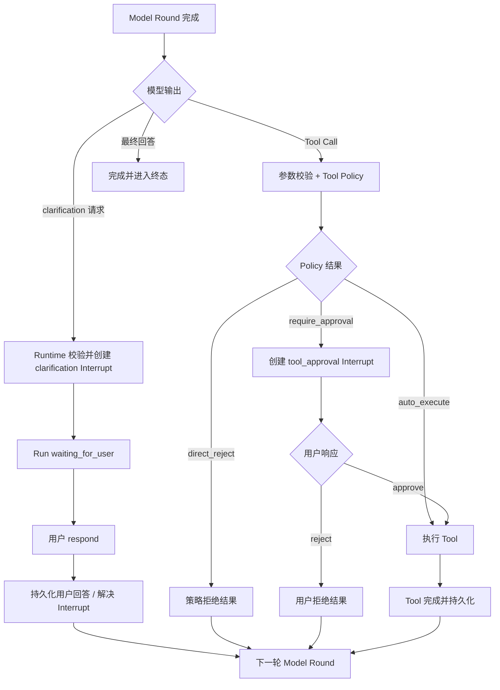

# Clarification & Tool Approval

> 阶段：K3.2 Release Control & Hardening
>
> 状态：方案冻结，尚未实现。
>
> 本阶段建立两条基于 K3.1 Interrupt & Resume Control Plane 的完整路径：模型请求用户澄清，以及 Runtime 在 Tool Dispatch 前请求用户批准。两者共用 Interrupt 的持久化和恢复机制，但响应语义与后续执行路径不同。

## 1. 本阶段目标

本阶段完成：

```text
clarification Interrupt
→ respond
→ 下一轮 Model Round
```

以及：

```text
tool_approval Interrupt
→ approve / reject
```

具体目标：

- 模型可以在信息不足或任务存在歧义时提出结构化 clarification 请求；
- Runtime 校验请求并创建持久化 `clarification` Interrupt；
- Run 进入 `waiting_for_user`，客户端可以观察等待原因；
- 用户回答以 `respond` 解决 Interrupt，并进入下一轮 Model Round；
- Runtime 根据受信任的 Tool Policy 判断 Tool 是否需要审批；
- 审批前不执行 Tool；
- `approve` 直接执行原始 Tool Call；
- `reject` 不执行 Tool，生成结构化拒绝结果，再进入下一轮 Model Round；
- 两条路径都兼容 Snapshot、Checkpoint、Event Tail、SSE cursor 和恢复；
- 重复响应、过期响应和并发响应具有确定性结果。

## 2. 本阶段不做什么

本阶段不实现：

- `edit` Tool 参数；
- 用户修改 Tool 参数后的重新校验和风险升级；
- 复杂的 Tool 风险分级、用户权限和审批策略管理；
- Tool 执行中的 pause/resume；
- 多人审批、审批转交和审批超时策略的完整产品化；
- 通用 `steer` 完整能力；
- Provider fallback、熔断和其他 K3 Release Hardening 项目。

Tool 的静态审批元数据可以作为受信任 Policy 的输入，但本阶段只要求 Runtime 能确定地得到三种结果：

```text
auto_execute
require_approval
direct_reject
```

## 3. 统一 Interrupt 模型

两类 Interrupt 共用同一套生命周期：

```text
pending
→ resolved
→ cancelled / expired（如后续启用）
```

但每个 Interrupt 只允许自己的响应类型：

```text
clarification
  allowed response: respond

tool_approval
  allowed response: approve | reject
```

Runtime 创建 Interrupt，模型或用户不能直接改变 Run 状态。模型只能提出 clarification 意图；Runtime 根据 Tool Policy 决定是否创建 approval Interrupt。

## 4. Clarification 路径

### 4.1 触发

在 Model Round 完成后，模型可以返回结构化 clarification 请求。请求至少包含：

- 面向用户的问题；
- 需要补充的信息说明；
- 当前任务或缺失条件的稳定标识；
- 可选的选项列表；
- 是否允许自由文本回答。

模型表达的是：

```text
我需要更多信息才能继续
```

真正的 Interrupt 由 Runtime 创建：

```text
Model Round 完成
→ 校验 clarification 请求
→ 创建 clarification Interrupt
→ 持久化当前 Round 和等待信息
→ Run 进入 waiting_for_user
```

如果 clarification 请求结构非法、问题为空或超过限制，Runtime 不创建 Interrupt，而是按模型协议错误处理。

### 4.2 用户响应

用户使用 `respond` 解决对应的 clarification Interrupt：

```text
clarification Interrupt
→ 用户提交 respond
→ Runtime 校验 interruptId、状态和响应格式
→ Interrupt 标记 resolved
→ 保存用户回答
→ 下一轮 Model Round
```

用户回答是新的任务语义，不能直接当作 Tool 参数执行。它必须进入下一轮 Context，让模型重新判断下一步。

### 4.3 Clarification 的上下文事实

至少保留三项事实：

```text
模型提出的问题
用户最终回答
该回答解决了哪个 clarification Interrupt
```

上一轮已经提交的 Model Round 不重复调用。下一轮模型输入应能区分：

```text
assistant clarification request
user clarification response
```

如果底层模型协议要求闭合结构，也可以由 Runtime 生成内部的 clarification result；但产品和事实层必须保留用户回答的原始来源，不能把它伪装成普通 Tool 执行结果。

### 4.4 多轮 clarification

本阶段允许模型在用户回答后再次提出 clarification，但每次只能有一个当前 pending clarification：

```text
Round N
→ clarification A
→ respond A
→ Round N+1
→ clarification B（如果仍然缺信息）
```

不在本阶段实现多个并行问题、问题依赖图或复杂表单编排。

## 5. Tool Approval 路径

### 5.1 触发

Tool Call 产生后，Runtime 在 `Tool Dispatch 前`进行控制仲裁：

```text
Model Round 完成
→ Tool Call 参数校验
→ 读取受信任 Tool Policy
→ 得到 auto_execute / require_approval / direct_reject
```

只有 `require_approval` 创建 `tool_approval` Interrupt：

```text
Tool Call
→ tool_approval Interrupt
→ 持久化待执行 Tool Call
→ Run 进入等待状态
```

Tool 在 Interrupt 解决前不得执行。

### 5.2 approve

```text
tool_approval Interrupt
→ 用户 approve
→ Runtime 原子解决 Interrupt
→ 直接执行原始 Tool Call
→ Tool Result 完成并持久化
→ 下一轮 Model Round
```

`approve` 不先重新调用模型，因为模型已经完成了当前 Tool 决策，用户只是在批准该动作。

### 5.3 reject

```text
tool_approval Interrupt
→ 用户 reject
→ Runtime 原子解决 Interrupt
→ Tool 不执行
→ 生成结构化拒绝结果
→ 下一轮 Model Round
```

拒绝结果至少需要表达：

```text
executed: false
status: rejected
reason: user_rejected
```

拒绝不是 Runtime 直接结束 Run。下一轮模型应看到拒绝事实，并自行决定换方案、继续提问、使用其他 Tool 或受限交付。

### 5.4 direct_reject

违反权限、安全或网络边界的 Tool Call 不创建审批 Interrupt：

```text
Tool Call
→ Runtime Policy 判定 direct_reject
→ Tool 不执行
→ 生成策略拒绝结果
→ 下一轮 Model Round
```

`direct_reject` 与用户 `reject` 必须区分：

```text
user_rejected
  用户不批准一个本来可以请求批准的动作

policy_rejected
  动作本身不在允许范围内，不应交给用户绕过策略
```

## 6. 两条路径的差异

| 项目 | clarification | tool approval |
| --- | --- | --- |
| 谁提出 | Model 提出语义请求 | Runtime 根据 Policy 触发 |
| 等待原因 | 信息不足或任务歧义 | Tool 不应自动执行 |
| 允许响应 | `respond` | `approve` / `reject` |
| 响应后第一步 | 下一轮 Model Round | approve 先执行 Tool；reject 生成拒绝结果 |
| 是否执行 Tool | 否 | approve 执行，reject 不执行 |
| 用户输入性质 | 新任务语义 | 对既定动作的许可决定 |
| 主要安全边界 | Model Round 完成 | Tool Dispatch 前 |

两者共用：

```text
Interrupt 创建
→ 持久化
→ Run 等待
→ 响应幂等校验
→ 状态和事件恢复
```

## 7. 状态与竞态原则

### 7.1 单一 pending Interrupt

本阶段一个 Run 同时只允许一个需要用户响应的 pending Interrupt。这样可以避免 clarification 和 tool approval 同时等待，降低客户端和恢复语义复杂度。

### 7.2 响应幂等

- 同一 `interruptId + idempotencyKey + payload` 重复响应，返回同一结果；
- 同一幂等键但 payload 不同，返回冲突；
- 已解决 Interrupt 的重复响应不得再次执行 Tool 或再次进入 Model；
- 已取消、过期或 Terminal Run 的 Interrupt 不可解决。

### 7.3 控制竞态

如果 Tool approval 尚未解决时收到新的用户 Steer，本阶段只要求 Runtime 保持确定性：

- 未执行 Tool 不得因 Steer 被偷偷执行；
- 后续完整 Steer 语义实现可以将当前 Tool 标记为 `superseded`；
- approval Interrupt 不能与已经 superseded 的 Tool 再次产生执行竞态。

本阶段不要求完成全部 Steer 交互，只保留清晰的安全边界。

## 8. 推荐流程图



## 9. 验收重点

### Clarification

- 模型提出合法 clarification 后，Run 进入 `waiting_for_user`；
- 页面刷新或 SSE 重连后仍能看到待回答问题；
- `respond` 后只启动下一轮 Model，不重复上一轮 Model Round；
- 用户回答进入下一轮 Context 并保留来源；
- 重复响应不重复推进 Run；
- 模型可以在回答后继续提出下一次 clarification。

### Tool Approval

- 需要审批的 Tool 在用户决定前不会执行；
- `approve` 不重新调用模型，直接执行原 Tool；
- `reject` 不执行 Tool，下一轮模型能看到结构化拒绝结果；
- `direct_reject` 不创建审批，不给用户绕过安全策略的入口；
- 重复 approve 不重复执行 Tool；
- Tool Result 持久化后，恢复不会重复执行成功 Tool。

## 10. 与后续阶段的关系

```text
K3.1 Interrupt & Resume Kernel
  → K3.2 Clarification & Tool Approval（本文）
  → K3.3 Steer
  → K3.4 Pause / Cancel / Retry Hardening
  → K5 Human-in-the-loop & Side-effect Control
```

本阶段验证统一 Interrupt 机制能同时承载“用户补充语义”和“用户批准动作”两种不同恢复路径。后续阶段再扩展 `edit`、复杂审批策略、Steer 竞态、审批超时和完整副作用控制。

## 11. 待继续讨论的问题

以下问题已识别，但不在今晚继续做结论；明天继续讨论后再更新方案：

### 11.1 Clarification 的模型输出协议

需要决定模型如何稳定表达“信息不足、需要用户澄清”：

- 独立的结构化 clarification 输出；
- 还是特殊的 clarification Tool Call；
- 多模型、不同 Provider 的兼容方式；
- 非法、空问题、过长问题和模型同时输出文本/Tool/clarification 时如何处理。

### 11.2 Clarification 触发条件

需要明确什么情况下值得打断用户，而不是让模型基于合理假设继续：

- 如何避免 Agent 过度追问；
- 哪些缺失信息属于必须澄清；
- 是否允许系统默认值或低风险假设；
- 是否需要限制连续 clarification 次数。

### 11.3 `approve` 到 Tool Dispatch 的崩溃一致性

需要继续定义用户批准和真正执行 Tool 之间的持久化边界：

```text
approve 已提交
→ Tool 尚未开始
→ 进程在中间崩溃
```

必须避免“批准但永远不执行”和“恢复后重复执行”两种结果，并明确 Interrupt、Tool Step、dispatch intent 与幂等键之间的关系。

### 11.4 `reject` 结果的协议身份

需要决定拒绝结果是：

- 特殊的 Tool Result；
- 独立的控制结果；
- 还是带有明确 `outcomeType = rejected_by_user` 的 canonical Tool Message。

目标是让模型不会把“用户拒绝”误判成“Tool 网络失败”，同时保持后续 Provider Tool Transcript 的完整性。

### 11.5 `respond` 与 `steer` 的重叠输入

用户可能在回答 clarification 的同时改变任务方向，例如既回答问题又要求停止当前搜索。需要决定：

- 当前有 pending clarification 时是否统一视为 `respond`；
- 是否允许一条响应同时包含回答和 Steer；
- 如何在事实历史中区分用户回答与控制意图；
- 哪种输入优先影响下一轮 Context。

### 11.6 单一 pending Interrupt 的阶段性限制

当前方案限制一个 Run 同时只有一个 pending Interrupt。需要评估这对以下场景的影响：

- 并行 Tool Call 同时需要审批；
- 多个用户问题的批量澄清；
- 后续 Delegation 或并行 Worker；
- 是保持单一 Interrupt，还是将多个等待项打包成一个 Interrupt。

### 11.7 `waiting_for_user` 与 Interrupt Kind 的分层

需要继续确认状态和语义的职责边界：

```text
Run.status = waiting_for_user
Interrupt.kind = clarification | tool_approval
```

Run Status 负责生命周期，Interrupt Kind 负责等待原因；前端、Snapshot、恢复和审计都不能只依赖其中一层。

### 11.8 本阶段定位

当前 K3.2 应被视为两个纵向切片验证统一 Interrupt/Resolution 内核，而不是最终的 Human-in-the-loop 抽象。未来的 `edit`、批量审批、并行等待、审批超时、复杂权限和完整副作用控制，必须在后续阶段重新评估，不能自动从本阶段约束推导出来。
