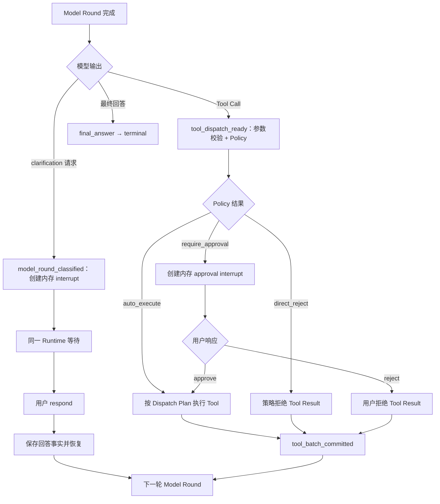
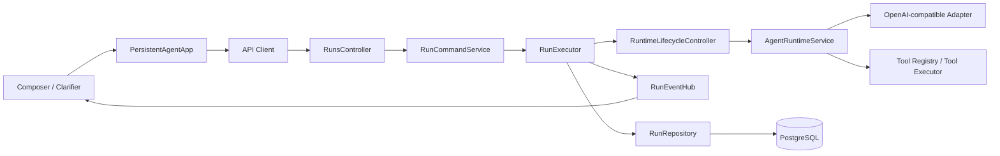
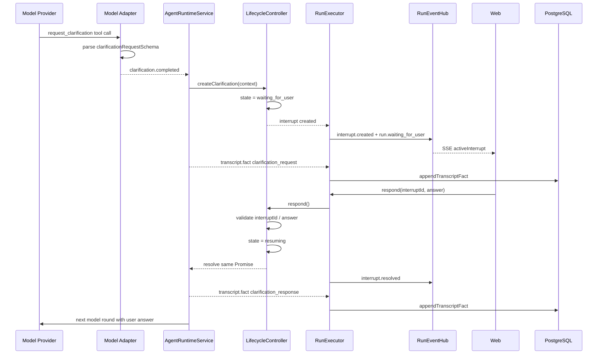
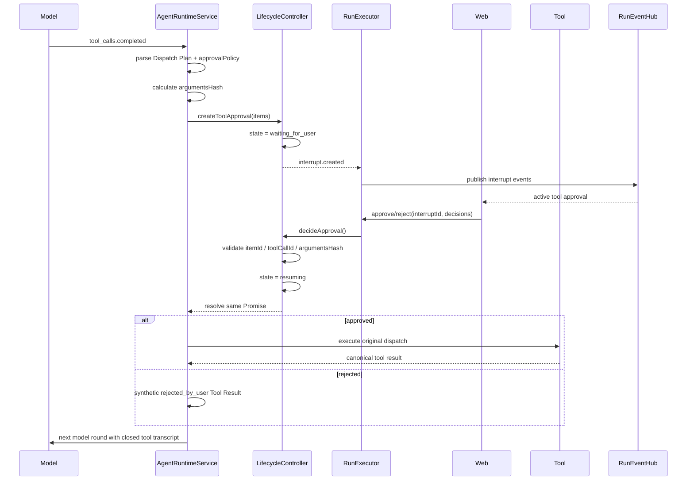

# Clarification & Tool Approval

> Implementation status: implemented in protocol `0.13.0` (2026-08-21). HITL waits are in-process only; clarification facts use the transcript enum migration and tool-control outcomes use existing transcript metadata. Steer, durable Interrupt state, and restart recovery remain out of scope.

> 阶段：K3.2 Release Control & Hardening
>
> 状态：已实现并完成验证（2026-08-21）。
>
> 本阶段在 K3.1 Runtime Lifecycle 的进程内安全边界上增加两条业务路径：模型请求用户澄清，以及 Runtime 在 Tool Dispatch 前请求用户批准。Interrupt 是当前 API 进程内的等待对象，不新增控制面数据库表、字段或迁移；是否需要跨进程恢复的持久化 Control Plane，另行作为后续方案冻结。
>
> 范围：K3.2 只实现 HITL，不实现 Steer 或 Follow-up Queue；后两者属于 K3.3。

## 1. 本阶段目标

```text
clarification request
→ 进程内 clarification interrupt
→ respond
→ 同一个 Runtime Promise 恢复
→ 下一轮 Model Round
```

```text
tool_dispatch_ready
→ 进程内 tool_approval interrupt
→ approve / reject
→ 同一个 Runtime Promise 恢复
```

具体目标：

- 模型可以在信息不足或任务存在歧义时提出结构化 clarification 请求；
- Runtime 校验请求，并在 `model_round_classified` 边界创建进程内等待；
- 用户回答作为正式语义事实保存，再进入下一轮 Model Round；
- Runtime 根据受信任的 Tool Policy 判断 Tool 是否需要审批；
- 审批前不执行 Tool；
- `approve` 不重新调用模型，恢复原 Dispatch Plan 后执行；
- `reject` 不执行 Tool，生成结构化拒绝结果，再进入下一轮 Model Round；
- 两条路径都保持 K3.1 的 Transcript 闭合、Tool 顺序和生命周期事件顺序。

本阶段不承诺服务重启、页面刷新、多实例切换后的等待恢复。等待期间数据库中的 Run 仍保持已有 `running` 状态；不新增 `waiting_for_user`、`paused` 或其他数据库状态。

## 2. 本阶段不做什么

本阶段不实现：

- `edit` Tool 参数；
- 复杂的 Tool 风险分级、用户权限和审批策略管理；
- Tool 执行中的 pause/resume；
- 多人审批、审批转交和审批超时策略的完整产品化；
- Steer 和 Follow-up Queue（属于 K3.3）；
- Provider fallback、熔断和其他后续 Reliability Backlog 项目；
- 持久化 Interrupt Envelope、Checkpoint、Resume Command、幂等键或跨进程恢复。

Tool 的静态审批元数据可以作为受信任 Policy 的输入，但本阶段只要求 Runtime 能确定地得到：

```text
auto_execute
require_approval
direct_reject
```

## 3. K3.1 当前底座约束

- 每个执行中的 Run 只有一个 `RuntimeLifecycleController`，由同进程 Registry 管理。
- Interrupt、等待 Promise、控制状态和当前阶段只存在内存；Resume 必须命中该 Runtime。
- `model_round_classified` 是 clarification 的挂载点，`tool_dispatch_ready` 是 approval 的挂载点。
- `tool_batch_committed` 只在全部 Tool Result、Transcript 和 Projection 完成后到达。
- Hook 只能读取强类型 Context、等待或返回控制结果；不能直接调用模型、执行 Tool、修改 Transcript/Projection 或广播 SSE。
- Runtime 是唯一推进 Loop 的主体；用户响应只唤醒原 Runtime，不创建新的 Executor，不重新调用模型，也不重复执行已经完成的 Tool。
- 用户回答、审批决定、Tool Control Outcome 和 Tool Result 仍按现有事实层规则持久化；这与不持久化等待控制对象不同。
- 服务重启或 Runtime 被释放后，未完成的进程内等待不会恢复。若产品未来需要跨进程恢复，再单独设计 durable Interrupt/Checkpoint/Command。

## 4. 统一 Interrupt 模型

两类 Interrupt 共用内存生命周期：

```text
pending → resolved | cancelled | expired
```

当前 K3.2 使用 `pending → resolved` 和终态取消；`expired` 只有明确超时策略后才能产生。K3.3 如果需要 `superseded`，应在 Steer 方案中另行定义，不属于本协议。

每个 Interrupt 只允许自己的响应类型：

```text
clarification
  allowed response: respond

tool_approval
  allowed response: approve | reject
```

Runtime 创建并持有 Interrupt；模型只能提出 clarification 意图，用户不能直接改变 Run 状态；Runtime Policy 决定是否创建 approval interrupt。

一个 Run 同时最多只有一个 pending Interrupt。创建 pending interrupt 时，Runtime 在相应生命周期边界暂停同一个执行 Promise，但不改变数据库 Run 状态或创建新的可调度 Step。

## 5. Clarification 路径

### 5.1 触发

Model Round 完成后，模型可以返回结构化 clarification 请求。请求至少包含：

- 面向用户的问题；
- 可选的选项列表；
- 是否允许自由文本回答。

模型表达的是“我需要更多信息才能继续”，真正的等待由 Runtime 在边界中创建：

```text
model_round_classified (clarification)
→ 校验请求
→ 创建进程内 clarification interrupt
→ await RuntimeLifecycleController
```

此时 Model Round 已完整提交，数据库 Run 仍为 `running`，不写入 `waiting_for_user`。校验要求：`question` 去除空白后非空且不超过配置上限；`options` 中每项非空、互不重复且数量不超过配置上限；`allowFreeText = false` 时必须至少提供一个 option。校验失败时不创建 Interrupt，按模型协议错误处理。

### 5.2 用户响应

用户使用 `respond` 唤醒当前 clarification interrupt：

```text
clarification interrupt
→ 校验 interruptId、状态和响应格式
→ 保存用户 clarification response 事实
→ resolve 当前等待 Promise
→ before_model_request
```

`respond` 内容去除空白后必须非空；`allowFreeText = false` 时，回答必须引用当前 Interrupt 提供的合法 option。响应校验失败不能解决 Interrupt。

用户回答是新的任务语义，不能直接当作 Tool 参数执行。它必须进入下一轮 Context，让模型重新判断下一步；上一轮 Model Round 不重复调用。

### 5.3 Clarification 的上下文事实

至少保留三项事实：

```text
模型提出的问题
用户最终回答
该回答解决了哪个 clarification interrupt
```

Provider Context 应能区分：

```text
assistant clarification request
user clarification response
```

如果底层模型协议要求闭合结构，Runtime 可以生成内部 clarification result；产品和事实层必须保留用户回答的原始来源，不能伪装成普通 Tool 执行结果。

本阶段允许用户回答后再次澄清，但每次只能有一个当前 pending clarification：

```text
Round N → clarification A → respond A → Round N+1 → clarification B
```

## 6. Tool Approval 路径

### 6.1 触发与等待

在 `tool_dispatch_ready` 前逐项进行控制仲裁：

```text
Model Round 完成
→ Tool Call 参数校验
→ 读取受信任 Tool Policy
→ auto_execute / require_approval / direct_reject
```

只要存在 `require_approval`，当前 Dispatch Plan 进入进程内 `tool_approval` interrupt：

```text
tool_dispatch_ready
→ 创建 tool_approval interrupt
→ await RuntimeLifecycleController
```

Tool 在 Interrupt 解决前不得执行，也不得发起下一轮模型。等待不创建 queued Tool Step，不写入 `waiting_for_user`。

同一 Model Round 混合出现三种 Policy 结果时采用批次屏障：所有 Tool Call 暂不 Dispatch；approval interrupt 解决后，`auto_execute` 与 approved 项按原顺序执行，rejected 与 `direct_reject` 项生成各自控制结果。

Approval 项绑定不可变的 `itemId`、`toolCallId`、Tool 名称、canonical 参数和 `argumentsHash`。这些值由当前 Runtime 保存并在响应时校验，防止执行被替换或修改的调用；它们不是当前控制面数据库约束。

### 6.2 approve

```text
tool_approval interrupt
→ 用户提交 approve
→ 校验完整决策
→ resolve 当前等待 Promise
→ 恢复原 Dispatch Plan
→ 按原顺序执行 approved/auto_execute Tool
→ tool_batch_committed
→ 下一轮 Model Round
```

`approve` 不重新调用模型。已经完成的 Tool 不重复执行；当前 Model Round 的 `assistant(tool_calls)` 必须与每个 Tool Call 对应的 Tool Message 一一配对。

### 6.3 reject

```text
tool_approval interrupt
→ 用户提交 reject
→ resolve 当前等待 Promise
→ Tool 不执行
→ 生成 synthetic canonical Tool Result
→ tool_batch_committed
→ 下一轮 Model Round
```

拒绝结果至少表达：

```text
type: tool_control_outcome
toolCallId: string
executed: false
outcomeType: rejected_by_user
retryable: false
```

事实层可同时保存独立 `ToolControlOutcome`，Provider Context 必须投影为匹配原 `toolCallId` 的 Tool Message，保持 Transcript 闭合。拒绝不是 Runtime 直接结束 Run；下一轮模型应看到拒绝事实并自行决定下一步。

### 6.4 direct_reject

违反权限、安全或网络边界的 Tool Call 不创建 approval interrupt：

```text
Tool Call → Policy direct_reject → synthetic canonical Tool Result → 下一轮 Model Round
```

`rejected_by_user` 与 `rejected_by_policy` 必须保持不同语义；策略拒绝不能交给用户绕过。

## 7. 响应与竞态原则

### 7.1 单一等待点

一个 Run 同时最多一个 pending Interrupt。已有 clarification 或 approval 等待时，只接受该 Interrupt 允许的响应类型或 Cancel；普通聊天输入、Queue 或其他控制命令不能解决 Interrupt，也不能触发待审批 Tool。

### 7.2 响应幂等（进程内）

当前不提供持久化幂等键。Runtime 对同一个 pending interrupt 的重复响应、错误响应或响应竞态，按内存状态返回明确冲突；已 resolved 的重复响应不得再次执行 Tool 或再次进入 Model。若网络重试需要跨请求稳定幂等，需在后续持久化 Control Plane 中增加 command identity 和幂等记录。

### 7.3 Cancel 与等待竞态

Cancel 复用 K3.1 AbortController，与生命周期等待共享唤醒路径。Cancel 获胜时，当前 Interrupt 变为 cancelled，Runtime 进入现有取消终态；Cancel 不执行 Resume，也不启动下一轮 Model。

## 8. 业务流程图



## 9. 验收重点

### Clarification

- 合法 clarification 在 `model_round_classified` 创建内存等待，数据库 Run 仍为 `running`；
- 等待期间不启动下一轮 Model；
- `respond` 后只启动下一轮 Model，不重复上一轮 Round；
- 用户回答进入下一轮 Context 并保留来源；
- 错误、重复或并发响应不会重复推进 Run；
- 模型可以在回答后继续提出下一次 clarification；
- 服务重启或 Runtime 不存在时明确返回不可恢复冲突，不尝试从数据库重建。

### Tool Approval

- 需要审批的 Tool 在用户决定前不会执行；
- `approve` 不重新调用模型，按原 Dispatch Plan 执行；
- `reject` 不执行 Tool，下一轮模型能看到 synthetic canonical Tool Result；
- `direct_reject` 不创建审批，不给用户绕过安全策略的入口；
- 混合 Policy 结果遵守批次屏障，等待期间没有 Tool 提前 Dispatch；
- 批量审批允许部分批准、部分拒绝，但缺失、重复、未知或摘要不匹配的决策整体拒绝；
- 重复 approve 不重复执行 Tool；
- Tool Result 持久化后，恢复同一 Runtime 不重复执行成功 Tool；
- `assistant(tool_calls)` 始终与全部 Tool Messages 闭合。

## 10. 与后续阶段的关系

```text
K3.1 Runtime Lifecycle
  → K3.2 Clarification & Tool Approval（本文）
  → K3.3 Steer & Follow-up Queue
  → K5 Human-in-the-loop & Side-effect Control
```

K3.2 只交付 clarification 与 tool approval 两条 HITL 路径，不把它们包装成持久化 Control Plane。K3.3 再讨论 Steer、supersede、队列和跨边界竞态；K5 负责风险分级、用户权限、复杂审批、完整审计和副作用治理。

## 11. 已冻结的业务结论

### 11.1 Clarification 协议

```ts
type ClarificationRequest = {
  type: 'clarification';
  question: string;
  options?: string[];
  allowFreeText: boolean;
};
```

Clarification 是独立结构化协议，不实现为 Tool Call。System Prompt 说明触发方式，Runtime 校验后创建 interrupt。Clarification 与 Tool Call、最终回答互斥；Transcript 使用专用 `clarification_request` / `clarification_response` 类型。Provider Adapter 在不支持自定义类型时投影为带稳定语义标记的 assistant/user 消息，但不转换为 Tool Message。

### 11.2 触发条件

仅当缺失信息会显著改变结果、成本或副作用，且无法从 Context 或可用 Tool 获得，也不存在安全、低成本、可逆的合理默认值时触发。提问前检查 Context，一次集中询问最少关键问题，不重复询问已回答内容。

### 11.3 Tool Control Outcome

```ts
type ToolControlOutcome = {
  type: 'tool_control_outcome';
  toolCallId: string;
  executed: false;
  outcomeType: 'rejected_by_user' | 'rejected_by_policy';
  reason?: string;
  retryable: false;
};
```

Runtime、审计和前端以独立控制事实为准；Provider Context 投影成匹配原 `toolCallId` 的 canonical Tool Message。未来 Steer 所需的 `superseded` 结果由 K3.3 自己定义，不能作为 K3.2 的当前协议值。

### 11.4 与 K3.3 的边界

K3.2 不定义或接受 Steer 命令。K3.3 设计 Steer 时不得让 pending approval 中的 Tool 绕过决策而执行；除此之外，Steer 的命令协议、优先级、仲裁批次、supersede 和前端交互均由 K3.3 独立冻结。

### 11.5 单一 pending Interrupt 的限制

Clarification 一次集中询问当前最少关键问题；同一安全边界的多个 Tool Approval 合并为一个内存 interrupt，每项具有稳定 `itemId`、`toolCallId`、canonical 参数和 `argumentsHash`。用户可以逐项 approve/reject，但响应必须完整覆盖全部项目；未知、遗漏或重复项目整体拒绝。多个独立 pending Envelope、分支恢复和多人审批不在本阶段范围内。

## 12. 未来持久化 Control Plane 的触发条件

只有当产品明确需要以下任一能力时，才重新设计并落库 Interrupt/Checkpoint/Command：

- 服务重启后继续等待并恢复；
- 多实例之间迁移 Runtime；
- 页面刷新后从数据库恢复完整 active interrupt；
- 跨请求稳定幂等、审计和事件回放；
- durable Tool Step、lease、execution_unknown 对账和至少一次副作用治理。

在此之前，K3.1 的生命周期控制器是唯一暂停/恢复权威，数据库只保存已经提交的业务事实，不保存进程内等待状态。

## 13. 实现映射与 Review Guide

本节将 K3.2 的业务语义映射到当前 Web、API、Runtime、SSE 和 Transcript 实现。设计稿中的状态展示不等于运行时会同时存在的状态；一个 Run 同时只有一个 active pending Interrupt。

### 13.1 端到端架构



实现位置：

| 责任 | 实现位置 |
| --- | --- |
| Clarifier 渲染和本地选择状态 | `apps/web/src/features/agent/components/conversation.tsx` |
| respond handler | `apps/web/src/app.tsx` 的 `handleClarificationResponse` |
| approve/reject handler | `apps/web/src/app.tsx` 的 `handleApprovalResponse` |
| Command schema/API 路由 | `apps/api/src/runs/runs.controller.ts`、`run-command.service.ts` |
| Interrupt Promise 和状态校验 | `apps/api/src/agent-runtime/runtime-lifecycle.ts` |
| Clarification / Approval 触发 | `apps/api/src/agent-runtime/agent-runtime.service.ts` |
| 中断事件和控制 Snapshot | `apps/api/src/runs/run.executor.ts`、`run-event-hub.ts` |
| Transcript facts / Tool outcome | `apps/api/src/runs/run.repository.ts` |
| 公共协议和 Zod schema | `packages/agent-protocol/src/index.ts` |

### 13.2 Clarification 数据流



Review 不变量：

1. Clarification 请求和普通 Tool Call、最终回答互斥。
2. 用户回答不能直接变成 Tool 参数，必须进入下一轮模型 Context。
3. `respond` 校验失败不能解决 Interrupt。
4. `respond` 不重新调用上一轮模型，不重复已有 Tool。
5. 请求事实和回答事实都要保留 `interruptId`、`roundId`、`roundSequence`。

### 13.3 Tool Approval 数据流



审批响应必须绑定当前 Runtime 生成的不可变摘要：

```text
itemId
toolCallId
toolName
canonical input
argumentsHash
```

用户响应中的任意项目缺失、重复、未知或 hash 不匹配，整个审批响应拒绝，不执行部分 Tool。

### 13.4 当前实现与“串行审批”产品意图的差异

当前实现的真实协议是：

```text
一个 tool_approval interrupt
→ payload.items 可以包含同一 Model Round 的多个需审批 Tool
→ 用户逐项给出 approve/reject
→ 一次提交完整 decisions
```

代码位置：

- `AgentRuntimeService` 收集 `approvalItems`：`apps/api/src/agent-runtime/agent-runtime.service.ts`
- `RuntimeLifecycleController.createToolApproval` 保存 `payload.items`：`apps/api/src/agent-runtime/runtime-lifecycle.ts`
- Web Composer 遍历 approval items：`apps/web/src/features/agent/components/conversation.tsx`

这和“模型工具调用按原顺序执行”不同：当前是执行顺序串行/按 Plan 处理，但审批协议仍允许一个 Interrupt 内多个项目。如果产品冻结为“一次只审批一个 Tool”，需要改变 Runtime，而不只是改变 UI：

```text
Dispatch Plan
→ 取第一个 require_approval Tool
→ 创建单 item Interrupt
→ 用户决定
→ 执行或生成拒绝结果
→ 再处理下一个 Tool
```

在协议真正收紧前，文档和 UI 不应宣称后端已经是严格 single-item approval。当前 Web 可将单 item 作为主要呈现，但必须保留多 item 响应校验的事实兼容性。

### 13.5 Web 状态与失败恢复 Review

当前 Web 的必要状态是：

```text
pending Interrupt
→ 本地选择/输入
→ submitting
→ interrupt.resolved 后清除
```

不需要把以下 showcase 状态作为持久 UI 状态加入产品：

```text
已批准，正在执行工具
已拒绝，Agent 将调整后续计划
已收到回答，正在继续执行
```

这些可以由普通 Tool Activity、Agent 文本或 SSE 控制状态自然表达，不需要额外结果卡片。

Review 时重点检查：

| 优先级 | Review 点 | 当前风险/结论 |
| --- | --- | --- |
| P1 | active Interrupt 时普通 Composer 是否仍显示 | 当前代码存在条件渲染，需确保输入框和操作栏只 disabled、不消失 |
| P1 | respond/approval 请求失败是否清除本地 submitting | 当前本地 loading 由 Composer 持有，失败重试需要显式 reset |
| P1 | Interrupt resolve 是否只发生一次 | `interruptId`、状态和 Promise resolver 必须 CAS-like 校验 |
| P2 | approval 是否严格 single-item | 当前协议允许 `payload.items` 多项，需要产品决策与文档保持一致 |
| P2 | Cancel 是否清除 activeInterrupt | `requestCancel` 应发送 `interrupt.cancelled` 并进入 cancelled 终态 |
| P2 | SSE 断线后是否恢复 pending interrupt | 同进程可从 Live Snapshot/Tail 恢复观察状态，重启后不能恢复 Runtime |
| P3 | Controller 错误文案是否覆盖 K3.2 | 应包含 `respond`、`approve`、`reject`，不能只写 pause/resume/cancel |

### 13.6 K3.2 测试矩阵

```text
Clarification
  合法请求 → waiting_for_user + interrupt.created
  空回答 → CLARIFICATION_RESPONSE_INVALID
  非法 option → CLARIFICATION_RESPONSE_INVALID
  正确 respond → interrupt.resolved + next model round
  重复 respond → INTERRUPT_NOT_FOUND
  Clarification 后再次 Clarification → 允许顺序发生

Tool Approval
  require_approval → Tool 未执行且产生 pending interrupt
  approve → 原 Dispatch Plan 执行，不重新调用模型
  reject → Tool 不执行，生成 rejected_by_user Tool Result
  direct_reject → 不创建用户审批，生成 rejected_by_policy result
  hash mismatch → TOOL_APPROVAL_RESPONSE_INVALID
  缺失/重复/未知 decision → 整体拒绝
  重复 approve → 不重复执行 Tool

Cross-cutting
  waiting_for_user + cancel → interrupt.cancelled + cancelled
  SSE reconnect → activeInterrupt 不重复、不丢失
  API command failure → UI 可重试且不丢失输入
  process restart → 明确 RUNTIME_NOT_FOUND，不伪装成可恢复
```

### 13.7 K3.2 与 K3.1 的边界

K3.2 不另造一套控制状态机。Clarification 和 Tool Approval 都复用 K3.1 的：

- `RuntimeLifecycleController` 状态所有权；
- `waiting_for_user`、`resuming`、`cancel_requested` 语义；
- RunCommand API 和 ConflictException 错误边界；
- RunEventHub 的事件序号、Snapshot 和 SSE Tail；
- Tool Batch 闭合和 Transcript 顺序约束。

差异只在等待原因和响应类型：

| Interrupt kind | 创建边界 | 响应 | 恢复动作 |
| --- | --- | --- | --- |
| `clarification` | `model_round_classified` | `respond` | 写入 user clarification fact，下一轮 Model |
| `tool_approval` | `tool_dispatch_ready` | `approve` / `reject` | 执行原 Tool 或生成 synthetic Tool Result |

这样可以保证 K3.1 的 Pause/Resume、Cancel 和 K3.2 的 HITL 等待不会互相覆盖或绕过同一个 Runtime 的生命周期仲裁。
