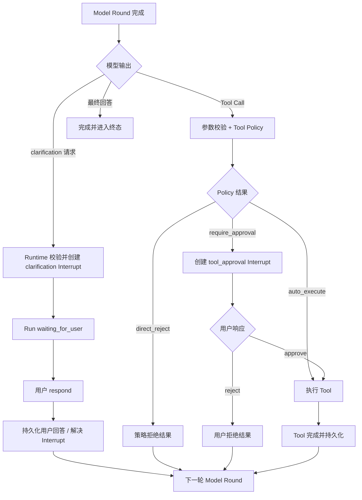

# Clarification & Tool Approval

> 阶段：K3.2 Release Control & Hardening
>
> 状态：方案冻结，尚未实现。
>
> 本阶段建立两条基于 K3.1 Interrupt & Resume Control Plane 的完整路径：模型请求用户澄清，以及 Runtime 在 Tool Dispatch 前请求用户批准。两者共用 Interrupt 的持久化和恢复机制，但响应语义与后续执行路径不同。

## 1. 本阶段目标

本阶段完成：

```text
clarification Interrupt
→ respond
→ 下一轮 Model Round
```

以及：

```text
tool_approval Interrupt
→ approve / reject
```

具体目标：

- 模型可以在信息不足或任务存在歧义时提出结构化 clarification 请求；
- Runtime 校验请求并创建持久化 `clarification` Interrupt；
- Run 进入 `waiting_for_user`，客户端可以观察等待原因；
- 用户回答以 `respond` 解决 Interrupt，并进入下一轮 Model Round；
- Runtime 根据受信任的 Tool Policy 判断 Tool 是否需要审批；
- 审批前不执行 Tool；
- `approve` 不重新调用模型，为原始 Tool Call 创建持久化 Tool Step 后执行；
- `reject` 不执行 Tool，生成结构化拒绝结果，再进入下一轮 Model Round；
- 两条路径都兼容 Snapshot、Checkpoint、Event Tail、SSE cursor 和恢复；
- 重复响应、过期响应和并发响应具有确定性结果。

## 2. 本阶段不做什么

本阶段不实现：

- `edit` Tool 参数；
- 用户修改 Tool 参数后的重新校验和风险升级；
- 复杂的 Tool 风险分级、用户权限和审批策略管理；
- Tool 执行中的 pause/resume；
- 多人审批、审批转交和审批超时策略的完整产品化；
- 通用 `steer` 完整能力；
- Provider fallback、熔断和其他后续 Reliability Backlog 项目。

Tool 的静态审批元数据可以作为受信任 Policy 的输入，但本阶段只要求 Runtime 能确定地得到三种结果：

```text
auto_execute
require_approval
direct_reject
```

## 3. 统一 Interrupt 模型

两类 Interrupt 共用同一套生命周期：

```text
pending → resolved | superseded | cancelled | expired
```

`resolved` 和 `cancelled` 在 K3.2 启用；`superseded` 在 K3.3 接入 Steer 时启用；`expired` 为保留状态，只有后续引入明确超时策略后才能产生。

但每个 Interrupt 只允许自己的响应类型：

```text
clarification
  allowed response: respond

tool_approval
  allowed response: approve | reject
```

Runtime 创建 Interrupt，模型或用户不能直接改变 Run 状态。模型只能提出 clarification 意图；Runtime 根据 Tool Policy 决定是否创建 `tool_approval` Interrupt。

## 4. Clarification 路径

### 4.1 触发

在 Model Round 完成后，模型可以返回结构化 clarification 请求。请求至少包含：

- 面向用户的问题；
- 可选的选项列表；
- 是否允许自由文本回答。

模型表达的是：

```text
我需要更多信息才能继续
```

真正的 Interrupt 由 Runtime 创建：

```text
Model Round 完成
→ 校验 clarification 请求
→ 创建 clarification Interrupt
→ 持久化当前 Round 和等待信息
→ Run 进入 waiting_for_user
```

Runtime 必须校验：`question` 去除空白后非空且不超过配置上限；`options` 中每项非空、互不重复且数量不超过配置上限；`allowFreeText = false` 时必须提供至少一个 option。校验失败时不创建 Interrupt，按模型协议错误处理。

### 4.2 用户响应

用户使用 `respond` 解决对应的 clarification Interrupt：

```text
clarification Interrupt
→ 用户提交 respond
→ Runtime 校验 interruptId、状态和响应格式
→ Interrupt 标记 resolved
→ 保存用户回答
→ 下一轮 Model Round
```

用户回答是新的任务语义，不能直接当作 Tool 参数执行。它必须进入下一轮 Context，让模型重新判断下一步。

`respond` 内容去除空白后必须非空；`allowFreeText = false` 时，回答必须引用当前 Interrupt 提供的合法 option。响应校验失败不能解决 Interrupt。

### 4.3 Clarification 的上下文事实

至少保留三项事实：

```text
模型提出的问题
用户最终回答
该回答解决了哪个 clarification Interrupt
```

上一轮已经提交的 Model Round 不重复调用。下一轮模型输入应能区分：

```text
assistant clarification request
user clarification response
```

如果底层模型协议要求闭合结构，也可以由 Runtime 生成内部的 clarification result；但产品和事实层必须保留用户回答的原始来源，不能把它伪装成普通 Tool 执行结果。

### 4.4 多轮 clarification

本阶段允许模型在用户回答后再次提出 clarification，但每次只能有一个当前 pending clarification：

```text
Round N
→ clarification A
→ respond A
→ Round N+1
→ clarification B（如果仍然缺信息）
```

不在本阶段实现多个并行问题、问题依赖图或复杂表单编排。

## 5. Tool Approval 路径

### 5.1 触发

一个或多个 Tool Call 产生后，Runtime 在 `Tool Dispatch 前`逐项进行控制仲裁：

```text
Model Round 完成
→ Tool Call 参数校验
→ 读取受信任 Tool Policy
→ 得到 auto_execute / require_approval / direct_reject
```

所有 `require_approval` 项合并到当前安全边界唯一的 `tool_approval` Interrupt Envelope：

```text
一个或多个 Tool Call
→ tool_approval Interrupt
→ 持久化待执行 Tool Call 与审批项
→ Run.status = waiting_for_user
```

Tool 在 Interrupt 解决前不得执行。

同一 Model Round 混合出现三种 Policy 结果时采用批次屏障：只要存在任一 `require_approval` 项，该 Round 的所有 Tool Call 都暂不 Dispatch。Envelope 只包含需要审批的项目；Envelope 解决后，`auto_execute` 与 approved 项进入 Tool Scheduler，rejected 与 `direct_reject` 项生成各自控制结果。

每个审批项必须持久化不可变的 `toolCallId`、Tool 名称、canonical 参数和 `argumentsHash`。审批响应引用 `itemId + toolCallId + argumentsHash`；执行前任一字段不匹配都必须返回冲突，不能执行被替换或修改过的 Tool Call。

### 5.2 approve（含批量部分批准）

```text
tool_approval Interrupt
→ 用户为全部审批项提交 approve / reject
→ Runtime 在同一事务中解决 Interrupt
→ 为 auto_execute 与 approved 项创建 queued Tool Step
→ 为 rejected 与 direct_reject 项持久化 Tool Control Outcome
→ Worker 执行 queued Tool Call
→ 本 Round 全部 Tool 项进入终态
→ 下一轮 Model Round
```

`approve` 不先重新调用模型，因为模型已经完成了当前 Tool 决策，用户只是在批准该动作。执行顺序或并行方式沿用既有 Tool Scheduler，不由审批协议重新定义；只有本 Round 全部 Tool Step / Control Outcome 都进入终态后，Runtime 才能启动下一轮模型。

### 5.3 reject（含批量部分拒绝）

```text
tool_approval Interrupt
→ 用户 reject
→ Runtime 原子解决 Interrupt
→ Tool 不执行
→ 生成结构化拒绝结果
→ 下一轮 Model Round
```

拒绝结果至少需要表达：

```text
type: tool_control_outcome
executed: false
outcomeType: rejected_by_user
retryable: false
```

拒绝不是 Runtime 直接结束 Run。下一轮模型应看到拒绝事实，并自行决定换方案、继续提问、使用其他 Tool 或受限交付。

### 5.4 direct_reject

违反权限、安全或网络边界的 Tool Call 不创建审批 Interrupt：

```text
Tool Call
→ Runtime Policy 判定 direct_reject
→ Tool 不执行
→ 生成策略拒绝结果
→ 下一轮 Model Round
```

`direct_reject` 与用户 `reject` 必须区分：

```text
rejected_by_user
  用户不批准一个本来可以请求批准的动作

rejected_by_policy
  动作本身不在允许范围内，不应交给用户绕过策略
```

## 6. 两条路径的差异

| 项目 | clarification | tool approval |
| --- | --- | --- |
| 谁提出 | Model 提出语义请求 | Runtime 根据 Policy 触发 |
| 等待原因 | 信息不足或任务歧义 | Tool 不应自动执行 |
| 允许响应 | `respond` | `approve` / `reject` |
| 响应后第一步 | 下一轮 Model Round | approve 先创建持久化 Tool Step；reject 生成拒绝结果 |
| 是否执行 Tool | 否 | approve 执行，reject 不执行 |
| 用户输入性质 | 新任务语义 | 对既定动作的许可决定 |
| 主要安全边界 | Model Round 完成 | Tool Dispatch 前 |

两者共用：

```text
Interrupt 创建
→ 持久化
→ Run 等待
→ 响应幂等校验
→ 状态和事件恢复
```

## 7. 状态与竞态原则

### 7.1 单一 pending Interrupt

本阶段一个 Run 同时只允许一个需要用户响应的 pending Interrupt Envelope，但 `tool_approval` Envelope 可以包含多个审批项。这样既支持同一安全边界的批量决策，也避免 clarification 和 tool approval 成为两个独立等待点。

创建或解决 Envelope 与 `Run.status` 的变化必须在同一事务完成：存在 pending clarification / tool approval Envelope 时，Run 必须为 `waiting_for_user`；Run 为 `waiting_for_user` 时，必须能从 Snapshot 找到唯一的 pending Envelope。

### 7.2 响应幂等

- 同一 `interruptId + idempotencyKey + payload` 重复响应，返回同一结果；
- 同一幂等键但 payload 不同，返回冲突；
- 已解决 Interrupt 的重复响应不得再次执行 Tool 或再次进入 Model；
- 已取消、过期或 Terminal Run 的 Interrupt 不可解决。

### 7.3 控制竞态

K3.2 不实现或开放 Steer Resume。存在 pending clarification / tool approval 时，只接受该 Interrupt 允许的响应类型或 Cancel；普通聊天输入、Queue 或其他控制命令都不能解决 Interrupt 或触发待审批 Tool。Steer 接入后的优先级、批次水位和 supersede 规则统一留到 K3.3 讨论与验收。

## 8. 推荐流程图



## 9. 验收重点

### Clarification

- 模型提出合法 clarification 后，Run 进入 `waiting_for_user`；
- 页面刷新或 SSE 重连后仍能看到待回答问题；
- `respond` 后只启动下一轮 Model，不重复上一轮 Model Round；
- 用户回答进入下一轮 Context 并保留来源；
- 重复响应不重复推进 Run；
- 模型可以在回答后继续提出下一次 clarification。
- 非法 clarification 输出或不符合选项约束的 respond 不创建或解决 Interrupt。

### Tool Approval

- 需要审批的 Tool 在用户决定前不会执行；
- `approve` 不重新调用模型，为原 Tool 创建持久化 Tool Step 后执行；
- `reject` 不执行 Tool，下一轮模型能看到结构化拒绝结果；
- `direct_reject` 不创建审批，不给用户绕过安全策略的入口；
- 同一 Round 的混合 Policy 结果遵守批次屏障，等待期间没有 Tool 提前 Dispatch；
- 批量审批允许部分批准、部分拒绝，但缺失、重复、未知或参数摘要不匹配的决策必须整体拒绝；
- 重复 approve 不重复执行 Tool；
- Tool Result 持久化后，恢复不会重复执行成功 Tool。
- Tool 执行结果不确定且下游不支持幂等或查询时，Tool Step 进入 `execution_unknown`、Run 转为 `failed`，不得盲目重试。

## 10. 与后续阶段的关系

```text
K3.1 Interrupt & Resume Kernel
  → K3.2 Clarification & Tool Approval（本文）
  → K3.3 Steer & Follow-up Queue
  → K5 Human-in-the-loop & Side-effect Control
```

本阶段验证统一 Interrupt 机制能同时承载“用户补充语义”和“用户批准动作”两种不同恢复路径。K3.1/K3.2 端到端通过后，再讨论并冻结 K3.3 的 Steer 与 Queue；后续阶段再扩展 `edit`、复杂审批策略、审批超时和完整副作用控制。

## 11. K3.2 已冻结设计结论

以下结论共同构成 K3.2 的实现约束；K3.3 相关行为只定义不可越过的集成边界，不纳入本阶段实现或验收。

### 11.1 Clarification 的模型输出协议

采用 Runtime Core 内置的独立结构化协议，不实现为 Tool Call：

```ts
type ClarificationRequest = {
  type: "clarification";
  question: string;
  options?: string[];
  allowFreeText: boolean;
};
```

- System Prompt 向模型说明协议语义和触发方式；Runtime 校验后创建 Interrupt 并生成 `interruptId`。
- 同轮可以包含面向用户的解释文本，但 `clarification` 与 Tool Call、最终回答互斥。
- 空问题、超长内容、非法选项或混合控制动作按模型协议错误处理。
- Transcript 使用专用的 `clarification_request` 和 `clarification_response` 类型。
- Provider Adapter 将其投影为目标模型支持的消息格式；不支持自定义类型时，转换为带稳定语义标记的 `assistant/user` 消息，不转换为 Tool Message。
- 专用类型用于 Runtime 控制、持久化和前端展示；模型获得的仍是正常对话 Context，但必须保留“澄清请求—用户回答”的关联语义。

### 11.2 Clarification 触发条件

Clarification 只作为阻塞解除机制。仅当以下条件同时成立时触发：

```text
缺失信息会显著改变结果、成本或副作用
AND 无法从现有 Context 或可用 Tool 获得
AND 不存在安全、低成本、可逆的合理默认值
```

典型场景包括缺少执行必需参数、多种解释会产生明显不同结果、高风险或不可逆动作，以及必须由用户表达的主观偏好。其他情况应采用合理默认值，简短说明关键假设并继续执行。

为避免过度追问：

- 提问前先检查已有 Context 和可获取信息；
- 一次集中询问当前已知的最少关键问题，并尽量提供推荐默认项；
- 不得重复询问用户已经回答的内容；
- 不设置固定连续轮数上限，仍存在真实 blocker 时允许继续澄清；Runtime 记录连续澄清次数，用于观测、评估和后续策略调优。

### 11.3 `approve` 到 Tool Dispatch 的崩溃一致性

采用“持久化调度 + 至少一次执行 + Tool 幂等”模型：

```text
approve
→ 在同一事务中解决 Interrupt，并创建 queued Tool Step / dispatch intent
→ 当前 Runtime Executor 领取并执行
→ 持久化 Tool Result
```

- Tool Step 使用跨重试稳定、不同 Step 唯一的 `executionKey`；审批请求、Interrupt 和 Tool Step 保留明确关联。
- Tool Step 至少具有 `queued → running → succeeded | failed | execution_unknown` 状态；当前单 Runtime 使用状态 CAS 领取 Step 和提交终态，不引入 lease、fencing 或多 Worker 协调。
- 执行前崩溃时，重启后的 Runtime Executor 可以重新领取尚未开始的 queued Tool Step。
- Tool 已产生外部副作用但结果尚未持久化时，Runtime 使用相同 `executionKey` 重试或查询外部结果。
- 下游支持幂等键时，重复请求必须返回第一次执行结果，不重复产生副作用。
- 下游不支持幂等或状态查询时，Runtime 不能承诺 exactly-once；结果不确定时 Tool Step 进入 `execution_unknown`，Run 以稳定的 `tool_execution_unknown` 错误转为 `failed`，禁止盲目自动重试。人工对账和后续恢复不在 K3.2 范围内。

Runtime 提供 durable scheduling 和 at-least-once execution；副作用 exactly-once 依赖 Tool 或下游服务的幂等、去重或对账能力。

这里的重复投递只用于恢复同一个持久化 dispatch intent，不等于面向用户的 Retry Current Step，也不引入通用失败重试、退避或重试预算。

### 11.4 `reject` 结果的协议身份

采用双层表示：事实层保存独立控制结果，Provider Context 层投影成闭合原 Tool Call 的 canonical Tool Message。

```ts
type ToolControlOutcome = {
  type: "tool_control_outcome";
  toolCallId: string;
  executed: false;
  outcomeType: "rejected_by_user" | "rejected_by_policy" | "superseded";
  reason?: string;
  retryable: false;
};
```

- Runtime、审计和前端以独立控制事实为准，不能将拒绝记录成 Tool 执行失败或成功。
- Provider Adapter 将该事实转换为匹配原 `toolCallId` 的 Tool Message，保持 Tool Transcript 闭合。
- 投影内容必须明确表达 Tool 未执行、拒绝来源和不可自动重试，让模型基于拒绝事实重新规划。
- `rejected_by_user` 与 `rejected_by_policy` 必须保持不同语义；`superseded` 为 K3.3 预留值，K3.2 不产生。

### 11.5 与未来 Steer 的集成边界

K3.2 只冻结两条边界：Steer 与 `respond` 必须是不同的显式命令，一个 API 请求不能同时提交两者；任何未来 Steer 都不能让 pending approval 中的 Tool 绕过决策而执行。Steer 是否优先、何时形成仲裁批次、如何 supersede Interrupt 和前端如何选择 Steer / Queue，全部留到 K3.3 重新讨论，不从 K3.2 自动推导。

### 11.6 单一 pending Interrupt 的阶段性限制

本阶段一个 Run 同时最多只有一个 pending Interrupt Envelope，但一个 Envelope 可以包含多个待处理项：

- Clarification 使用一个 Envelope，一次集中询问当前已知的最少关键问题。
- 同一安全边界产生的多个 Tool Approval 合并到一个 Envelope；每项具有稳定的 `itemId` 和 `toolCallId`。
- 每项绑定不可变的 Tool 名称、canonical 参数和 `argumentsHash`，批准后只能执行该精确版本。
- 用户可以对每项独立 `approve / reject`，允许部分批准、部分拒绝。
- 响应必须完整覆盖全部待处理项；未知、遗漏或重复的 `itemId` 均拒绝，全部决策校验成功后 Envelope 才原子转为 `resolved`。
- Tool 只能在 Envelope 成功解决后，按各自决策进入执行或生成拒绝结果。
- 多个独立 pending Envelope、`InterruptGroup`、`branchId` 和分支级恢复留到 Delegation / 并行 Worker 阶段。

### 11.7 `waiting_for_user` 与 Interrupt Kind 的分层

Run 生命周期与等待原因明确分层：

```text
Run.status = waiting_for_user
Interrupt.kind = clarification | tool_approval
Interrupt.status = pending | resolved | superseded | cancelled | expired
```

- `Run.status` 控制调度，表示 Runtime 当前不能继续；`Interrupt.kind` 决定等待原因、允许响应和前端组件；`Interrupt.status` 记录等待事实的生命周期。
- 创建 pending clarification / tool approval 与 Run 转为 `waiting_for_user` 必须在同一事务中完成。
- 解决最后一个 pending Interrupt、创建下一 Step / dispatch intent 与 Run 转回 `queued` 必须在同一事务中完成，再由 Executor CAS 领取为 `running`。
- Run 进入终态时，所有 pending Interrupt 同时转为 `cancelled`。
- Snapshot 必须同时返回 `Run.status` 和完整 `activeInterrupt`；前端不能只凭 Run Status 选择澄清框或审批面板，Runtime 也不能只凭 Interrupt Kind 判断是否可调度。
- Pause 单独使用 `Run.status = paused` 与 `Interrupt.kind = pause`，不伪装成 `waiting_for_user`。

### 11.8 本阶段定位

K3.2 是统一 Interrupt/Resolution 内核的首批生产纵向切片，不是临时原型，也不代表完整 Human-in-the-loop 已完成。

本阶段冻结并长期保留的内核契约包括：

- Interrupt Envelope 的持久化、状态转换、幂等解决和恢复；
- clarification 的 `respond → 下一轮 Model Round` 语义；
- tool approval 的 `approve → 原 Tool` 与 `reject → 控制结果 → 下一轮 Model Round` 语义；
- Tool Dispatch 前审批、拒绝结果闭合和 Provider Context 投影；
- Run Snapshot、Event/SSE 与 active Interrupt 的一致观测。

本阶段的限制包括：

- 一个 Run 同时最多一个 pending Interrupt Envelope；
- 只支持 `respond / approve / reject`，不支持 `edit`；
- 不支持多人审批、审批转交、复杂超时策略和并行分支独立恢复；
- Tool Policy 只需确定地产生 `auto_execute / require_approval / direct_reject`，不在本阶段建设完整风险与权限系统。

后续职责边界：

- K3.3 Steer & Follow-up Queue 在 K3.1/K3.2 完成后单独讨论，负责运行中语义控制、跨 Run 输入排队及其竞态；
- K5 Human-in-the-loop & Side-effect Control 负责风险分级、用户权限、复杂审批、完整审计和副作用治理。

K3.2 的完成标准是 clarification 与 tool approval 两条路径从模型/Policy 触发、API、持久化、Snapshot/SSE、前端交互，到恢复和幂等验证全部端到端跑通，而不是只完成类型、表结构或状态机定义。
