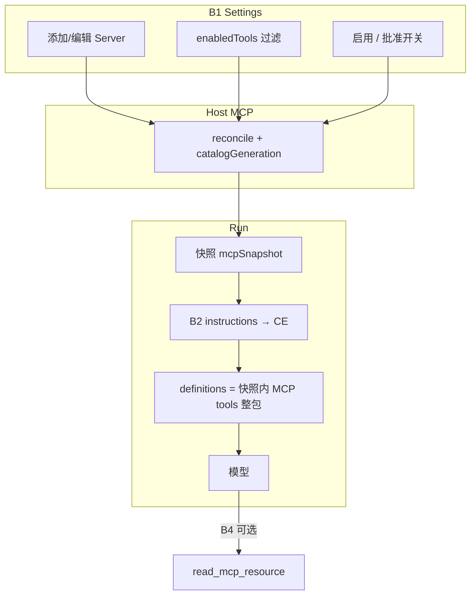

# C4：Host MCP Client 与工具生态扩展

> 文档状态：**C4 完成（C4-A / C4-B）**  
> 最后更新：2026-09-24（§12.1 手工验收；Capability 进度见 [implementation-status](./implementation-status.md)）  
> 关联：[implementation-status §7](./implementation-status.md)、[33-c3 §7](./33-c3-agent-sandbox-cloud-execution.md)  
> 外部参考（只读对照）：DSH `docs/subsystems/mcp.md`、`dsh-mcp-client`；Codex 开源 `codex-rs/codex-mcp`、`core/src/mcp_tool_call.rs`

## 1. 目标与非目标

### 1.1 目标

在 **Harness API Host** 上实现 MCP Client，通过**可配置的外部 MCP Server** 扩展模型工具面，且：

- 与现有 **Agent Loop、`ToolRegistryService`、K3.2 `tool_approval`、Context Engineering** 同链路；
- **Credential 与 MCP 连接留在 Host**（与 [33-c3 §7](./33-c3-agent-sandbox-cloud-execution.md) 一致），不迁入 OpenSandbox；
- 命名与行业惯例对齐（`mcp__<serverName>__<rawName>`），便于对照 DSH 与 Codex 行为。

### 1.2 非目标（C4 不做）

| 项 | 说明 |
| --- | --- |
| Cordis / profile HMR / `plugin_manager` 装包 | 配置由 **Settings → Admin API → DB** 管理，非 Run 内 pnpm 装 Host 代码 |
| MCP **Server**（对外暴露 Harness 工具） | 可列为 C4 后期或独立项；DSH 亦 defer |
| Codex 级 **Marketplace / OAuth / Elicitation / Codex Apps** | 首期不做；仅预留扩展点 |
| **stdio MCP**（子进程） | C4-A/B **不做**；若本地子进程 MCP 有强需求再单独立项 |
| **Session 级 MCP 覆盖 / OAuth** | C4-B **不做**；配置保持 user 级 DB + Settings |
| **Tool Search / Deferred / 大 catalog 按需 expose** | 后续 **Kernel K5**（非 C4；专项文档待建） |
| 完整 **K6** Side-effect Policy 平台 | 用 `executionPolicy.approval` + server 级默认策略 |
| Sandbox 内跑 MCP Client | 禁止 |

---

## 2. 设计原则（借鉴 DSH / Codex，不照搬）

从 DSH、Codex 开源实现里抽取、并在 Harness 落地的**思路**如下（实现语言与模块划分可以完全不同）：

| 原则 | 来源直觉 | Harness 落地 |
| --- | --- | --- |
| **Host 桥接** | 外部 MCP 进程/HTTP 在 Host 连；模型只见统一 Tool 接口 | `McpModule` + 现有 `ToolRegistryService` / Runtime |
| **双名分离** | public 名给模型；wire 只用 MCP `Tool.name` | 注册表存 `(serverName, rawName, publicName)`，execute 不 parse public 名 |
| **Server 本地命名空间** | `serverName` 是配置项，不用远端 `serverInfo.name` | DB **user scope** 内唯一 `serverName` |
| **Catalog 快照** | Codex `McpBinding`：一轮推理/tool plan 内 catalog 不变 | **Run 级**冻结 `definitions`；可选 Round 级再收紧 |
| **Generation 护栏** | Codex `PreparedMcpCall`：catalog revision 变了则拒绝执行 | execute 前校验 `catalogGeneration` 与 Run 快照一致 |
| **失败不闪断** | DSH/Codex：listTools 失败保留上一代 | reconcile 失败不清空已发布 tool 列表 |
| **慢 Server 不拖死** | Codex optional grace：非 required 可超时 omit | 配置 `required` + `startupTimeoutMs`；非 required 失败仅省略该 server |
| **连接复用** | Codex refresh 时 identity 相同则复用连接 | reconcile 时 transport/secret 指纹不变则不断连 |
| **Schema 透传** | 不在 Host 重写 MCP JSON Schema（首期） | 原样进 `AgentToolDefinition.parameters` |
| **审批在 Host** | 副作用不进 Sandbox；MCP 走 HITL | K3.2 + `defaultApproval` / `mcp__*` 默认 |

**刻意不引入**：Cordis 插件装载、Codex catalog precedence、Apps/OAuth/elicitation、tool_search/deferred、DSH HMR、app-server 专用 MCP RPC。

---

## 3. 参考实现对照（只借思路）

两者都是 **Host MCP Client → 统一 Agent Tool 运行时**。Codex 的 MCP 内核在 **`codex-mcp` + `core::Session`**，`app-server` 主要是 Turn/RPC 与 invalidate，不重复实现 Client。

### 3.1 共同点

| 维度 | DSH (`dsh-mcp-client`) | Codex (`codex-mcp`) |
| --- | --- | --- |
| 协议 | 官方 MCP SDK（TS / Rust rmcp） | 同左 |
| 模型可见名 | `mcp__<serverName>__<rawName>` | 同前缀；另支持 namespace 拆分与 `prefix_mcp_tool_names` |
| 线上调用名 | 闭包保存 **rawName**，不解析 public 名 | `ToolInfo.tool.name` 回传 MCP |
| 多 Server | 每 Server 独立连接 + 本地 `serverName` 唯一 | `McpConnectionSet` + `ResolvedMcpCatalog` 合并 |
| Schema | MCP JSON Schema **透传** | 透传 + Responses API 消毒/长度限制 |
| 取消 | `exec.signal` → SDK | 同左 + tool timeout |
| Resources | `mcp-resources` 三个共享工具 + instructions 进 system prompt | binding 内 list/read + 状态快照 RPC |
| 连接失败 | 保留上一代 tool list；重连可配置 | `McpRuntime` 原子发布；startup 事件；required server 等待 |

### 3.2 差异（Harness 裁剪）

| 维度 | DSH | Codex | **Harness C4 建议** |
| --- | --- | --- | --- |
| 配置入口 | `cordis.yml` 多实例插件 | 分层 `config.toml` + plugin MCP 声明 + catalog  precedence | **Admin API → DB（事实源）**；含 **用户维度凭证**（加密落库，§4.4.2） |
| 生命周期 | Cordis effect dispose / HMR | Thread 级 `McpRuntime` + **`McpBinding` 冻结** | **进程内连接池（全局）** + **Run 创建时快照 catalog generation** |
| 权限 | Tool 管道 + sandboxPolicy | `AskForApproval` + AppToolApproval + OAuth | **K3.2 `require_approval`**；按 server 默认 + 可选 tool 级覆盖 |
| 工具暴露 | 全量 register | 部分 **Deferred** + `tool_search` | **首期全量**；definitions 过大时再上 deferred |
| 插件生态 | Cordis 包 = 一切能力 | Plugin 可 **声明 MCP server** 并入 catalog | **仅外部 MCP**；内置仍 Nest `AgentTool` |
| 凭证 | env scrub + config.env | OAuth keyring + ChatGPT hosted apps | **DB 加密 + user scope**（§4.4.2）；OAuth **C4-B 可选** |
| 结果 | canonical MCP JSON + attachment 投影 | `CallToolResult` + 专用 UI 卡片 / 脱敏 | 对齐现有 **`ToolExecutionResult` → Runtime 序列化**；图片二期 |

### 3.3 小结

- **MVP 能力形状**接近 DSH：一 Server 一连接、discover → 注册 → `callTool`、命名前缀 `mcp__`。
- **并发正确性**向 Codex 看齐：Run 快照 + execute 时 **generation 校验**（见 §4.5.1）。
- **产品与配置**保持 Harness 风格：**Admin/DB + Settings**，无 Cordis、无 Codex Marketplace。

---

## 4. 在本项目中的架构

### 4.1 Placement

```text
┌─────────────────────────────────────────────────────────────┐
│ apps/api (Host, 可信)                                        │
│  AgentRuntimeService                                         │
│    → definitions(run) = builtin + registry.definitions(run)   │
│    → execute → ToolRegistryService                           │
│  ToolRegistryService                                         │
│    ├─ 静态 AgentTool（web_search, bash, create_file, …）     │
│    └─ 动态 McpAgentTool（由 McpToolCatalog 物化）            │
│  McpModule                                                   │
│    McpServerConfigRepository（Prisma，user scope + 加密凭证）│
│    McpConnectionManager（SDK Client，streamable-http）        │
│    McpToolCatalogService（listTools, publicName, 世代号）    │
│    McpToolExecutor（callTool, 取消, 超时, 结果映射）          │
│  ContextEngineeringService（可选：MCP instructions 片段）     │
└─────────────────────────────────────────────────────────────┘
         │ tools/call                    ▲
         ▼                               │ HTTP
   External MCP Server(s)                 │
└─────────────────────────────────────────────────────────────┘
 OpenSandbox（C3）：仅 bash / agent-browser；不运行 MCP Client
```

### 4.1.1 MCP 架构图（ASCII）

```text
                    ┌──────────────────────────────────────┐
                    │  Settings → Admin API → DB (user scope) │
                    └──────────────────┬───────────────────┘
                                       │ enabled servers
                                       v
┌──────────────────────────────────────────────────────────────────────────┐
│                         McpConnectionManager                              │
│  reconcile():  per server ──► SDK connect (HTTP, C4-A)                   │
│                listTools ──► raw Tool[] + filter(enabled/disabled)       │
│                on success ──► publish view @ catalogGeneration (G)       │
│                on failure ──► keep previous view, mark degraded          │
│  live store:  Map<serverName, { client, tools[], generation, status }> │
└───────────────────────────────┬──────────────────────────────────────────┘
                                │ read view @ generation G
                                v
┌──────────────────────────────────────────────────────────────────────────┐
│                         McpToolCatalogService                           │
│  • publicName = normalize(mcp__{server}__{raw})                          │
│  • entries: { publicName, serverName, rawName, schema, approval, gen }   │
│  • definitionsForRun(run): view frozen @ run.mcpCatalogGeneration        │
└───────────────────────────────┬──────────────────────────────────────────┘
                                │ merge at call time (not Nest DI register)
                                v
┌──────────────────────────────────────────────────────────────────────────┐
│  ToolRegistryService (extended)                                           │
│    definitions(run)  = static AgentTools + mcpCatalog.definitionsForRun │
│    execute(name)     = static ? : mcpExecutor (generation guard)         │
│    approvalPolicy()  = static ? : mcp entry defaultApproval             │
└───────────────────────────────┬──────────────────────────────────────────┘
                                │
        AgentRuntimeService ◄───┘  Model Round: tools[] → ModelAdapter
                                │
                                v
                         McpToolExecutor
                                │ callTool(rawName), signal, timeout
                                v
                    ┌───────────────────────┐
                    │  External MCP Server   │
                    └───────────────────────┘
```

说明：**MCP 工具不写入** Nest 启动期的 `AGENT_TOOLS` 数组；它们在 **Registry 合并层** 与内置工具拼成模型可见列表。

### 4.1.2 Run 内 MCP 工具加载与注册流程（ASCII）

聚焦：**何时连 MCP、何时 listTools、何时进入模型 tool 列表、Run 中途是否变化**。

```text
[进程生命周期 — 与 Run 无关，但影响 Run 能看到的工具]

  API 启动 / Admin PATCH / POST reconcile
       │
       v
  McpConnectionManager.reconcile()
       │
       ├─► 对每个 enabled server
       │     connect + initialize (startupTimeoutMs)
       │     listTools (paginated) ──wire──► MCP Server
       │     map ──► ToolInfo[] (rawName 保留)
       │     filter enabledTools / disabledTools / visibility
       │     publicName 规范化
       │
       ├─► 成功 ──► catalogGeneration++ (G0 → G1 → …)
       │            发布 PublishedCatalog[G]
       │
       └─► 失败 ──► 保留 PublishedCatalog[G-1]，server = degraded


[单次 Agent Run]

  Create Run (sessionId, user message, …)
       │
       v
  读取 live catalogGeneration = G_now
       │
       ├─► 对每个 required server：必须已有 PublishedCatalog 条目且 client ready
       │     否则 Run 创建失败（C4-A 建议）
       │
       ├─► 对 optional server：未 ready 则本 Run 快照中不含该 server 的工具
       │
       v
  冻结 run.mcpCatalogGeneration = G_now
  冻结 run.mcpToolEntries = copy(PublishedCatalog[G_now])   // 逻辑快照
       │
       v
  AgentRuntimeService.run()  loop
       │
       ├──────────────────────────────────────────┐
       │  每个 Model Round (before_model_request) │
       v                                          │
  buildToolDefinitions(run)                      │
       │                                          │
       │   static = ToolRegistry.definitions()    │  web_search, bash, …
       │   mcp    = mcpCatalog.definitionsForRun(run)  // 仅快照内 publicName+schema
       │                                          │
       v                                          │
  tools[] = [...static, ...mcp, ...builtin]  ────┼──► ModelAdapter.chat(tools)
       │                                          │
       │◄──────── model returns tool_calls ───────┘
       │
       v
  对每个 tool_call.name
       │
       ├─► 内置名 ──► ToolRegistry.execute (现有路径)
       │
       └─► mcp__* ──► McpToolExecutor
                 │
                 ├─► lookup(publicName) → (serverName, rawName)
                 ├─► generation 校验: entry.gen == run.mcpCatalogGeneration ?
                 │       否 ──► mcpCatalogStale (不 call MCP)
                 ├─► client ready ?
                 │       否 ──► mcpUnavailable
                 ├─► approvalPolicy require_approval ?
                 │       是 ──► K3.2 interrupt → approve/reject
                 v
            SDK callTool(name=rawName, args) ──► MCP Server
                 │
                 v
            ToolExecutionResult → Runtime 序列化 Tool Message → 下一 Model Round
                 │
                 └──► 下一 Round 仍用同一 run.mcpCatalogGeneration 快照
                      (reconcile 产生 G_now+1 不影响本 Run 的 definitions)


[Run 结束后]

  新 Run 创建时重新 capture G_live；旧 Run 历史 transcript 中的 mcp__ 名
  仍指向当时快照语义，execute 护栏防止 config 变更后误执行。
```

**要点（与上图对应）**：

| 阶段 | MCP 在做什么 | 是否「注册」进工具列表 |
| --- | --- | --- |
| reconcile | 连 Server、listTools、更新 PublishedCatalog | 更新 **全局** 世代视图，还不进模型 |
| Run 创建 | `run.mcpCatalogGeneration` + 快照条目 | 确定 **本 Run 可用** MCP 集合 |
| 每 Model Round | `definitionsForRun(run)` 与 static 合并 | **此时**进入发给模型的 `tools[]` |
| tool_call | Executor + generation 校验 + 可选审批 | 不新增注册；按快照 **执行** wire rawName |

### 4.2 与现有组件映射

当前 `ToolRegistryService` 在 Nest 启动期用 **静态 `AGENT_TOOLS` 数组** 建 Map（见 `tool-catalog.ts`），**不支持**运行时 `register()`。C4 推荐：

| 现有 | C4 扩展 |
| --- | --- |
| `ToolRegistryService` | **不**改 Nest 动态 provider；增加 **`McpToolCatalogService` 只读层**，由 `definitions()` / `execute()` / `approvalPolicy()` **合并** MCP 条目 |
| MCP 执行体 | 单一 **`McpToolExecutor`**（按 `(serverName, rawName)` 分发），或薄 `McpAgentTool` 包装同一 executor |
| `executionPolicy.approval` | Server 级 `defaultApproval`；Registry 合并时对 `mcp__*` 可设默认 `require_approval` |
| `AgentRuntimeService` | **Run 创建**时读取当前 `catalogGeneration`，写入 Run 状态（metadata 或 `RunScopedMcpSnapshot`） |
| `definitions()` 调用点 | 已有：`builtinToolDefinitions()` + `tools.definitions()`；改为 **+ mcpCatalog.definitionsForRun(run)** |
| K3.2 tool_approval | 与 bash 升权同一 Interrupt；MCP 无单独 UI 协议也可复用现有审批卡片（展示 server/tool/args） |
| `@harness/agent-protocol` | 错误码：`mcpUnavailable`、`mcpCatalogStale`；可选 SSE `mcp_server_status`（C4-B） |

### 4.3 工具命名（冻结）

与 DSH **同语义**（算法可实现为等价单测，不要求与 DSH 字节级一致）：

```text
publicName = normalize(`mcp__${serverName}__${rawName}`)
```

- `serverName`：配置项 `^[A-Za-z0-9_-]{1,32}$`，**本地唯一**（非远端 serverInfo.name）。
- 非法字符 → `_`；超长 → 截断 + 稳定 hash 后缀（避免碰撞）。
- `tools/call` 仅发送 **rawName**。
- 可选（Codex）：若 tool 带 MCP ext-apps `_meta.ui.visibility` 且不含 `model`，**不**进入 `definitions()`（`tool_is_model_visible` 等价）。

### 4.4 配置模型（Prisma 草案）

```text
McpServerConfig
- id, userId (FK users；R1 仍只有 local user，但 **scope 按用户**，为多用户预留)
- sessionId? (null = 用户级默认；非 null = Session 覆盖，**C4-B**)
- serverName (unique per userId [+ sessionId when set])
- enabled
- transport: streamable_http（**C4-A 冻结**；stdio 后置时再增 command/args/cwd）
- url (required for C4-A)
- headersPlain (json: 非敏感 header 键值)
- （关联表 `mcp_server_secrets`，见 §4.4.2；**主表不含明文**）
- startupTimeoutMs (default 30000) — 首次 connect + initialize + 首次 listTools
- toolCallTimeoutMs (default 60000) — 单次 tools/call
- required (default **false**) — 见 §11.1 说明；C4-A 建议默认 false，少阻塞对话
- failOnStartupError (default false)
- defaultApproval: auto_execute | require_approval
- enabledTools?, disabledTools? (optional allow/deny list，同 Codex ToolFilter)
- maxInstructionBytes (default 32768)
- reconnectEnabled, reconnectMaxAttempts (DSH 默认)
- createdAt, updatedAt
```

**首期**：用户级配置（`sessionId = null`）；Session 级覆盖为 **C4-B**。

凭证 **仅加密形态** 落库；解密仅在 Host 内 `reconcile` / `tools/call` 路径使用，**不出现在** API 列表、Tool Result、SSE、日志。

#### 4.4.1 MCP Server 配置入口（单源原则）

**运行时 reconcile 只读 DB** 中当前 **user scope** 下 `enabled` 的行；**C4-A 不做** `.env` bootstrap、不做「DB 存 env 变量名、真值在 .env」的双轨。

| 入口 | 角色 |
| --- | --- |
| **Settings → Admin API → DB** | **唯一事实源**：URL、headers、Bearer/API Key、MCP 所需 env 等均由用户在弹框填写，与 server 元数据一并持久化 |

```text
改 MCP Server（如从 ModelScope 抄 url / header / token 说明）
  → POST /api/agent/mcp/servers（或 Settings 提交）
  → DB 持久化（敏感字段加密）
  → reconcile → listTools → catalogGeneration++
  → 新 Run 快照内出现 mcp__* 工具
```

**外部市场（如 [ModelScope MCP](https://modelscope.cn/mcp)）**：C4-A **不提供** marketplace 自动同步；用户 **手工** 录入 HTTP 参数与凭证。后续「一键导入」单独立项。

**与 Codex 差异**：Codex 主入口是 `config.toml` + Plugin 声明；Harness 主入口是 **DB + Admin API**，与 Workbench Settings 同一模型。

#### 4.4.2 凭证落库与安全（C4-A）

与「配置走 DB」一致：**用户维度**存 MCP 凭证（header / bearer / 连接 env），Settings 与 Admin API 为读写入口。

| 能力 | C4-A 约定 |
| --- | --- |
| **存储** | 独立表 `mcp_server_secrets`（或等价列）：`kind`（header / env / bearer）、`name`（如 `Authorization` 或 env 键）、`ciphertext` + `nonce` + `keyVersion`；**禁止**明文列 |
| **加密** | 应用层 **AES-256-GCM**（或 libsodium `secretbox`）；**主密钥**来自部署 env `HARNESS_SECRETS_MASTER_KEY`（或接入 KMS）。这是 **实例级** 密钥，**不是** 用户 Token 列表；无 master key 时 **拒绝写入** 新 secret（可读已有配置的非敏感字段） |
| **API 读** | `GET /api/agent/mcp/servers` 只返回 `secretsConfigured: { headerNames, envKeys }` 或 masked 占位，**永不**回传明文 |
| **API 写** | `POST`/`PATCH` body 可带明文 secret（本地/HTTPS）；落库前加密。PATCH 省略某 secret 字段 = **保留** 原密文（常见「不修改 token」） |
| **使用** | `McpConnectionManager` 在内存中短暂解密组装 transport headers/env；进程内不缓存明文到共享日志/Run state |
| **scope** | 查询/写入均带 `userId`（R1 绑定 local user）；禁止跨用户读 secret |
| **审计** | 与 §6 一致；日志不得含解密后内容 |

**C4-A 明确不做**：`.env` 灌库 bootstrap、DB 仅存 env 变量名引用、把用户 Token 放进 `.env` 与 Settings 两套来源。

**后置（非 C4-A）**：OAuth refresh token 落库、KMS/HSM、secret 轮换 API、按 session 覆盖凭证。

`mcp_server_secrets`（草案，1:N → `McpServerConfig`）：

```text
mcp_server_secrets
- id
- mcpServerConfigId (FK, on delete cascade)
- kind: header | env | bearer
- name                 // 如 Authorization、X-Api-Key 或 MCP env 键名
- ciphertext, nonce, keyVersion
- createdAt, updatedAt
```

**连接指纹（reconcile 复用连接）**：`url` + `headersPlain` + secrets 解密后的稳定 hash（不落库明文）；任一变更 → 重建 client。

### 4.5 连接与 catalog 语义

| 事件 | 行为 |
| --- | --- |
| API 启动 | `OnModuleInit` → `reconcile()`（读 DB enabled servers）；无 master key 时跳过需 secret 的 server 并标 `degraded` + 日志 |
| Admin 保存 / PATCH | **同步** `reconcile()`（§11 #6）；成功 listTools 后 **catalogGeneration++** |
| listTools 失败 | **保留上一代** 已发布 tools；打日志；server 标 `degraded` |
| 新 Run 开始 | 捕获当前 `catalogGeneration` → `run.mcpCatalogGeneration`；该 Run 的 `definitions()` 只读该世代视图 |
| Run 进行中 reconcile | 已运行 Run **不**换 definitions；新 Run 用新世代 |
| 连接断开 | 自动重连（可关）；耗尽后该 server 从当前世代视图移除并 `degraded` |
| Session 删除 | C4-A 无 Session 级连接；C4-B 若有 Session 覆盖配置再 dispose |

#### 4.5.1 Execute 护栏（借鉴 Codex `PreparedMcpCall`）

除 Run 级快照外，**每次** `execute` 前：

1. 用 `publicName` 查注册条目，取 `(serverName, rawName, boundGeneration)`。
2. 若 `boundGeneration != run.mcpCatalogGeneration` **或** 当前 live generation 已前进且 Run 未刷新 → 返回 **`mcpCatalogStale`**（可重试：用户新开 Run），**禁止**静默换 client/工具集执行。
3. 若 server 当前无 ready client → `mcpUnavailable`（retryable）。

这样 config 热更新与 reconnect 不会导致「历史 tool_call 名」打到新连接上的歧义。

#### 4.5.2 Optional server 启动（借鉴 Codex grace）

对 `required: false` 的 server：Create Run 时若该 server 未 ready（含 degraded），**本 Run 快照不含**其 tools，其它 server 与内置工具正常。  
对 `required: true`：**Create Run 失败**并返回可读错误（Settings 里检查 URL/凭证/连通性）；**不**拖到首 Model Round（与 §4.1.2 图一致）。

#### 4.5.3 Run 快照驻留与 Connection Durable

与 [26-connection-durable-agent-loop.md](./26-connection-durable-agent-loop.md) 一致：**C4-A 只保证 API 进程存活期内** Run 可续。

| 场景 | C4-A 行为 |
| --- | --- |
| Run 进行中、SSE 重连、页面刷新 | `ActiveRun` 仍在内存 → 沿用已绑定的 `mcpCatalogGeneration` + 条目快照 |
| Admin 改 MCP、generation++ | 当前 Run **不变**；execute 护栏防误执行 |
| **API 进程重启** | 不自动续跑；**不**持久化 MCP 快照（§11 #1）。新 Run 重新 latch live catalog |
| 未来：进程外恢复 Run | 需持久化 generation 或快照 id（**非 C4-A**） |

快照建议挂在 **`ActiveRun` / Run executor 句柄**（与 loop 同生命周期），**不**写入 Prisma `runs` 行。

### 4.6 执行路径

1. Model → `tool_call.name = mcp__github__create_issue`
2. Registry 合并层 → `McpToolExecutor.execute`（或 `McpAgentTool`）
3. 查表 `(serverName, rawName)` + generation 校验（§4.5.1）
4. `client.callTool({ name: rawName, arguments }, { signal, timeout: toolCallTimeoutMs })`
5. 映射 `CallToolResult` → `ToolExecutionResult`：
   - `isError` → `status: failed`
   - text content → `output` 字符串或结构化块（与 `renderBashResult` 同级由 Runtime 统一转 Tool Message）
   - 图片：**C4-A** 仅 text 诊断；**C4-B** 接入 C1 Attachment（对齐 DSH attachment 路径）

### 4.7 System prompt / Resources / 工具暴露（分期）

**C4-A（MVP，已落地）**：仅 MCP **tools**；Run 快照内 **过滤后 tool 列表整包** 进入 `definitions`（无 Resource、无 instructions 注入）。

**C4-B（运维 + 理解 Server + 可选 Resource）**：

| 模块 | 内容 | 对模型的影响 |
| --- | --- | --- |
| **B1 Settings 闭环** | 编辑 Server（PUT）、`enabledTools` / `disabledTools` UI（PATCH 已有字段） | **人工收窄** 进入 catalog / Run 快照的 tool 集合；仍 **整包 definitions** |
| **B2 instructions** | reconcile 取得 server instructions → CE 在 system 区插入短片段（`maxInstructionBytes`、多 server 总上限） | 更好 **选对 Server、少踩权限/参数坑**；**不减少** schema token |
| **B3 可观测** | Settings degraded 文案；Run/Debug `catalogGeneration`、快照 tool 数；超阈值 warn 日志 | 排障与预算预警 |
| **B4 Resources（按需）** | Host 工具：`list_mcp_resources`、`list_mcp_resource_templates`、`read_mcp_resource`（`server` = `serverName`） | **按需读 Resource**，不注册成大量 `function` |

**C4-B 明确不做**：stdio、Session 级 MCP 覆盖、OAuth、SSE `mcp_server_status`、MCP 图片 → Attachment（有明确需求再开切片）。

**C4 交付边界**：未配 `enabledTools` 时，过滤后 tools **仍整包** 进入 `definitions`（如 Tushare 200+）。大 catalog 按需 expose、CE 预算分池属后续 **Kernel K5**，不在本文范围。

**边界对照**：

- **C4 完成后（当前）**：allowlist（`enabledTools`）可人工收窄；否则快照内 MCP tools 仍全部进 definitions。
- **K5（未来）**：按需 expose / discovery 工具 / compile 预算（实施时再写专项文档）。

---

## 5. API 与产品面

### 5.1 Admin / Settings API（C4-A）

路径前缀与现有 API 一致：**`/api/agent/mcp/...`**（实施后同步更新 [11-api-protocol.md](./11-api-protocol.md)）。

| 方法 | 用途 |
| --- | --- |
| `GET /api/agent/mcp/servers` | 列表 + `status`（connected/degraded）、`toolCount`、`lastError` 摘要；**无 secret 明文** |
| `POST /api/agent/mcp/servers` | 创建 server + 可选 secrets；**同步 reconcile** 后返回 |
| `PUT /api/agent/mcp/servers/:id` | 全量更新非 secret 字段 + 可选 secrets（省略 secret 字段 = 保留原密文） |
| `PATCH /api/agent/mcp/servers/:id` | 局部：`enabled`、`defaultApproval`、`enabledTools`/`disabledTools`、`required` |
| `DELETE /api/agent/mcp/servers/:id` | 删除配置 + secrets；dispose 连接 |
| `POST /api/agent/mcp/servers/:id/test` | 同步探测：connect + listTools → 返回 raw tool 名列表（不写 catalog、不进模型） |

**Scope**：所有写操作绑定当前 **local user**（R1）；响应 `serverName` 在 user 内唯一。

**审批展示（K3.2）**：`tool_approval` 卡片展示 `publicName`，并附带 `serverName` / `rawName` / args 摘要（不含解密凭证）。

### 5.2 Workbench / Settings

- **入口**：Workbench **左下角「设置」** → Settings 弹框。
- **C4-A（已落地）**：MCP 页签 — 添加/删除 Server、探测、折叠卡片、**启用** / **执行前需批准** 开关（PATCH）、URL 复制、连接状态与 `toolCount`。
- **C4-B（已落地）**：
  - **编辑 Server**（PUT：URL、headers、超时、required、Token 轮换；省略 secret = 保留原密文）。
  - **工具过滤**：加载 catalog 多选 → PATCH `enabledTools`（全选保存为 `null`）；卡片 **「可用 N / 共 M」**（`toolCountExposed` / `toolCountTotal`）。
  - **degraded** 时展示 `lastError` + 可操作排查建议（URL/Token/探测/启用开关）。
  - Run **Context 预览** 一行：`MCP gen {catalogGeneration} · {toolCount} tools latched`（`runContextDebug.mcp`）。

### 5.3 模型可见性

- 模型可见 definitions = 静态工具（`isAvailable()`）+ **当前 Run 快照内**、enabled 且已纳入快照的 MCP tools
- Sandbox 未启用时 MCP 仍可用（Host 能力）
- 单个 server 启动失败：`failOnStartupError=false` 时跳过该 server 并打日志；不拖垮 API

### 5.4 从消息添加 MCP（后续最小改造方案）

**目标**：保留现有 user scope、DB、连接与 catalog 生命周期；增加一条低门槛入口，让用户把 MCP 配置片段或说明直接发给 Agent，由 Agent 提取 HTTP MCP 配置并添加到当前用户。该能力是现有 Settings CRUD 的补充，不改变 MCP Client 主架构。

#### 范围与边界

- 仅接受 **Streamable HTTP MCP**（`https` URL）；**stdio 一律不支持**。不执行用户文本里的 `npx`、shell 命令或安装步骤。
- 用户输入不按 JSON、URL、CLI 命令或说明文档分支处理；统一作为任意文本交给模型做语义提取，归一化为同一个结构。
- 新增两个职责分离的 Tool：`extract_mcp_config` 和 `mcp_add_server`。前者只提取/报告，不产生副作用；后者只接收规范化配置，执行校验、安全处理、按当前用户保存并 reconcile。
- 新建配置默认 `enabled=true`、`required=false`，Server 配置的 `defaultApproval=auto_execute`（即新增后 MCP 工具默认无需逐次审批），但须服从更高层的安全/管理策略。用户明确要求关闭时可传 `enabled=false`。
- 此默认值仅适用于该明确添加流程中新建的 Server；不隐式修改已有 Server。Settings 手工创建/更新的既有审批语义不因本功能改变。
- “添加 Server 无需审批”与“调用 MCP 工具无需审批”是同一 MVP 的两个决策：按本方案新添加的 Server 默认工具调用无需审批。若未来引入组织策略、工具风险分级或安全策略，它们应能覆盖该默认值。不得把此默认值解释为放开 Host/Sandbox 其他工具的审批。

#### Tool 1：`extract_mcp_config`

由模型在看到用户提交的配置/说明后调用。该 Tool 是纯提取能力，不连接远端、不写数据库、不启用 Server；同一输入中可提取多个 Server，并逐项标记不支持或缺失信息。提取本身不替代后端确定性校验。

建议规范化输出：

```json
{
  "servers": [
    {
      "name": "tinyfish",
      "transport": "streamable_http",
      "url": "https://agent.tinyfish.ai/mcp",
      "headers": { "Authorization": "Bearer <secret>" }
    }
  ],
  "unsupported": [
    { "name": "local-example", "transport": "stdio", "reason": "当前仅支持 HTTP MCP Server" }
  ],
  "missing_fields": []
}
```

约定：

- 接受 JSON 配置、裸 URL、CLI 配置命令、复制来的服务商说明及其混合文本；不为这些输入类型分别实现解析器或要求用户选择格式。
- 将可识别的 Server 映射为统一字段：`name`、固定支持值 `transport=streamable_http`、`url`、`headers`。命令行只解释其表达的配置，绝不执行。
- `stdio`、`command`、`args`、`env` 等本地进程配置放入 `unsupported`，不转交添加 Tool。若输入同时包含 HTTP 与 stdio，只可继续添加 HTTP 条目，并清楚告知 stdio 被忽略。
- 不猜测或编造缺失的 URL、Server 名称、认证值。信息不足时填写 `missing_fields`，由 Agent 向用户追问；不得为了凑齐配置而创建无效 Server。
- 密钥可以在模型提取结果与 Tool 调用链路中短暂传递，但不得出现在最终回复、普通日志、遥测或非必要持久化字段中；添加 Tool 必须在落库前转入现有加密 secret 存储。

#### Tool 2：`mcp_add_server`

只接收 `extract_mcp_config` 产生/确认的单个规范化 Server 对象（或在一次调用中接收数组，按原子性约定逐项返回结果）。不接收任意原始 shell 命令，不做格式解析。身份从当前认证上下文取得，禁止模型传入或覆盖 `userId`。

建议输入字段：

```json
{
  "name": "tinyfish",
  "transport": "streamable_http",
  "url": "https://agent.tinyfish.ai/mcp",
  "headers": { "Authorization": "Bearer <secret>" },
  "enabled": true,
  "defaultApproval": "auto_execute"
}
```

后端处理顺序：

1. 对 schema 和字段做确定性校验；transport 必须是 `streamable_http`，URL 必须为合法 HTTPS MCP endpoint；拒绝 `command` / `args` / `env` 和非 HTTP transport。
2. 应用 URL/网络安全校验，至少拒绝 loopback、link-local、私网与其他不允许的目标，避免 SSRF；重定向目标也必须受同一策略约束。
3. 校验 Server 名称（user scope 内唯一）；按明确的重复规则处理：同名配置相同则幂等返回 `already_exists`；同名配置不同则默认拒绝并要求用户通过现有 Settings 编辑流程处理，避免无提示覆盖连接和凭证。
4. 将 Authorization、API Key 等敏感 headers，以及 URL query 中的 `token` / `key` / `secret` 等凭证识别并写入现有 `mcp_server_secrets` 加密存储；主配置只保存非敏感 URL/headers。响应、错误和日志对凭证严格脱敏。
5. 以当前 `userId` 写入配置：`sessionId=null`、`transport=streamable_http`、`enabled=true`（除非用户明确要求关闭）、`required=false`、`defaultApproval=auto_execute`；随后同步 reconcile + `listTools`，遵循现有失败保留 catalog、generation 和连接语义。
6. 返回 `created` / `already_exists` / `created_with_warning` / `rejected` 等结构化结果。成功时返回 Server 名称、启用状态、连接状态和可用工具名；不得返回 secret。连接测试失败是否保留启用配置应与现有 API 一致，并明确报告 warning，不伪报成功。

#### 调用流程与用户反馈

```text
用户消息（任意配置文本）
  → Agent 调用 extract_mcp_config
  → 检查 extracted / unsupported / missing_fields
  → 对可添加项调用 mcp_add_server
  → 后端校验、加密、user-scope 写入、同步 reconcile
  → Agent 汇总结果（成功项、失败原因、stdio 不支持项）
```

Tool 分拆便于审计和测试提取结果，同时将有副作用的写入收敛到单一受校验入口。不要把用户看到的体验拆成“先选择格式”；用户只需粘贴信息，必要时补齐缺失字段。回复应确认添加/启用状态、连接测试结果及工具列表，并确认认证信息已安全保存；不得回显密钥。

#### 验收要点

- JSON、URL、CLI 命令、长说明及混合内容走相同提取 Tool，并归一化到同一 schema。
- 提取 Tool 无网络/数据库副作用；添加 Tool 不执行任何命令，且仅接受 HTTP MCP。
- stdio 纯输入不会创建配置；混合输入只添加 HTTP 部分并报告 stdio 未支持。
- 配置与凭证严格限定当前用户，secret 加密且不经 API/日志/最终回复泄露。
- 新建 Server 默认启用、`required=false`、`auto_execute`；该默认不覆盖既有 Server，也不绕过更高层策略。
- 非法 URL、禁止网络目标、重复异配置、缺失必要字段均有可操作的结构化结果；添加后同步 reconcile 并报告真实连接状态。

---

## 6. 安全与审批（K6 Policy 前置最小集）

| 规则 | 默认 |
| --- | --- |
| 新 server 首次启用 | 建议 Admin 显式启用，非模型可配 |
| `defaultApproval` | **`require_approval`**（外部写）；只读 server 可配 `auto_execute` |
| 命名前缀 | Registry 对 `mcp__*` 默认 **`require_approval`**，除非该 tool/server 显式 `defaultApproval: auto_execute`（**server 默认以 require 为准**） |
| 审计 | 日志：`runId`, `toolCallId`, `serverName`, `rawName`, `durationMs`, `approvalDecision`（不含 secret/response 全文） |
| 并发 | 首期 **串行** MCP 调用与同 Run 其它工具一致；读工具可按 MCP `readOnlyHint` 标记 `isConcurrencySafe`（Codex 同）二期 |

---

## 7. 实施阶段

### C4-A — MCP Tools MVP（**已落地**）

1. 依赖：`@modelcontextprotocol/sdk`（C4-A：**Streamable HTTP** Client）
2. `McpConnectionManager.reconcile` + `McpToolCatalogService`（generation、复用、失败保留）
3. `publicToolName()` + 注册条目元数据（单测：命名 normalize、碰撞、raw/public 分离）
4. **Registry 合并**：扩展 `ToolRegistryService.definitions/execute/approvalPolicy`（或薄 facade），不拆 Nest 静态 catalog
5. Run 创建 latch `mcpCatalogGeneration` + 快照至 **ActiveRun**（§4.5.3）；`definitions(run)` / execute **generation 护栏**（§4.5.1）
6. Admin CRUD + `SecretsCryptoService` + `mcp_server_secrets` 仓储；`.env.example` 增加 `HARNESS_SECRETS_MASTER_KEY` 说明
7. Workbench：**左下角设置** → MCP 弹框（§5.2）
8. Admin 集成测（`mcp-admin.spec.ts`）+ 真实 HTTP MCP 手工冒烟（如 Tushare / Tinyfish）

**完成标准**：

- 配置至少 1 个真实 HTTP MCP Server，模型可调用；相同 toolCall 幂等
- reconcile 中 listTools 失败时，旧 tool 列表仍对**已冻结 Run**可用
- config 变更 generation++ 后，旧 Run 上 MCP execute 返回 `mcpCatalogStale`（不 silent wrong server）
- duplicate `serverName` 拒绝；`required: false` 慢 server 不阻塞其它 tools
- `require_approval` 走 K3.2
- Settings 可 CRUD server、保存后可见连接结果；GET 永不泄露 token 明文
- 无 `HARNESS_SECRETS_MASTER_KEY` 时无法保存含 secret 的配置（明确 4xx）

### C4-B — 可运维、可理解、可选 Resource（**已落地**；手工验收见 §12.1）

**目标**：在仍可能 **全量 register 过滤后 tools** 的过渡期，让多 Server、大 Server（人工子集）可配置、可维护；补 instructions / Resource；大 catalog 按需暴露 **不在 C4 范围**。

**实施顺序**：**B1 → B3 → B2 →（按需）B4**。

#### B1 — Settings 与 Admin 闭环（优先）

| 任务 | 说明 |
| --- | --- |
| 编辑 Server | `PUT /api/agent/mcp/servers/:id`，表单与「添加」复用 |
| 工具过滤 UI | PATCH `enabledTools` / `disabledTools`；搜索、多选、保存后 reconcile |
| 可用计数 | 列表卡片：**可用 N / 共 M**（过滤后进 catalog 数 vs `listTools` 总数） |
| 文档 | [11-api-protocol.md](./11-api-protocol.md) MCP 章与 UI 行为对齐 |

**验收**：Tushare 等可只暴露 10～20 个常用接口；改 Token 无需删重建。

#### B2 — Context：MCP instructions

| 任务 | 说明 |
| --- | --- |
| 连接层 | reconcile / initialize 后读取 server **instructions**（若协议提供） |
| CE | `compileRound` 在 system 区插入 `<mcp_instructions server="…">` 片段；遵守 `maxInstructionBytes`；多 server 合并全局上限 **65536 字节**（`MCP_INSTRUCTIONS_GLOBAL_MAX_BYTES`）；disabled server 不注入 |
| 单测 | 超长截断、多 server 合并上限 |

**验收**：权限/用法写在 instructions 的 Server 上，模型误用接口减少（辅助 prompt，非硬保证）。

#### B3 — 可观测（轻量）

| 任务 | 说明 |
| --- | --- |
| Settings | degraded + `lastError` + 建议动作（URL/Token/required） |
| Run / Debug | latched `mcpCatalogGeneration`、快照 MCP tool 数 |
| 日志 | Run 创建时 MCP definitions token 估算；超阈值 warn |

**验收**：`mcpCatalogStale`、required 失败与配置错误可区分。

#### B4 — MCP Resources（**按需**；可排在 B1–B3 之后）

| 任务 | 说明 |
| --- | --- |
| Host 工具 | `list_mcp_resources`、`list_mcp_resource_templates`、`read_mcp_resource` |
| 执行 | 同一 MCP Client + `defaultApproval` / K3.2 |
| 触发 | 下一批必须接的 MCP **强依赖 resource** 时再开；否则延后 |

**验收**：文档/模板在 Resource 中的 MCP 可读，且不 inflate function definitions。

#### C4-B 端到端流程（与 C4-A 主路径的关系）

```text
Settings(B1) ──POST/PUT/PATCH──► Admin API ──► reconcile ──► catalog(filtered tools)
                                                                    │
Create Run ──latch generation + mcpSnapshot ◄─────────────────────┘
     │
     ▼
compileRound(B2 instructions) + definitions(快照内 MCP tools 仍整包)
     │
     ▼
Agent Loop ──mcp__*──► callTool          Agent Loop ──B4──► list/read resource（可选）
```



**C4-B 不做清单（近期）**：stdio、Session 级 MCP 覆盖、OAuth、SSE `mcp_server_status`、MCP 图片 Attachment、Tool Search / deferred（→ 后续 Kernel K5）。

---

## 8. 代码落点（建议）

```text
apps/api/src/mcp/
  mcp.module.ts
  mcp-server-config.repository.ts
  mcp-server-secrets.repository.ts
  secrets-crypto.service.ts          # AES-GCM + HARNESS_SECRETS_MASTER_KEY
  mcp-connection.manager.ts
  mcp-tool-catalog.service.ts
  mcp-public-tool-name.ts            # 与 DSH 对照测试
  mcp-tool-executor.ts               # callTool + generation 校验
  mcp-result.mapper.ts
  mcp-admin.controller.ts              # /api/agent/mcp/*

apps/api/src/tools/tool-registry.service.ts
  # definitions(run?) / execute / approvalPolicy 合并 MCP（run 从 Runtime 传入）

apps/api/src/agent-runtime/
  agent-runtime.service.ts           # buildToolDefinitions(run) + ActiveRun.mcpSnapshot
  active-run.types.ts（或等价）      # mcpCatalogGeneration + entries

packages/agent-protocol/             # mcpUnavailable、mcpCatalogStale；C4-B：SSE mcp_server_status

apps/web/src/features/agent/components/
  settings-dialog.tsx                # C4-A 列表/折叠/开关；C4-B B1 编辑 + enabledTools UI

apps/api/src/context-engineering/
  context-engineering.service.ts     # C4-B B2：MCP instructions 片段

apps/api/src/tools/                  # C4-B B4：list/read_mcp_resource*（按需）

apps/api/test/integration/mcp-*.spec.ts
```

---

## 9. 风险

| 风险 | 缓解 |
| --- | --- |
| MCP schema 质量差 | 文档说明 garbage-in；C4-B 可选 max description 长度 |
| HTTP 连接泄漏 /  hung listTools | `OnModuleDestroy` dispose；Run cancel → `AbortSignal`；startup/tool 双超时 |
| Tool 定义 token 膨胀 | Settings 里 `enabledTools` 过滤；**K5** Tool Exposure |
| 与 C6 边界混淆 | C6 = Sandbox **agent-browser** 公开页；C4 = Host **外连业务 MCP** |
| DB 凭证泄露 | 加密 at rest；GET 不回明文；日志 redaction；禁止 secret 进 RunEvent payload |
| 多实例 API | C4-A 单实例假设；每实例独立连接池 + 同一 DB catalog；HTTP MCP 无 sticky 问题 |
| 无 master key 的 dev | `.env.example` 文档化；集成测试注入固定 test key |

---

## 10. 验收记录（实施后填写）

| # | 项 | 结果 |
| --- | --- | --- |
| 1 | 真实 HTTP MCP ping / tool 调用 | ✅ 手工（Tushare 等，§12.1） |
| 2 | 命名 normalize / 双名分离单测 | 通过 |
| 3 | tool_approval + MCP execute | 复用 K3.2 路径（待 live） |
| 4 | Run 内 definitions 不随 reconcile 变化 | 代码：ActiveRun.mcpSnapshot |
| 5 | listTools 失败保留旧 catalog | 代码：reconcile 保留上一代 |
| 6 | generation 变更后旧 Run execute → stale | 手工：待批准窗口内 PATCH allowlist → `mcpCatalogStale`（2026-09-24） |
| 7 | optional server 超时 omit | 代码：McpRunLatchService |
| 8 | Settings CRUD + secret 不回显 | UI + 集成 GET |
| 9 | 无 master key 拒绝写 secret | 代码：McpAdminService 4xx |

---

## 11. 已冻结决策（2026-09-23）

| # | 决策 |
| --- | --- |
| 1 | **`run.mcpCatalogGeneration` 不进 DB**：Run 创建时在内存绑定当前 `catalogGeneration` + 工具快照，**整个 Run 期间** definitions 只用这份快照；**不**每个 Model Round 重新 listTools。Run 结束后丢弃。用户 **新开 Run** 即重新对齐当前 MCP 配置。 |
| 2 | **C4-A/B 仅 HTTP MCP**（Streamable HTTP）；**不**做 stdio 子进程（除非未来单独立项）。 |
| 3 | **Settings UI（C4-A 必做）**：左下角设置 → 弹框内 MCP Server 配置（走 Admin API）。 |
| 4 | **MCP 审批**：完全 **复用 K3.2 `tool_approval`**，不单独做 MCP 审批协议。 |
| 5 | **Admin 鉴权**：与现有本地 API 一致；MCP 配置属高权限操作。 |
| 6 | **Settings 保存 + reconcile**：保存后 **同步** 完成一次 connect + listTools（或明确失败），再返回成功/错误，便于用户在弹框里立刻看到「连上 / 失败原因」。独立 `POST .../test` 同样同步。 |
| 7 | **MCP 凭证**：与配置同 **DB + user scope**；应用层加密落库；**不做** C4-A `.env` bootstrap / env 变量名间接引用。部署仅需 **`HARNESS_SECRETS_MASTER_KEY`**（实例主密钥，非用户 Token）。 |
| 8 | **`required: true`**：未 ready → **Create Run 失败**（§4.5.2），不拖到首 Model Round。 |
| 9 | **Admin API 路径**：`/api/agent/mcp/*`；与 [11-api-protocol](./11-api-protocol.md) 对齐（C4-A 实施时改文档）。 |
| 10 | **C4-B 范围**：B1–B3 + 按需 B4；**不做** stdio、Session 级 MCP 覆盖、OAuth。 |
| 11 | **C4 范围不含** 大 catalog Tool Exposure；后续 Kernel K5，专项文档待建。 |

### 11.1 概念说明（产品 / 实现共读）

**`required: true` 是什么？**  
某条 MCP Server 配置上的开关：**「这个 Run 是否必须连上它」**。

- `required: false`（**默认**）：连不上就 **跳过**，该 Run 没有它的工具，其它内置工具照常。
- `required: true`：连不上则 **Run 创建失败**（或明确报错），避免用户以为「一定有 GitHub MCP」其实没有。  
C4-A 建议新加的 server 默认 **false**；只有关键集成才勾 true。

**reconcile「同步 / 异步」是什么？**  
用户在 Settings 里点「保存」之后：

- **同步**：API 等 MCP 连接 + 拉工具列表 **结束后再响应**（成功或报错）。用户立刻知道配对了没有。
- **异步**：API 马上返回「已保存」，后台慢慢连；用户可能短暂看到旧 tool 列表或 degraded。  
已冻结：**Settings 保存走同步 reconcile**（见上表 #6）。

**「每次 Run 重新拉取」和「不进 DB」**  
= **不**把 generation 写到 Run 数据库行；**要**在 **Create Run** 时读当前已 reconcile 好的 catalog，绑在本 Run 的内存上。Run **进行中** Admin 改了 MCP，**当前 Run 工具列表不变**（避免模型/tool_call 乱套）；**下一个 Run** 再用新 catalog。

---

## 12. 方案自检（2026-09-23）

实施前已对齐项；若代码与下列不符，以本文为准更新实现或回改文档。

| 项 | 状态 |
| --- | --- |
| 配置与凭证单源 DB + Settings | ✅ 已冻结 |
| C4-A HTTP-only；stdio / Session 覆盖 / OAuth | ✅ C4-B **不做** |
| Registry **合并层**（不改 Nest 静态 `AGENT_TOOLS`） | ✅ 已落地 |
| Run 快照仅 **ActiveRun 内存**；generation 不进 DB | ✅ 已落地 |
| Prisma `McpServerConfig` + `mcp_server_secrets` | ✅ C4-A |
| agent-protocol `mcpUnavailable` / `mcpCatalogStale` | ✅ C4-A |
| Settings 折叠卡片 + 启用/批准 PATCH | ✅ C4-A（2026-09-24） |
| C4-B B1 编辑 Server + enabledTools UI | ✅ 已落地 |
| C4-B B2 instructions → CE | ✅ 已落地 |
| C4-B B3 Run Debug generation / 快照 tool 数 | ✅ 已落地 |
| C4-B B4 Resources 三工具 | ✅ 已落地 |
| K5 Tool Exposure / search + hydrate | 📋 后续 Kernel（非 C4） |
| 11-api-protocol MCP 章与 B1 UI 对齐 | ✅（§15 + `toolCountExposed`/`Total`） |
| C4-B 手工验收（Workbench + Settings） | ✅ §12.1（2026-09-24） |
| ModelScope / marketplace 自动导入 | ❌ 非 C4 |
| K6 统一 Policy 平台 | ❌ 后置；C4 用 K3.2 + server `defaultApproval` |

### 12.1 C4-B 手工验收（2026-09-24）

环境：本地 `pnpm dev`（Web 4317 / API 4318）。主要 MCP：`tushareMcp`（allowlist 子集）、`Tinyfish`（tools + resource）。

| 切片 | 项 | 结果 | 备注 |
| --- | --- | --- | --- |
| B1 | Settings 编辑 PUT、allowlist PATCH、可用/共计数 | ✅ | UI 文案「可用」非「暴露」 |
| B2 | `<mcp_instructions server="…">` 进 CE system | ✅ | Tushare + Tinyfish 均可见 |
| B3 | Context `MCP gen · tools latched` | ✅ | 与 Settings `catalogGeneration` 一致 |
| B3 | degraded + 排查建议 | ✅ | 无效 URL → 降级 + 文案 |
| B3 | Run 进行中改 catalog → stale | ✅ | `require_approval` 待批时 PATCH allowlist；批准后 `mcpCatalogStale` |
| B3 | 改 allowlist 后 **新开 Run** 对齐 | ✅ | gen/toolCount 与 definitions 更新 |
| B4 | `list_mcp_resources` + `read_mcp_resource` | ✅ | **Tinyfish** → `ui://tinyfish/automation`（MCP App HTML）；非 `mcp__*` 注册 |

**C4 结论**：C4-A/B 代码与上述手工项通过；**Capability C4 完成**。

**仍可有意的二期项**：MCP 图片 → Attachment、进程外 Run 恢复时的 MCP 快照持久化、stdio MCP（单独立项）。

---

## 13. 参考链接

- DSH MCP 子系统：`deepseek-harness/docs/subsystems/mcp.md`
- DSH MCP Client Agent Note：`deepseek-harness/.agents/notes/implemented/feature/2026-07-07-mcp-client-plugin.md`
- Codex MCP crate：`codex-rs/codex-mcp/`（`McpConnectionSet`、`McpBinding`、`PreparedMcpCall`）
- Codex 执行与审批：`codex-rs/core/src/mcp_tool_call.rs`（Harness 仅借鉴「prepare + 审批链」形状，不搬 Apps/OAuth）
- Codex tool 暴露：`core/src/mcp_tool_exposure.rs`（Deferred/tool_search，对照 **K5**）
- Harness 工具注册：`apps/api/src/tools/tool-registry.service.ts`
