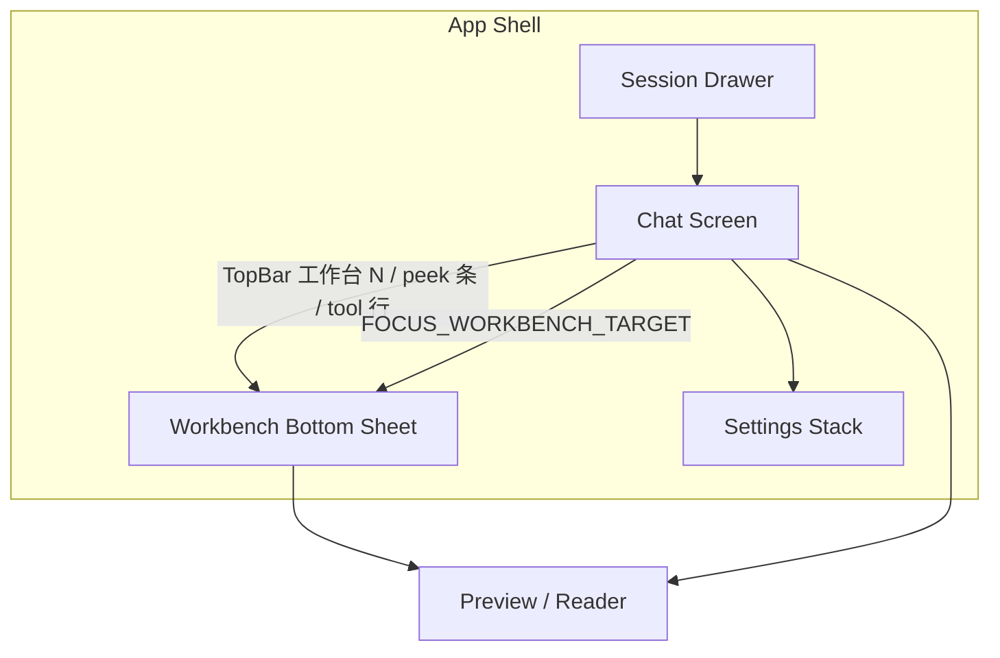
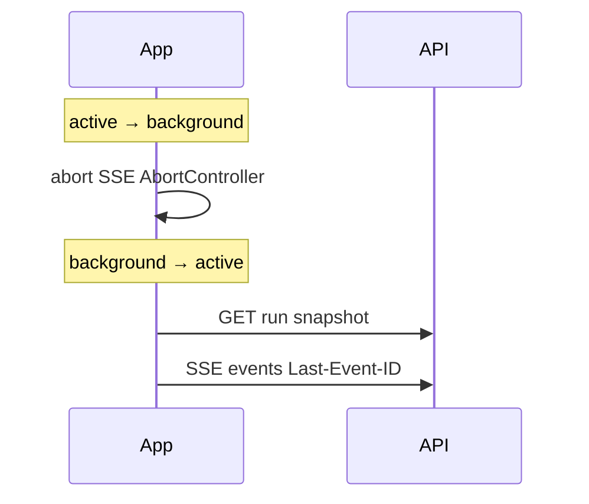

# Mobile Agent Frontend（React Native）

> 文档状态：**移动端产品与技术方案（待实施）；Phone UI Stitch v3 已 freeze**  
> 最后更新：2026-09-26（Manus 式 Workbench Sheet、Composer 内 HITL、五帧设计定稿见 §5.5）  
> 关联：[19-agent-frontend.md](./19-agent-frontend.md)（Web 产品契约，Mobile 须语义 parity）、[11-api-protocol.md](./11-api-protocol.md)、[26-connection-durable-agent-loop.md](./26-connection-durable-agent-loop.md)、[18-project-structure.md](./18-project-structure.md)、[35-c4-mcp-client.md](./35-c4-mcp-client.md)（MCP Settings parity）  
> 范围：**`apps/mobile` React Native 客户端，覆盖当前 Web `/agent` 已实现的全部 Agent 能力**，不是精简版或只读伴侣。

## 1. 目标与非目标

### 1.1 目标

- 在 **iOS / Android**（可选 iPad 分屏）提供与 Web `/agent` **等价的终端用户 Agent 工作台**。
- **同一 API、同一 `packages/agent-protocol`**；Run 创建、SSE 恢复、HITL、Steer、Follow-up、Workbench、附件、Artifact 版本链、MCP 管理均可完成。
- 交互参考 **Manus**（异步任务、步骤感、交付物优先）与 **OpenHands / Cline / Suna** 等开源 Agent（可观察执行、Plan/Act、工具检查点），并映射到 Harness 已有投影模型，不另造协议。
- 与 Web 共享 **headless 投影/reducer**（见 §8），避免双份业务逻辑漂移。

### 1.2 非目标（本阶段文档不承诺）

| 项 | 说明 |
| --- | --- |
| 替代 Web 或 IDE | Mobile 是并列客户端，不删除 Web |
| 本地跑 NestJS / PostgreSQL | 仍连接已有 API；真机通过 LAN/Tailscale/未来云端 URL |
| Memory / Delegation / Skills UI | 与 Web 一致：能力未落地则不显示控件 |
| 服务端重启后 Run 自动续跑 | 与 [26-connection-durable-agent-loop.md](./26-connection-durable-agent-loop.md) 相同边界 |
| OAuth 登录、多租户 | R1 仍为 local user，无账号体系 |
| 在 Sandbox 内执行 MCP | 与 [35-c4-mcp-client.md](./35-c4-mcp-client.md) 一致：MCP 仅在 Host |

### 1.3 与 Web 文档的关系

- **行为语义**：Composer 模式、Progress 文案、Workbench Tab 可用性、`FOCUS_WORKBENCH_TARGET`、recovery 顺序以 [19-agent-frontend.md](./19-agent-frontend.md) 为准；本文只补充 **Mobile 布局、导航、Native 生命周期与工程结构**。
- **冲突时**：产品语义以 `19` + `agent-protocol` 为准；Mobile 特有交互以本文为准。
- **Debug Tab**：Web production 无 Debug；Mobile 同样 **不实现 Debug Tab**。Web Workbench 中的 **Context** Tab 是正式调试入口（Model Round JSON），Mobile **必须保留**。

---

## 2. 产品定位

Mobile 是 **本地 Harness Agent 的全功能客户端**，用户可以在外网环境下：

```text
配置 API 连接
-> 打开/创建 Session
-> 提交任务（含附件、模型、推理强度）
-> 观察 Run（流式对话 + 工作台）
-> 澄清 / 工具审批 / Steer / Follow-up / 取消
-> 阅读 Sources、Report、Artifact 版本链
-> 修改/恢复 Artifact 并发起 revise Run
-> 管理 MCP Server（Settings）
-> 杀进程或切后台后恢复同一 Run 视图
```

**一句话**：Mobile = Web Agent 能力的 **Native 壳 + 移动端 IA**，不是「只能聊天」或「只能看报告」。

---

## 3. 外部交互参考（借鉴点与边界）

### 3.1 Manus（商业 Agent App）

| 借鉴 | Harness 落地 |
| --- | --- |
| Chat vs 多步 Agent 执行 | 统一 Composer；**执行任务**走 `createRun`；若未来有纯 Chat SSE，再增模式切换 |
| 关 App 异步执行 + 完成通知 | Durable Run + **AppState 断 SSE / 回前台 Snapshot 续订** + **终态本地推送**（§7.4） |
| 任务分解 / todo 可见 | **`PlanSnapshot` + Plan 浮卡/步骤条**（K4） |
| 交付物（报告、文件）优先展示 | **Artifact 卡片 + Workbench Artifact/Report Tab** |
| Stop / 改方向 | **`cancelRun`、`controlRun` steer、Follow-up Queue** |
| 「虚拟计算机」隐喻 | **Workbench Tab**（Activity/Bash/Sources），不对终端用户暴露 raw event |

**不借鉴**：隐藏执行细节、仅展示最终结果（与全功能 parity 冲突）。

### 3.2 OpenHands（开源 Agent 平台）

| 借鉴 | Harness 落地 |
| --- | --- |
| 对话 + 工作区双面板 | Phone：**Chat 全屏 + Workbench Bottom Sheet**（§5.1）；Pad：**并排**（§5.2） |
| 可观察 action 流 | **Activity 时间线 + 内联 tool_activity**（用户可读摘要） |
| Signal→Plan→Execute→… 阶段感 | **Progress 文案 + Plan 步骤 + Activity 状态** 三处一致（复用 `ACTIVITY_STATUS_COPY`） |
| Event stream 技术 | WebSocket；Harness 用 **Run SSE + Snapshot**，Mobile 复用同一客户端解析 |

### 3.3 Cline（开源 IDE Agent）

| 借鉴 | Harness 落地 |
| --- | --- |
| Plan 再 Act | Plan 浮卡 / 步骤条在 **running 时显示** |
| 每次 tool = 检查点 | **`tool_approval` Interrupt**：列表项 **可展开** `toolInputSummary` |
| Auto-approve 策略 | MCP **`defaultApproval`** + Settings 配置 |

### 3.4 Suna / 同类 Generalist 开源 Agent

| 借鉴 | Harness 落地 |
| --- | --- |
| 并行子任务（Wide Research） | **`AgentChainOfThought`** 搜索步骤与结果 Chip |
| 浏览器/沙箱在容器执行 | `web_fetch` / `bash` 在 Activity 与 CoT 中展示 **用户可读标题** |

### 3.5 LibreChat / LobeChat

| 借鉴 | Harness 落地 |
| --- | --- |
| 统一会话 Inbox | **Session Drawer** |
| Agent 工具在设置中配置 | **Settings → MCP** 全 CRUD + Test |

---

## 4. 全功能 Parity 矩阵（验收清单）

以下每一项必须在 Mobile 可完成，且与 Web 使用 **同一 API 与 protocol 语义**。

### 4.1 壳层与服务

| ID | 能力 | API / 来源 | Mobile 要点 |
| --- | --- | --- | --- |
| M-SVC-1 | Readiness | `GET /readyz` | 启动与 Settings 显示；未就绪禁用 Composer |
| M-SVC-2 | Public Config | `GET /api/agent/config/public` | 模型列表、reasoning capability、feature gating |
| M-SVC-3 | API Base URL | 用户配置 | 默认空则仅模拟器同源；真机必填 LAN URL |
| M-SVC-4 | 连接态 | 本地 | `idle \| connecting \| live \| reconnecting \| offline`（对齐 Web 语义） |
| M-SVC-5 | 错误 | `ProblemDetails` | 不展示 stack/API Key；支持「重新连接」 |

### 4.2 Session

| ID | 能力 | API | Mobile 要点 |
| --- | --- | --- | --- |
| M-SES-1 | 创建 | `POST /api/agent/sessions` | 首次发送时可创建 |
| M-SES-2 | 列表 | `GET /api/agent/sessions` | Drawer；置顶在前 |
| M-SES-3 | 详情恢复 | `GET /api/agent/sessions/:id` | 打开 Session 加载 messages + pending inputs |
| M-SES-4 | 更新 | `PATCH` title/pinned | 长按或 `…` 菜单 |
| M-SES-5 | 删除 | `DELETE` + 确认 | 说明删除报告/证据（与 Web 一致） |
| M-SES-6 | 深链 | 本地 | `harness://agent?session=` 或 Universal Link；等价 Web `?session=` |
| M-SES-7 | 并行 pending | 本地 | `pendingSessions` 按 sessionId；切换 session 不串 Run |

### 4.3 Run 与 Connection-Durable

| ID | 能力 | API | Mobile 要点 |
| --- | --- | --- | --- |
| M-RUN-1 | 创建 Run | `POST .../runs` | content、model、reasoningEffort、idempotencyKey、attachmentIds、artifactVersionContext |
| M-RUN-2 | Snapshot | `GET /api/agent/runs/:id` | 进入/恢复/冲突对齐 |
| M-RUN-3 | SSE | `GET .../runs/:id/events` + `Last-Event-ID` | 与 Web 相同帧解析；cursor 单调 |
| M-RUN-4 | 取消 | `POST .../cancel` | Composer ■；cancelling 禁重复 |
| M-RUN-5 | 控制 | `POST .../commands` | `pause` / `resume` / `cancel` / `respond` / `approve` / `reject`（协议全量；UI 与 Web 同步暴露策略，见 §6.5） |
| M-RUN-6 | 后台 | AppState | background 关闭 SSE；foreground Snapshot + 续订 |
| M-RUN-7 | 幂等 | event seq | duplicate/replay 不重复 UI item |

### 4.4 Conversation 呈现

| ID | 能力 | 来源 | Mobile 要点 |
| --- | --- | --- | --- |
| M-CONV-1 | User 消息 | persisted messages | 文本、时间、attachments、pendingState |
| M-CONV-2 | Assistant blocks | `AssistantContentBlock` | text / tool_activity / reasoning / artifact / user_intervention 等 |
| M-CONV-3 | 穿插顺序 | `conversation-blocks` | text 与 tool_activity 按 durable 顺序，禁止拆分「执行区/回答区」 |
| M-CONV-4 | CoT | `AgentChainOfThought` | 折叠过程、工具步骤、搜索摘要 |
| M-CONV-5 | Markdown | 同源规则 | sanitize、外链、`[Sx]` 跳转 Sources（Report 内） |
| M-CONV-6 | 长列表 | FlashList | >40 条虚拟化；吸底阈值对齐 `stickToBottomThresholdPx` |
| M-CONV-7 | 点击 Activity | `FOCUS_WORKBENCH_TARGET` | 打开 Workbench Sheet + 定位 execution |
| M-CONV-8 | 复制 | 本地 | 复制反馈时长对齐 Web |

### 4.5 Composer

| ID | 能力 | Mobile 要点 |
| --- | --- | --- |
| M-CMP-1 | 模式 | `new-run` / `steer` / `clarification` / `disabled` |
| M-CMP-2 | 模型 | `PublicModelConfig` 选择 |
| M-CMP-3 | 推理强度 | off / low / high / max；capability 禁用 + tooltip |
| M-CMP-4 | Steer 文案 | placeholder + 提交后「已接受，将从下一步骤生效」 |
| M-CMP-5 | Clarification | HITL 面板；选项按钮 + 自由文本 |
| M-CMP-6 | Tool approval | 列表 + 展开 detail；批准/拒绝；可取消 Run |
| M-CMP-7 | Follow-up Queue | promote / send / cancel pending |
| M-CMP-8 | Plan 浮卡 | `PlanFloatingCard` 等价；running 时可见 |
| M-CMP-9 | Context 环 | tokens / budget / compactionTriggered |
| M-CMP-10 | 附件 | 选图/文件、上传进度、retry/cancel/remove、Vision 校验 |
| M-CMP-11 | 粘贴 | 图片剪贴板；长文本 → TXT 附件（4000 code points 阈值） |
| M-CMP-12 | 历史 reasoning 不兼容 | 禁发 + 引导新建 Session |
| M-CMP-13 | revisionContext | 「基于此版本修改」预填 prompt + `artifactVersionContext` |

### 4.6 文件与 Artifact API

| ID | 能力 | API |
| --- | --- | --- |
| M-FILE-1 | 上传 | `POST .../sessions/:id/files` |
| M-FILE-2 | 状态/预览 | `GET files/:id`, `GET .../preview` |
| M-FILE-3 | retry/delete | `POST retry`, `DELETE` |
| M-ART-1 | 元数据/预览/下载 | artifacts endpoints + download URL |
| M-ART-2 | 系列 | `GET .../artifacts/series/:id` |
| M-ART-3 | restore | `POST .../restore` + expectedCurrentArtifactId |
| M-RPT-1 | Report 聚合 | `GET .../artifacts/reports/:id` |
| M-RPT-2 | delete report | 若 Web 已暴露则 Mobile 同步 |

### 4.7 Workbench（Tab 集合与 Web 一致）

动态 Tab 规则对齐 `WorkbenchShell`（`apps/web/src/features/agent/components/workbench-views.tsx`）：

| Tab | 出现条件 | Mobile 内容 |
| --- | --- | --- |
| Activity | 始终 | master/detail：详情（含 **BashTerminalPanel**）+ 时间线 |
| Artifact | 有 artifacts 或 artifactSeries | 版本、预览、下载、revise、restore 确认 |
| Sources | sources.length > 0 | clue/fetched、passage、外链 |
| Report | 有 report | Markdown Reader |
| Context | 始终（Web 固定最后） | `RunContextDebug` JSON 树 |

Workbench 行为（与 Web §14.1 相同）：

- `workbenchOpen` / `followMode: auto \| pinned` / `autoOpenSuppressedRunIds`
- 新 Run 首次 tool call：**auto-open**（可 suppress）
- `FOCUS_WORKBENCH_TARGET` 原子：open → tab → resource → scroll
- 无法解析目标：降级 Activity 总览 + 用户提示

### 4.8 Settings

| ID | 能力 | 对齐 Web `settings-dialog.tsx` |
| --- | --- | --- |
| M-SET-1 | 主题 light/dark | 系统 + 手动 |
| M-SET-2 | 正文字号 12–17 | 对话区 |
| M-SET-3 | MCP 列表 CRUD | create/update/patch/delete |
| M-SET-4 | MCP Test | `POST .../test` + 状态 Badge |
| M-SET-5 | MCP 表单字段 | serverName、url、headers、timeout、approval、reconnect 等 |

### 4.9 Pending Input API

| ID | API |
| --- | --- |
| M-PND-1 | submit / promote / cancel / send / resume queue（与 `client.ts` 一致） |

### 4.10 开发辅助（可选 Dev Client）

| ID | 能力 |
| --- | --- |
| M-DEV-1 | Fixture 预览菜单（对齐 `/agent/preview` 状态列表）供 UI 无后端回归 |

---

## 5. 信息架构（IA）

### 5.1 手机（默认）

```text
Root
├── SessionDrawer（Modal / 左滑，背景 #fbfaf9 对齐 Web sidebar）
│     ├── 新建任务
│     ├── 会话列表（置顶优先）
│     └── 会话 … 菜单（重命名 / 置顶 / 删除）
├── ChatScreen（默认、唯一主路由层）
│     ├── TopBar：☰ · 标题 · Run 摘要（运行中绿点）· 「工作台 (N)」· ⚙
│     ├── MessageList（画布 #f7f7f6；用户气泡 #edf3fe；助手无气泡）
│     ├── Composer 区（sticky，surface #fff，border #ededeb）
│     └── WorkbenchSheet（@gorhom/bottom-sheet，overlay；非 Tab、非独立路由）
│           ├── detents：closed | peek(~38%) | half(~60%) | full(~92%)
│           ├── Header：拖把手 · 标题「工作台 (N)」· 关闭
│           ├── Segmented：Activity | Sources | Artifact/Report（动态 Tab，语义同 Web）
│           └── Footer（Artifact Tab）：下载 · 主 CTA「基于此版本修改」（#171717）
├── PreviewScreen（Artifact / 文件 / 图片）
├── ReportReaderScreen（可选全屏；大 Markdown 也可在 Sheet full detent）
└── SettingsStack
      ├── General
      └── MCP（列表 → 详情表单）
```

**Workbench Bottom Sheet（Manus 式，Stitch v3 定稿，见 §5.5）**：

- **禁止** 底部 Tab Bar 在「会话 / 工作台」之间切换页面；Chat 始终挂载，Sheet 关闭时仅对话 + Composer。
- **主入口**：TopBar **「工作台 (N)」**（N 规则见 §5.5.2）。
- **次入口（可选）**：Run 进行中 Composer 上方 **peek 条**（一行 Activity 标题 + chevron），与顶栏入口打开 **同一 Sheet**，避免双逻辑。
- **内联 tool_activity**：对话区只保留 **一行摘要**（图标 + 工具名 + 状态 + chevron）；大段 diff、Terminal 全文、Report 预览在 Sheet 对应 Tab；点击行 → `FOCUS_WORKBENCH_TARGET` + Sheet 至少 `half`。
- **HITL（clarification / tool_approval）**：**不得**使用 Workbench Bottom Sheet（无拖把手、无 detent、无「工作台」标题）。与 Web 相同：在 **Composer 壳内** 用 `composer-hitl-panel` 替换输入区（`hideComposerInput`）；长命令摘要可滚动，批准/拒绝固定在 panel 底。可选：极长多项审批时用 **居中 Modal**（`AlertDialog`），仍区别于 Workbench Sheet。
- **Context Tab**：仍在 Sheet 内，与 Web 相同为最后一项；peek detent **不** 展示 Context JSON（仅 half/full）。

**不采用（设计已否决）**：

- Segmented「对话 | 工作台」占满主屏。
- Git「提交并推送分支」类 CTA（产品无 Host Git 集成）；Artifact 底栏仅 **下载 / 分享 / 基于此版本修改 / restore 确认**（对齐 C2-D）。

### 5.2 平板（iPad，宽度 ≥ 768pt）

```text
+------------------------------------------------------------------+
| [Drawer] | Conversation（固定宽或 flex 1） | Workbench（flex 1）   |
|          | Composer                       | Tabs + Content        |
+------------------------------------------------------------------+
```

等价 Web 双栏；Session Drawer 仍为 overlay。

### 5.3 导航图（逻辑）



### 5.4 Workbench Sheet 状态机（Phone）

```text
closed
  -> openPeek | openHalf | openFull
     （入口：工作台按钮 / peek 条 / focus target 默认 half）

openPeek
  -> drag up -> openHalf | openFull
  -> drag down / close / scrim tap -> closed

openHalf | openFull
  -> drag down -> 下一 detent 或 closed
  -> 切换 Tab 不改变 detent（保持用户高度）

规则：
- auto-open（Web 同）：新 Run 首次 tool call 可 openPeek；suppress 后不再自动弹。
- followMode pinned：用户手动调高 Sheet 后不随 focus 自动降为 peek。
- Composer：closed/peek 时可用；full 时 Sheet 覆盖 Composer，HITL interrupt 除外。
- **Overlay 互斥**：`sessionDrawerOpen === true` 时 Workbench Sheet 必须为 `closed`（先关 Sheet 再开 Drawer，或开 Drawer 时自动关 Sheet）。
```

### 5.5 设计定稿（Stitch v3，2026-09-26）

设计资产为 Stitch 内 **五帧**（393×852 iPhone 15 Pro full-bleed，Harness Web token）。**不强制** 再补 Dark / Settings / MCP 表单帧；实现以本文 + Web 对照为准。

#### 5.5.1 帧清单与工程映射

| 帧 | Stitch 标题（参考） | 定稿内容 | 实现锚点 |
| --- | --- | --- | --- |
| **A** | Sheet closed / 会话主视图 | Chat 画布、tool 一行摘要、Composer（+ 上传 / 上下文）、顶栏「工作台 (N)」；Sheet **closed** | `ChatScreen` + `ConversationPanel` |
| **B** | Sources Tab | Workbench Sheet ~60%，Tab **来源**；列表 + 卡片内 passage/标签；**无** Sheet 底栏（导出/查看详情） | `WorkbenchSheet` → `SourcesView` parity |
| **C** | HITL 内嵌 Composer | **非 Sheet**：Composer 白壳内 `composer-hitl-panel`，`hideComposerInput`；bash/pytest 审批 + 沙箱说明 + 拒绝/批准 | `ComposerStack` / 复用 Web `Confirmation` 语义 |
| **D** | Session Drawer | 左 Drawer ~78% `#fbfaf9`；新建、搜索、列表（进行中绿点）；底栏账号脱敏 + 设置 | `SessionDrawer` |
| **+** | Workbench 半开 · 产物 | Sheet half+，Tab **产物**；diff 预览、版本 v1.2、**下载** + **基于此版本修改** | `ArtifactTab` + C2-D footer |

**组件分工（冻结）**：

```text
Session Drawer     — 仅会话列表（D）
Workbench Sheet    — 仅活动 / 来源 / 产物 / Report / Context（B、产物帧）
Composer HITL Panel — 仅 clarification + tool_approval（C）；禁止与 Sheet 共用 @gorhom 实例
```

#### 5.5.2 冻结决策（实现必须遵守）

1. **工作台 badge `(N)`**  
   `N =` 当前 Session **active Run**（若存在）上：`status ∈ { running, queued, waiting, cancelling }` 的 **tool_activity 块数量** + **当前 Run Workbench 内 artifact 条数**（含 series 当前版本，不去重历史版本）。无 active Run 时 `N =` 最近一条 assistant Run 的 artifact 数，若无则隐藏 badge 数字仅显示「工作台」。

2. **帧 A 内「查看产物 (k)」**  
   与顶栏「工作台」打开 **同一 `WorkbenchSheet` 实例**；点击后 `detent >= half` 且 `activeView = artifact`。若另有「查看某报告」类文案，等价于 `FOCUS_WORKBENCH_TARGET` 指向该 `artifactId` / Report，**不**单独路由。

3. **Workbench Tab 动态规则**  
   与 Web `WorkbenchShell` 一致：`sources` 仅 `sources.length > 0`；`report` 仅有 report 投影；`artifact` 有 artifacts/series；**activity、context 始终可用**（Context 在 Segment 最后）。**Plan 不得作为独立 Tab**（仅 Plan 浮卡 / 可选 peek 条）。

4. **Clarification HITL**  
   与帧 C **同一 Composer panel 组件**；标题「需要补充信息」、选项 Chip + 可选自由文本、主按钮「提交回答」；不另出设计帧。

5. **Overlay 互斥**  
   Session Drawer 与 Workbench Sheet **不得同时打开**（见 §5.4）。HITL 显示时 Sheet 应为 `closed`（审批优先于浏览工作台）。

6. **首版工程切片（MVP）**  
   设计 freeze 覆盖全量 §4 parity，但 **建议先交付**：P0 抽包 → P1 Session/Settings URL → P2 Run/SSE → P3 Composer 主体 → P4 HITL → P5 Workbench Sheet（A/B/产物帧）。**P1.5 可选**：Composer peek 条（顶栏工作台已足够）。**P7 推送、iPad 并排、Maestro 全量** 属 P8，不阻塞 MVP 演示。

#### 5.5.3 明确不做 / 不补帧

| 项 | 说明 |
| --- | --- |
| Git commit / push | 无 Host Git；产物底栏仅 C2-D 动作 |
| 来源 Tab 底栏 CTA | 无 bulk 导出 API；行内展开 + 外链 + Passage Modal |
| HITL Bottom Sheet | 已否决；仅 Composer panel 或（极端）居中 Modal |
| Dark Stitch 参考 | 实现跟 `theme.css` dark token；不阻塞开工 |
| Settings / MCP UI | 无 Stitch 帧；对齐 Web `settings-dialog` |

#### 5.5.4 文案与无障碍

- 审批标题统一 **「需要批准工具调用」**（避免「批复」等别称）。  
- 主按钮填充 Light `#171717` / Dark `#d8d8d8`；拒绝用 `#f8ecea` / `#984b41` 语义，避免满屏警示红块。  
- 触控 44pt；Sheet 拖把手仅 Workbench 出现。

---

## 6. 屏级交互规范

### 6.1 TopBar

| 元素 | 行为 |
| --- | --- |
| ☰ | 打开 Session Drawer |
| 标题 | 当前 Session title；过长截断 |
| Run 摘要 | running：Activity 标题或 Plan 步骤「第 n/m 步」；paused/waiting 用 `ACTIVITY_STATUS_COPY` |
| **工作台 (N)** | 打开 Workbench Sheet；N 为 badge；**非 Tab 选中态** |
| 连接指示 | live / reconnecting 点状或文案（可与 Run 摘要合并） |
| ⚙ | Settings |

### 6.2 对话列表

- **空态**：与 Web 一致的引导文案（「今天想完成什么任务？」）。
- **User 气泡**：附件栈；pending steer/follow-up 态样式区分。
- **Assistant**：
  - 流式：`deliveryStatus: streaming` + Shimmer/thinking 指示（不展示 raw reasoning 进 Conversation 规则与 Web 相同）。
  - **Reasoning block**：可折叠 `Reasoning`（若 block 存在且非 off 策略隐藏）。
  - **Tool activity**：图标+文案+状态；`running` 旋转态；整行可点 → focus workbench。
  - **Artifact block**：卡片 → 预览或切 Workbench Artifact Tab。

**滚动**：

- 距底 < 32px 时新 token 吸底；用户上滑阅读时停止强制滚动（与 Web `stickToBottom` 一致）。

### 6.3 Composer 区（自上而下）

```text
[ Error banner + 重新连接 + 关闭 ]
[ PlanFloatingCard — 条件显示 ]
[ FollowUpQueue — pending inputs ]
[ HITL — clarification | tool_approval — 条件显示 ]
[ Composer — attachments header | textarea | footer tools ]
```

**Footer tools**（对齐 Web）：

- `new-run`：`+` 附件菜单（文件和图片）。
- 模型菜单 + 推理强度菜单（`Dropdown` → Mobile 用 **ActionSheet / BottomSheet**）。
- Context 环（百分比 + 展开 token 详情）。
- 发送 / 停止：`submitting` 时主按钮为 **停止**（`cancelRun`）。

**键盘**：

- iOS/Android 安全区；键盘弹起时列表 padding，避免遮挡输入。
- Enter 发送、Shift+Enter 换行；IME composing 时 Enter 不提交（与 Web 一致）。

### 6.4 HITL — Clarification

- **容器**：与 §6.5 相同 — **Composer 壳内 panel**，非 Workbench Sheet（Stitch 帧 C 组件复用，§5.5.2-4）。
- 标题：「需要补充信息」。
- 展示 `interrupt.payload.question`；有 options 则 **Chip 快捷选** + 仍允许自定义输入。
- 提交：`controlRun` `{ type: 'respond', interruptId, payload: { answer } }`。
- 右上角关闭 → **cancel Run**（与 Web 一致）。

### 6.5 HITL — Tool Approval

- **容器**：Composer 同宽圆角卡片（`shadow-composer`），**不是** `@gorhom/bottom-sheet` Workbench 实例。
- 标题：「需要批准工具调用（N 项）」；右上 **×** → cancel Run（与 Web `composer-hitl-cancel` 一致）。
- 每项：`toolTitle` + 可展开 `toolInputSummary`（Cline 检查点）。
- 主操作：**批准**（全 approve）；扩展 v1.1 可支持逐项决策（若 Web 先支持则 Mobile 跟随）。
- 拒绝路径：协议支持 `reject` + decisions；UI 与 Web 同步。
- **Pause / Resume**：协议已在 `runControlCommandSchema`；若 Web Workbench/Composer 未暴露按钮，Mobile 可在 Workbench 顶栏 **「暂停 | 继续」** 先行提供，且调用 `controlRun({ type: 'pause' \| 'resume' })`；Web 补齐后交互对齐。

### 6.6 Workbench — Activity

布局与 Web **纵向 master/detail** 相同：

```text
+--------------------------------+
| 当前选中 execution 详情         |
| （bash → Terminal 面板）        |
+--------------------------------+
| 调用时间线（可滚动）            |
+--------------------------------+
```

- **Bash**：复用 `formatBashTerminalRendered` / `formatBashTerminalCopyText` 逻辑（package 下沉）；RN 终端区：等宽字体、ScrollView、复制到剪贴板。
- **其他工具**：title、detail、inputSummary、outputSummary、metrics。
- 时间线选中态 `aria-pressed` 等价：视觉高亮 + pinned followMode。

### 6.7 Workbench — Sources

- 顶栏统计：「X 个回答采用 · Y 已读取 · Z 线索」（对齐 Web `SourcesView` header）。
- 列表项：domain、title、excerpt；**点整行**展开 `<details>` 式 passage 列表（与 Web 内联 `candidate-passages` 相同）。
- **无 Sheet 底栏 CTA**（不做「导出引用」「查看来源详情」全局按钮；无 bulk export API）。
- 单条 passage 过长 → 半屏 **Passage Modal**；来源 URL → in-app browser（`SFSafariViewController` / Chrome Custom Tabs）。
- 顶栏可选 **筛选** icon（Web 已有 placeholder）；Report 内 `[Sx]` → focus source（与 Web 一致）。

### 6.8 Workbench — Report

- Markdown 渲染规则与 Web `MarkdownContent` 同源策略。
- `[Sx]` 点击 → `FOCUS_WORKBENCH_TARGET` kind `source`。
- limited report 状态文案克制展示（Web parity）。

### 6.9 Workbench — Artifact

- 版本 Badge、`isCurrent`、operation（create/revise/restore）。
- 操作：预览（PreviewScreen）、下载（系统分享/保存）、基于此版本修改、恢复确认（ActionSheet 二次确认）。

### 6.10 Workbench — Context

- 空态：「当前 Run 尚无 Context」。
- 有数据：Round、estimated tokens、attempt、**JSON 树**（懒加载大节点）。
- 不进入 Conversation；不对模型暴露（与 Web 相同）。

### 6.11 Settings — MCP

分节表单（长表单拆页）：

1. 基本信息：名称、启用开关  
2. 连接：URL、headers（键值对编辑器）  
3. 超时：startup、toolCall  
4. 策略：required、failOnStartupError、defaultApproval、maxInstructionBytes  
5. 重连：enabled、maxAttempts  

列表项展示 **状态 Badge**（connected / degraded / disconnected），与 Web `mcpStatusLabel` 一致。

### 6.12 进行中 peek 条（Manus 式，可选）

当 `submitting && workbench.activityStatus in (running, queued, …)` 且 Sheet 为 `closed`：

```text
Composer 上方：[ ● 正在搜索公开来源 · 步骤 2/5 › ]  → 打开 Sheet（建议 half + Activity focus）
```

与 Plan 浮卡并存时：peek 条优先显示 **Plan 当前 in_progress 步骤标题**。顶栏「工作台 (N)」始终可用，与 peek 条 **同一 Sheet 实例**。

---

## 7. Connection-Durable 与 Native 生命周期

### 7.1 加载顺序（与 Web §17 一致）

```text
GET session detail
-> 选定 activeRunId（Session 内最新非 terminal 或 persisted）
-> GET run snapshot
-> 投影 Conversation + Workbench
-> subscribeRun(lastEventId)
```

本地 UI state（`workbenchOpen`、tab、focus）**不写入服务端**；刷新默 focus 到 running execution 或 terminal 最后一项（Web 规则）。

### 7.2 SSE 客户端

- 实现与 `apps/web/src/api/client.ts` 的 `subscribeRun` **字节级等价**：`fetch` + `ReadableStream` + `\n\n` 分帧 + `runStreamEventSchema.parse`。
- React Native 0.7x+ 优先使用原生 fetch stream；若不 available，使用 `react-native-sse` 或 polyfill，但 **cursor 语义不变**。

### 7.3 AppState



- 后台 **不** 调用 cancel。
- 可选：后台超过 T 秒仅 **指数退避轮询** `GET run`（T 默认 30s），foreground 恢复 SSE。

### 7.4 本地通知（推荐 P1）

| 触发 | 内容 | 点击 |
| --- | --- | --- |
| Run completed | 会话名 + 「任务已完成」 | Deep link session |
| Run failed | 错误摘要 | 同上 |
| waiting_for_user | 「需要你的确认」 | 打开 Composer HITL |
| tool_approval pending | 「需要批准工具调用」 | 同上 |

需用户授权；Dev 可关闭。

### 7.5 真机 API 连接

- Settings 存储 `apiBaseUrl`（MMKV）。
- 文档与 Dev Menu 说明：Mac 开发机 IP、`4318` 端口、防火墙、HTTPS 未来选项。
- iOS ATS：开发 build 可配置例外；生产建议 HTTPS 反向代理。

---

## 8. 工程架构

### 8.1 Monorepo 目标结构

```text
hello-harness-agent/
  apps/
    web/                          # 逐步依赖 packages
    api/
    mobile/                       # 新建 Expo 应用
  packages/
    agent-protocol/               # 已有
    agent-testkit/                # 已有
    agent-client/                 # 新建：REST + SSE + upload
    agent-conversation/           # 新建：conversation-blocks、tool-copy、bash-transparent
    agent-projection/             # 新建：workbench 投影、applyRunEvent 纯函数
    agent-ui-logic/               # 可选：composerMode、focus reducer、pending 合并
```

### 8.2 依赖规则

- Mobile **不得** import `@nestjs/*`、Prisma、后端 entity。
- Mobile **必须** 通过 `agent-protocol` zod 解析所有 API/SSE payload。
- Web 重构顺序：**先抽 package + Web 切换引用（零行为变化）**，再建 `apps/mobile`。

### 8.3 从 Web 下沉的模块（首批）

| 现路径 | 目标 package |
| --- | --- |
| `apps/web/src/api/client.ts` | `agent-client` |
| `apps/web/src/features/agent/model/conversation-blocks.ts` | `agent-conversation` |
| `apps/web/src/features/agent/model/tool-copy.ts` | `agent-conversation` |
| `apps/web/src/features/agent/model/bash-transparent.ts` | `agent-conversation` |
| `apps/web/src/features/agent/elements/assistant-message-adapter.ts` | `agent-conversation` 或 `agent-projection` |
| `app.tsx` 内纯函数投影（workbench from metadata 等） | `agent-projection` |

`app.tsx` 中 React 耦合的 `applyRunSnapshot` / session 状态机：先抽 **reducer + 类型** 到 `agent-ui-logic`，Web/Mobile 各自 hook 包装。

### 8.4 Mobile 技术栈

| 领域 | 选型 | 说明 |
| --- | --- | --- |
| 框架 | Expo SDK 52+ | Dev Client；非 Expo Go 限制（原生模块） |
| 语言 | TypeScript strict | 与 monorepo 一致 |
| 导航 | React Navigation 7 | Drawer + Native Stack |
| 列表 | @shopify/flash-list | 长对话 |
| Sheet | @gorhom/bottom-sheet | **仅 Workbench Sheet**、ActionSheet 菜单；**HITL 不用 Sheet**（§5.5） |
| 动画 | react-native-reanimated | Sheet / 列表 |
| 服务端状态 | TanStack Query v5 | Session 列表、Config |
| Run 观察 | 每 Session 单例 Observer | ref 存 cursor，与 Web 相同 |
| 持久化 | react-native-mmkv | apiBaseUrl、theme、fontSize、lastSessionId、cursor 缓存（可选） |
| 安全存储 | expo-secure-store | 若未来存 token；R1 可无 |
| 附件 | expo-document-picker、expo-image-picker、expo-clipboard | |
| 文件 | expo-file-system、expo-sharing | 下载 Artifact |
| 浏览器 | expo-web-browser | 外链 |
| 通知 | expo-notifications | §7.4 |
| Markdown | WebView 模板 或 RN markdown + 共享 sanitize | 与 Web 安全策略一致 |
| JSON | 轻量树组件 | Context Tab |
| E2E | Maestro | 黄金路径 |
| 单测 | vitest/jest 在 packages | 与 web 共用 fixture |

### 8.4.1 UI 定案（仅 React Native Reusables）

**2026-09-26 共识**：Mobile **只有一套 UI 来源** — **[React Native Reusables](https://reactnativereusables.com/) + NativeWind v4**，组件 **CLI 添加后拷贝在** `apps/mobile/components/ui/`（与 Web shadcn 相同工作流）。**不再引入**第二套 UI 库（Tamagui、Paper、Gluestack、assistant-ui、Vercel AI Elements RN 等）。

| 类型 | 做法 |
| --- | --- |
| Button / Input / Dialog / Tabs / Card… | Reusables → `components/ui/*` |
| 聊天 / Composer / HITL / Tool 行 / Terminal | **`components/agent-elements/*` 自研**，仅用 Reusables 原语拼装；**不是** npm 上的「AI UI 库」 |
| 业务状态与投影 | `packages/agent-*`（无 UI） |

**与 Web 对称（实现方式，非共用 npm）**：Web `components/ui` + `ai-elements`；Mobile `components/ui`（Reusables）+ `agent-elements`。

**Reusables 首装建议（按需 add，勿一次全库）**：`text`、`button`、`input`、`textarea`、`card`、`tabs`、`dialog`、`alert-dialog`、`separator`、`skeleton`、`label`；Toast 用 Reusables 自带或 **sonner-native** 二选一。

**非 UI 库、但随 Reusables/Expo 常见依赖**（不算第二套设计系统）：`@rn-primitives/*`（Reusables 底层）、`lucide-react-native`、`react-native-reanimated`、`@gorhom/bottom-sheet`（仅 Workbench Sheet）、`@shopify/flash-list`。

**Markdown / Terminal**：WebView 或轻量渲染包；不为此再选 UI Kit。

**脚手架**：Reusables 官方 Expo 模板或现有 Expo 项目 + Reusables 文档接入；再挂 monorepo `@harness/agent-protocol` 等。

### 8.5 `apps/mobile` 目录（建议）

```text
apps/mobile/
  app/                    # Expo Router 或 src/screens
  src/
    features/agent/
      screens/
        ChatScreen.tsx
        WorkbenchPanel.tsx
        SettingsScreen.tsx
        McpServerFormScreen.tsx
        PreviewScreen.tsx
      components/
        ui/                 # Reusables 拷贝（shadcn 等价）
        agent-elements/     # 对标 web ai-elements
        conversation/
        composer/
        workbench/
        settings/
      hooks/
        useRunObserver.ts
        useSessionState.ts
      theme/
    lib/
      api.ts              # 薄封装 agent-client + baseUrl
  maestro/
  app.config.ts
  package.json
```

不提前创建空模块；按里程碑递增（与 [19-agent-frontend.md §21](./19-agent-frontend.md) 精神一致）。

### 8.6 脚本与 CI

```text
pnpm dev:mobile          # Expo start
pnpm --filter @harness/mobile typecheck
pnpm --filter @harness/mobile test     # 若有
maestro test apps/mobile/maestro/       # CI optional
```

根 `pnpm check` 扩展：packages 单测 + mobile typecheck（mobile 存在后）。

---

## 9. 状态模型

### 9.1 与 Web 对齐的类型

复用/共享（`features/agent/model/types.ts` 迁入 package 或 re-export）：

- `AgentUiState`、`WorkbenchState`、`ConversationItem`、`ToolCallView`、`SourceView`
- `WorkbenchFocusTarget`、`WorkspaceView`、`ActivityStatus`

### 9.2 Mobile 扩展（仅本地）

```ts
type WorkbenchSheetDetent = 'closed' | 'peek' | 'half' | 'full';

type MobileChromeState = {
  sessionDrawerOpen: boolean;
  workbenchSheet: {
    detent: WorkbenchSheetDetent;
    /** 用户是否手动拖高过；影响 auto-open 降级 */
    userExpanded: boolean;
  };
  apiBaseUrl: string;
  pushNotificationsEnabled: boolean;
};
```

不写入 API；不参与 Snapshot。

### 9.3 Run Observer 职责

与 Web `app.tsx` Run 订阅循环等价：

1. `getRun` 对齐 Snapshot  
2. `subscribeRun(cursor, onEvent)`  
3. `onEvent` → `applyRunEvent`（共享）  
4. 断线 → `reconnecting` + 退避  
5. terminal → 关闭 SSE + 可选通知  

每个 `sessionId` 最多一个 active observer；切换 session 时 abort 旧 controller，**不 cancel run**。

---

## 10. 设计系统（Mobile）

与 Web [`design-system/README.md`](../apps/web/src/design-system/README.md) 及 Stitch **Harness Agent Mobile Workbench v2** 一致：

- **颜色（Light）**：canvas `#f7f7f6`、sidebar/drawer `#fbfaf9`、surface `#ffffff`、subtle `#f1f1ef`、text `#171717` / secondary `#555551`、composer border `#ededeb`、user bubble `#edf3fe`、primary CTA `#171717`、link `#3f5f78`、approval `#eaf2ec` / rejection `#f8ecea`。
- **颜色（Dark）**：canvas `#101010`、surface `#181818`、user bubble `#202020`（非蓝 tint）、primary CTA `#d8d8d8`。
- **字号**：默认正文 **14px**（`text-content`），次级 13px；可设置 12–17，与 Web 侧栏字号联动语义相同。
- **圆角**：control 8px、panel/sheet 12px、user bubble 22px。
- **Elevation**：Sheet/Modal 用 `shadow-panel`（hairline + 软阴影），避免 border+shadow 叠加重框。
- **画板参考**：iPhone 15 Pro **393×852**，全屏 bleed；Home Indicator 留白。
- **触控**：最小 hit area 44×44pt。
- **图标**：lucide 语义与 Web 一致（`lucide-react-native`）。
- **Motion**：Sheet slide-up + scrim fade；Activity running 图标 spin；避免大面积动画影响 SSE。

---

## 11. 典型用户流程（Wireflow）

### 11.1 联网调研 Run（web_search + web_fetch + 回答）

```text
1. 用户打开 App → readyz OK → Drawer 选 Session 或新建
2. Composer 选模型/推理 → 输入目标 → 发送
3. createRun → Observer 订阅 SSE
4. 对话区：text delta 穿插 tool_activity「搜索…」「读取…」
5. 顶栏「工作台」/ peek 条 / Plan 卡显示进度；用户点入口 → Sheet half + Activity
6. Sources Tab 出现 → 用户点某来源 → passage Modal
7. 最终 assistant 文本 + 若有 Report → Report Tab / Artifact 卡
8. 用户切后台 10 分钟 → 回 App Snapshot 续看，无重复 block
9. Run completed → 可选推送「任务已完成」
```

### 11.2 Bash + 网络审批 + Terminal

```text
1. 用户任务触发 bash 工具
2. tool_activity 显示；Workbench Activity 选中 bash execution
3. Terminal 面板流式/完成态 ANSI 输出；可复制
4. 若 policy 触发 tool_approval → Composer HITL 列表展示 command 摘要
5. 用户批准 → controlRun approve → Run 继续
6. 若用户拒绝 → reject 路径；状态 failed/cancelled 与 Web 一致
```

### 11.3 Artifact revise 链

```text
1. Workbench Artifact → 选 v2 → 「基于此版本修改」
2. revisionContext 写入 session 本地 state；Composer 预填 prompt
3. createRun 带 artifactVersionContext
4. 新版本 v3 出现在系列列表；isCurrent 更新
5. restore 旧版本 → 确认 → restore API → refresh session
```

---

## 12. 测试策略

### 12.1 单元 / 契约

- `agent-conversation`、`agent-projection` 与 Web **同一套** `agent-testkit` fixture 输入。
- 覆盖：SSE duplicate、tool_activity 插入顺序、Snapshot 恢复 reasoning block、focus target 解析。

### 12.2 Maestro E2E（最低集）

| 用例 | 断言 |
| --- | --- |
| 配置 API + ready | Composer 可输入 |
| 创建 Session + 简单 Run | 看到 assistant 回复 |
| 切换 Session | 不串消息 |
| 杀 App 重启 | 同一 Session Run 状态合理恢复 |
| 打开 Workbench Sources | Tab 可见（fixture 或 seed） |
| Settings MCP 列表 | 与 API 一致 |

与 Playwright mobile viewport **互补**：Web 测响应式 CSS；Maestro 测 Native 导航与生命周期。

### 12.3 手动矩阵

- iOS 17+ 真机 + Android 13+ 真机  
- 局域网 API  
- 大附件上传、图片 Vision  
- 长 Run（20+ tool）滚动性能  

---

## 13. 实施里程碑

里程碑 **不削减 §4 范围**；仅排序。

### 13.1 设计交付（Stitch）

| 状态 | 交付物 |
| --- | --- |
| **Freeze v3**（2026-09-26） | 五帧：A closed、B 来源、C HITL Composer、D Session Drawer、产物 Sheet；见 §5.5 |
| 不补帧 | Dark、Settings/MCP、Clarification 单独帧（§5.5.3） |

Stitch 源文件由设计侧保管；工程以 **本文 §5.5 + §6 + Web 组件** 为验收参照。

### 13.2 工程里程碑

| 阶段 | 交付 | 依赖 |
| --- | --- | --- |
| **P0** | `agent-client` + `agent-conversation` 抽包；Web 引用无回归 | 无 mobile |
| **P1** | `apps/mobile` 脚手架；Settings API URL；Session CRUD + **Session Drawer（D）**；ready | P0 |
| **P1.5** | （可选）Composer **peek 条** → 同一 Workbench Sheet | P1 |
| **P2** | createRun + SSE + Snapshot 恢复 + cancel；对话 text/tool_activity | P1 |
| **P3** | Composer 全量（模型/推理/附件/粘贴/队列/Plan/Context 环） | P2 |
| **P4** | HITL clarification + approval；controlRun 全类型 | P3 |
| **P5** | Workbench Sheet（**A/B/产物帧**）+ detents + 动态 Tab + focus/pinned/auto-open | P4 |
| **P6** | Bash Terminal + Artifact revise/restore + Report Reader | P5 |
| **P7** | Settings MCP 全表单 + Test | P5 |
| **P8** | 推送、Maestro、iPad 分屏、性能与硬ening | P6–P7 |

---

## 14. 验收标准（Release Gate）

1. §4 矩阵 **每一 ID** 在真机可演示或通过自动化覆盖。  
2. 同一 Session、同一 Run：Mobile 与 Web 展示的 **conversation block 顺序、tool_activity 状态、Workbench 数据源** 一致（以服务端 Snapshot 为准）。  
3. Clarification / Steer / Follow-up / Cancel **不混淆**（与 [19 §22](./19-agent-frontend.md) 一致）。  
4. SSE replay **不重复** UI item；cursor 严格单调。  
5. 点击内联 Tool Activity **3s 内**定位到正确 `toolCallId`（常规网络）。  
6. MCP 在 Mobile 修改后 Web Settings 可见，反之亦然。  
7. `pnpm check`（含 packages + mobile typecheck）通过。

---

## 15. 风险与对策

| 风险 | 对策 |
| --- | --- |
| RN SSE 不稳定 | Snapshot 轮询降级；foreground 强制 resync |
| 大 JSON Context 卡顿 | 懒展开；限制初始深度 |
| Markdown 表格差 | Report 用 WebView 渲染 |
| 双端逻辑漂移 | 共享 package 单测 gate CI |
| localhost 真机不可达 | Settings + 文档；Dev Menu 显示当前 API |
| MCP 表单复杂 | 分步页 + 与 Web 相同 zod 校验 |
| 审批 UI 宽于 Web | Mobile 先全 approve；逐项跟随 Web |

---

## 16. 文档维护

- Web 新增 Agent UI 能力时：**先更新 [19-agent-frontend.md](./19-agent-frontend.md)**，再在本文件 §4 矩阵增行并调整里程碑。  
- API 变更：**先更新 [11-api-protocol.md](./11-api-protocol.md) 与 `agent-protocol`**，再更新 `agent-client`。  
- 实施完成后更新 [implementation-status.md](./implementation-status.md) 增加 Mobile 小节。

---

## 17. 阅读顺序（Mobile 专项）

1. 本文 §5.5 设计定稿（Stitch v3）+ §4 Parity 矩阵  
2. [19-agent-frontend.md](./19-agent-frontend.md) — Composer / Workbench 语义  
3. [26-connection-durable-agent-loop.md](./26-connection-durable-agent-loop.md) — SSE/cursor  
4. [35-c4-mcp-client.md](./35-c4-mcp-client.md) — MCP Settings  
5. [31-c2-artifact-and-report-generation.md](./31-c2-artifact-and-report-generation.md) — Artifact 版本链  
6. [33-c3-agent-sandbox-cloud-execution.md](./33-c3-agent-sandbox-cloud-execution.md) — Bash/Terminal 投影  

---

## 18. 附录 A — Web → Mobile 组件映射

| Web | Mobile |
| --- | --- |
| `Sidebar` | `SessionDrawer` |
| `Conversation` | `ConversationPanel` + FlashList |
| `Composer` / HITL | `ComposerStack`（含 `ComposerHitlPanel`，**非** WorkbenchSheet） |
| `WorkbenchShell` | `WorkbenchSheet`（Phone overlay）/ `WorkbenchPanel`（Pad 并排） |
| `BashTerminalPanel` | `BashTerminalView` |
| `MarkdownContent` | `MarkdownView` |
| `JsonViewer` | `ContextJsonTree` |
| `settings-dialog` | `SettingsStack` + `McpServerForm` |
| `PlanFloatingCard` | 同逻辑组件 |
| `FollowUpQueue` | 同逻辑组件 |
| `AgentChainOfThought` | 同逻辑 RN 布局 |
| `components/ui/*`（shadcn） | `components/ui/*`（Reusables） |
| `components/ai-elements/*` | `components/agent-elements/*` |

---

## 19. 附录 B — `WorkspaceView` 与 Tab 标签

与 Web 一致，标签英文或中文与 Web 当前 UI 一致（Activity / Sources / Report / Artifact / Context），便于用户跨端识别。

```ts
type WorkspaceView =
  | 'activity'
  | 'artifact'
  | 'sources'
  | 'report'
  | 'context';
```

`plan` 不作为独立 Tab；Plan 仅通过 **浮卡/步骤条/Workbench header badge** 展示（与 Web 相同）。

---

## 20. 附录 C — Deep Link 约定（草案）

```text
harness://agent/session/:sessionId
harness://agent/session/:sessionId/run/:runId
```

查询参数兼容 Web：`?session=<uuid>`。实现阶段在 `app.config.ts` 注册 scheme；通知 payload 携带 `sessionId` + 可选 `runId`。
